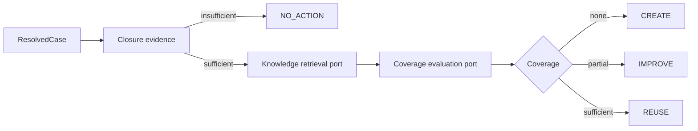
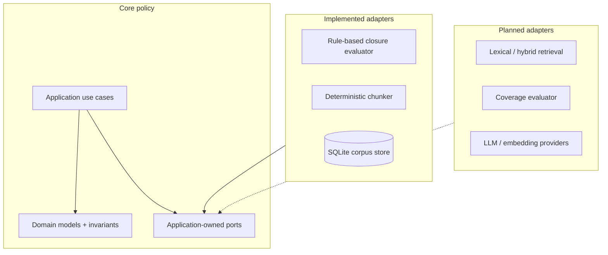
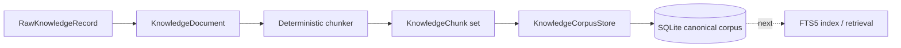

# Tropos

**Every resolution strengthens the next.**

[](https://github.com/kumarchandansingh/tropos/actions/workflows/ci.yml)

Tropos is a governed knowledge-management system for turning resolved support cases into auditable knowledge decisions.

Its first capability, **Tropos Resolve**, evaluates whether a resolved case has enough closure evidence, retrieves related knowledge through an application port, assesses coverage, and produces one governed action:

- `REUSE` — existing knowledge is sufficient;
- `IMPROVE` — related knowledge exists but is incomplete;
- `CREATE` — no adequate knowledge exists;
- `NO_ACTION` — the case does not contain enough closure evidence to justify a knowledge change.

## Current build state

Tropos is deliberately being built from a deterministic governed core outward.



### Implemented now

- canonical `ResolvedCase`, `KnowledgeDocument`, `KnowledgeChunk`, access-policy and decision domain models;
- explicit `REUSE / IMPROVE / CREATE / NO_ACTION` decision policy;
- rule-based closure-evidence evaluation;
- application orchestration through ports for retrieval, coverage evaluation and decision storage;
- immutable raw-ingestion records with canonical SHA-256 fingerprints;
- governed access semantics with `UNRESOLVED`, `TENANT`, and `RESTRICTED` scopes;
- deterministic, lossless chunking with exact offsets, stable IDs, provenance, access inheritance and strategy versioning;
- a `KnowledgeCorpusStore` application port;
- SQLite persistence for the current canonical `KnowledgeDocument` + `KnowledgeChunk` snapshot, including provenance and access metadata;
- atomic replacement of one knowledge item's persisted snapshot when a newer source version is stored;
- unit tests across domain, application, ingestion, evaluation, chunking and persistence;
- GitHub CI on every pull request and every push to `main`;
- protected `main` with required `api-quality` status checks.

### Planned next

- lexical / SQLite FTS5 retrieval baseline over governed chunks;
- tenant/group permission filtering in retrieval;
- chunk-level retrieval-hit/evidence contracts;
- concrete knowledge-coverage evaluation;
- retrieval evaluation datasets and ranking metrics;
- embeddings / hybrid retrieval only if the lexical baseline shows a measurable need;
- LLM-assisted recommendation and drafting behind validated contracts;
- API / UI delivery surfaces;
- preview, UAT/staging and production deployment.

> Planned components are intentionally not described as implemented. The repository documents both the current executable boundary and the target architecture.

## Architecture in one view



Tropos follows a **modular-monolith + ports-and-adapters** design. Business policy lives inward; replaceable infrastructure lives behind application-owned contracts.

## Persistence boundary



The SQLite adapter is the first executable corpus baseline, not the final production-database decision. The application depends on `KnowledgeCorpusStore`, so later storage technology can change without moving persistence concerns into the domain.

## Repository map

```text
.
├── apps/api/
│   ├── src/tropos/domain/          # business concepts and invariants
│   ├── src/tropos/application/     # use cases, ingestion boundary, ports
│   ├── src/tropos/adapters/        # deterministic + persistence implementations
│   └── tests/unit/                 # executable evidence for current behavior
├── docs/                           # living product + architecture knowledge
└── .github/                        # PR template and CI quality gate
```

Start with **[`docs/README.md`](docs/README.md)** for the visual documentation map.

## Development

The API package currently requires Python 3.14 and uses `uv`, Ruff, mypy and pytest. SQLite persistence uses Python's standard-library `sqlite3` module, so this slice adds no runtime dependency.

```bash
cd apps/api
uv sync --dev --locked
uv run ruff format --check .
uv run ruff check .
uv run mypy src tests
uv run pytest
uv build
```

The same quality sequence runs in GitHub Actions. `main` is protected, so normal delivery is:


## Public-repository boundary

This repository is intended to contain product code, architecture, tests and **synthetic** examples. Secrets, real customer/support records, employer/client confidential material, production configuration and private evaluation datasets do not belong here.

See the living documentation for the detailed product model, evidence model, RAG plan, evaluation strategy and release controls.
