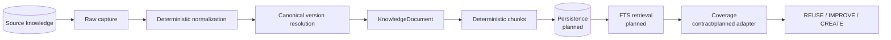
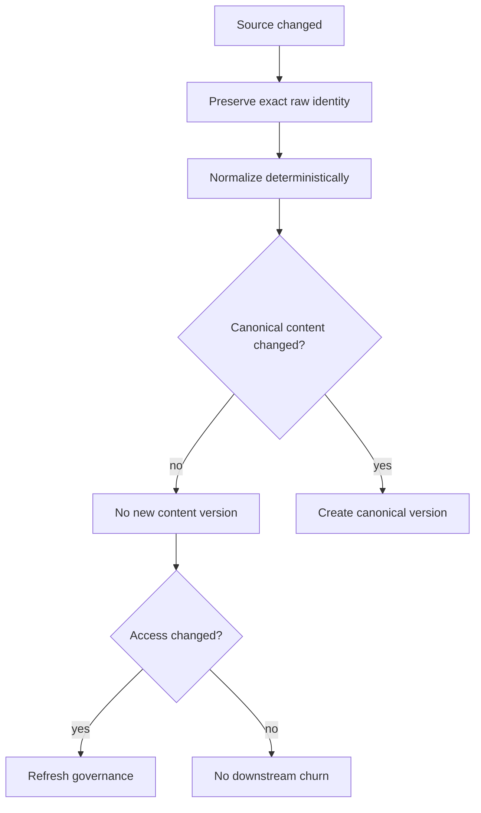
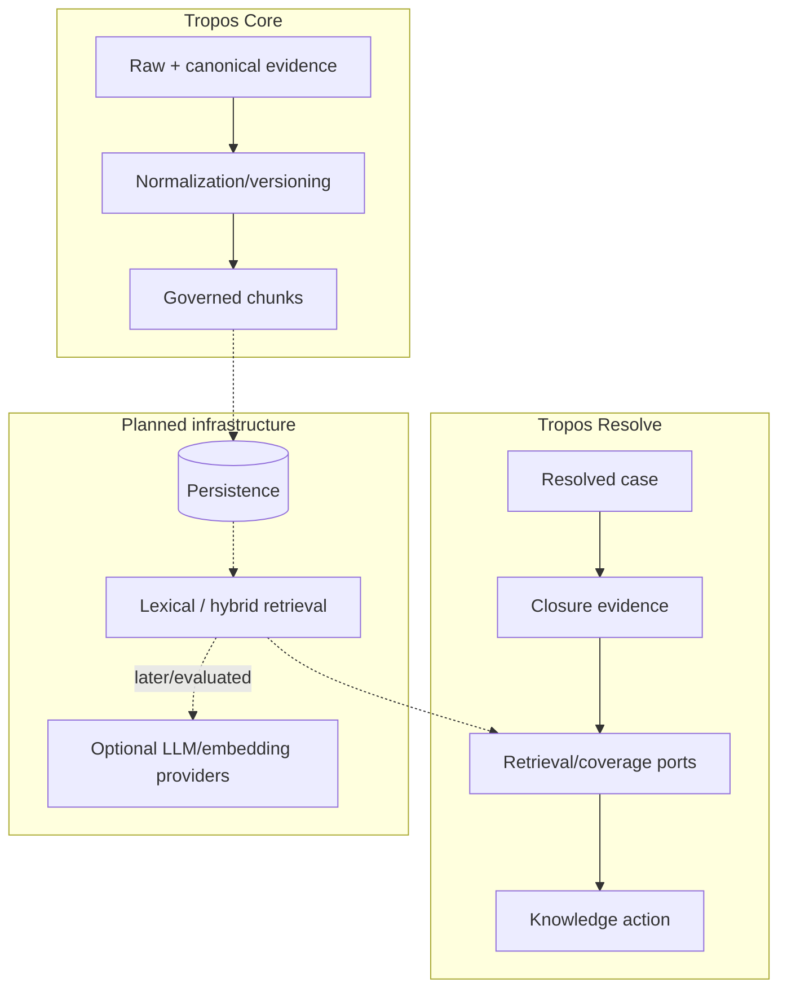
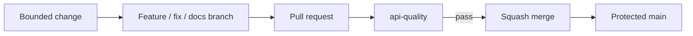

# Tropos

**Every resolution strengthens the next.**

[](https://github.com/kumarchandansingh/tropos/actions/workflows/ci.yml)

Tropos is a governed knowledge-management system for turning resolved support cases into auditable knowledge decisions. It is being built as a reusable governed-knowledge **Core** plus domain capabilities such as **Tropos Resolve**.

Tropos Resolve evaluates closure evidence, retrieves related knowledge through application contracts, assesses coverage, and produces one governed action:

- `REUSE` — existing knowledge is sufficient;
- `IMPROVE` — related knowledge exists but is incomplete;
- `CREATE` — no adequate knowledge exists;
- `NO_ACTION` — the case lacks enough closure evidence to justify a knowledge change.

## Current build state

Tropos is deliberately being built from a deterministic governed core outward.



### Implemented now

- modular boundary between reusable `tropos.core` and `tropos.capabilities.resolve`;
- canonical `ResolvedCase`, `AccessPolicy`, `KnowledgeDocument` and `KnowledgeChunk` models;
- explicit `REUSE / IMPROVE / CREATE / NO_ACTION` decision policy;
- rule-based closure-evidence evaluation and application orchestration;
- immutable raw ingestion with separate exact-payload and source-envelope fingerprints;
- **Level 1 deterministic normalization** for Unicode, line endings, whitespace and presentation noise;
- **Level 2 structural extraction** for headings, paragraphs and lists;
- stable canonical serialization/text plus normalized content fingerprint;
- canonical version resolver distinguishing content changes, no-op source churn, access-only changes and normalizer rebaselines;
- governed access semantics with `UNRESOLVED`, `TENANT` and `RESTRICTED` scopes;
- deterministic lossless chunking with exact offsets, stable canonical-content-based IDs, provenance, access inheritance and processing-strategy versions;
- unit tests across core identity/normalization/versioning/chunking and Resolve policy/orchestration;
- GitHub CI on every pull request and every push to `main`;
- protected `main` with required `api-quality` status checks.

### Contract only / planned next

- production persistence for canonical documents, versions, chunks and decisions;
- lexical/full-text retrieval baseline;
- concrete knowledge-coverage evaluation;
- richer source connectors/parsers for formats such as HTML/DOCX/PDF;
- evaluation datasets and retrieval metrics;
- embeddings/hybrid retrieval only if the lexical baseline shows a measurable need;
- LLM-assisted recommendation/drafting behind validated contracts;
- API/UI delivery surfaces and deployment environments.

> Planned components are intentionally not described as implemented. The repository documents both the executable boundary and target architecture.

## Why normalization/versioning exists before retrieval

Raw source change is not the same as knowledge change.



A Word/Markdown formatting change should not eventually force duplicate chunks, index rows or embeddings. A real policy change such as `90 days` to `60 days` must. The normalization algorithm itself is versioned so an implementation change cannot silently masquerade as a business-content change.

Read [`docs/architecture/INGESTION_NORMALIZATION.md`](docs/architecture/INGESTION_NORMALIZATION.md) and [`docs/decisions/ADR-004-deterministic-normalization-and-content-versioning.md`](docs/decisions/ADR-004-deterministic-normalization-and-content-versioning.md) for the detailed reasoning.

## Architecture in one view



Tropos follows a **modular-monolith + Ports-and-Adapters** design. Reusable governed knowledge mechanics live in Core; capability policy remains isolated; replaceable infrastructure stays behind contracts.

## Repository map

```text
.
├── apps/api/
│   ├── src/tropos/core/                     # reusable governed-knowledge foundation
│   │   ├── domain/                           # access, documents, chunks
│   │   ├── application/ingestion/            # raw capture, normalization, versioning
│   │   └── adapters/                         # deterministic normalizer/chunker
│   ├── src/tropos/capabilities/resolve/      # support knowledge-improvement capability
│   └── tests/unit/                           # executable architecture evidence
├── docs/                                     # living product/architecture/quality knowledge
└── .github/                                  # PR template and CI gate
```

Start with **[`docs/README.md`](docs/README.md)** for the visual documentation map.

## Development

The API package requires Python 3.14 and uses `uv`, Ruff, mypy and pytest.

```bash
cd apps/api
uv sync --dev --locked
uv run ruff format --check .
uv run ruff check .
uv run mypy src tests
uv run pytest
uv build
```

The same quality sequence runs in GitHub Actions. Normal delivery is:



## Public-repository boundary

This public repository contains product code, architecture, tests and **synthetic** examples. Secrets, real customer/support records, employer/client confidential material, production configuration and private evaluation datasets do not belong here.
