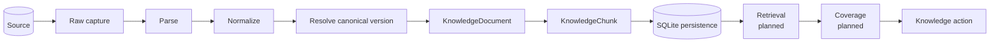

# Tropos

**Every resolution strengthens the next.**

[](https://github.com/kumarchandansingh/tropos/actions/workflows/ci.yml)

Tropos is a governed knowledge-management system for turning resolved support cases into auditable knowledge decisions. The repository is organized as a reusable governed-knowledge core plus domain capabilities such as **Tropos Resolve**.

Tropos Resolve produces one of four actions:

| Action | Meaning |
| --- | --- |
| `REUSE` | Existing knowledge is sufficient. |
| `IMPROVE` | Related knowledge exists but is incomplete. |
| `CREATE` | No adequate knowledge exists. |
| `NO_ACTION` | Closure evidence is insufficient to justify a knowledge change. |

## Status

The deterministic ingestion foundation is implemented through durable local persistence. Retrieval, coverage evaluation, delivery surfaces, and model-assisted behavior remain staged.

| Area | Status |
| --- | --- |
| Raw capture and deterministic parsing for text, Markdown, HTML, and DOCX | Implemented |
| Access policy, normalization, canonical versioning | Implemented |
| Deterministic chunking and evidence lineage | Implemented |
| Synchronous ingestion orchestration and SQLite persistence baseline | Implemented |
| Resolve decision policy and orchestration contracts | Implemented |
| PDF/OCR and richer document parsing | Planned |
| Lexical retrieval | Planned |
| Concrete coverage evaluation and retrieval evals | Planned |
| Embeddings, hybrid retrieval, and LLM assistance | Deferred until the deterministic baseline is measurable |

## Architecture



`IngestKnowledge` coordinates the ingestion stages while parser, normalizer, version resolver, chunker, and persistence adapters keep their own implementation responsibilities. The first persistence adapter uses SQLite for durable source captures, ingestion-run state, canonical versions, chunks, and access state.

The codebase follows a modular-monolith and Ports-and-Adapters design. Reusable evidence, access, parsing, normalization, versioning, chunking, orchestration, and persistence boundaries live in `tropos.core`; support-case-specific policy lives in `tropos.capabilities.resolve`.

See [Architecture overview](docs/architecture/ARCHITECTURE_OVERVIEW.md) for module boundaries and dependency rules.

## Repository

```text
.
├── apps/api/
│   ├── src/tropos/core/
│   ├── src/tropos/capabilities/resolve/
│   └── tests/unit/
├── docs/
└── .github/
```

## Development

The API package requires Python 3.14 and uses `uv`, Ruff, mypy, and pytest.

```bash
cd apps/api
uv sync --dev --locked
uv run ruff format --check .
uv run ruff check .
uv run mypy src tests
uv run pytest
uv build
```

The same quality checks run in GitHub Actions for every pull request and every push to `main`.

## Documentation

Start with [docs/README.md](docs/README.md).

Key documents:

- [Product model](docs/product/PRODUCT_MODEL.md)
- [Architecture overview](docs/architecture/ARCHITECTURE_OVERVIEW.md)
- [Ingestion and normalization](docs/architecture/INGESTION_NORMALIZATION.md)
- [Knowledge model](docs/architecture/KNOWLEDGE_MODEL.md)
- [RAG architecture](docs/architecture/RAG_ARCHITECTURE.md)
- [Evaluation strategy](docs/quality/EVAL_STRATEGY.md)
- [Architecture decisions](docs/decisions/README.md)

## Repository data boundary

Examples and fixtures in this repository are synthetic. Secrets, real customer or support records, confidential employer/client material, and production configuration do not belong in the repository.
