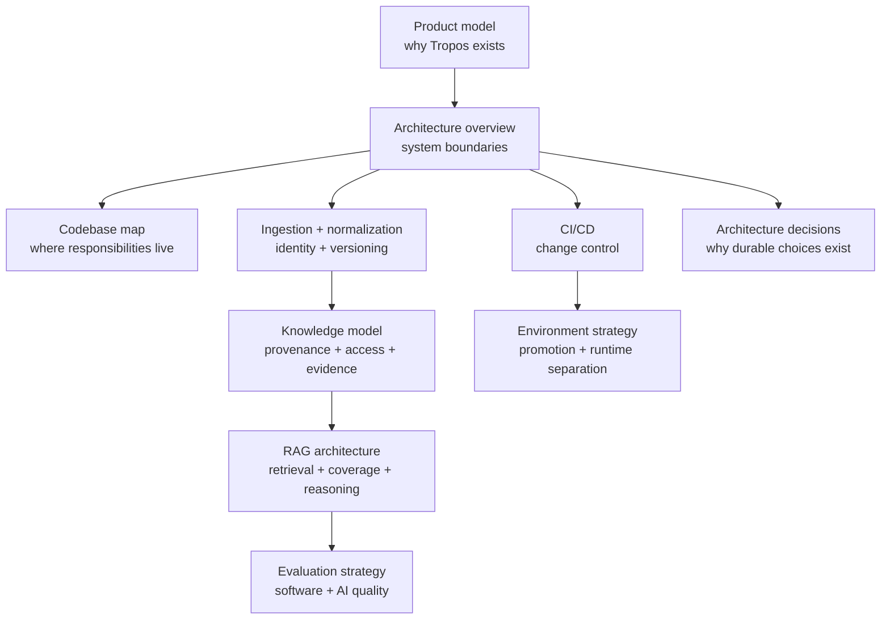
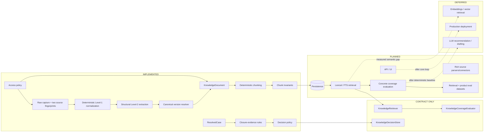

# Tropos Documentation

This is the living knowledge system for Tropos. The goal is not to duplicate code in prose; it is to make the product, architecture, evidence model, quality model and delivery controls understandable enough that a new engineer can reason about the system before changing it.

**Documentation rule:** diagram first, explanation second, executable evidence third.

## System map

## Status legend

Tropos uses these labels consistently so future architecture is not confused with current capability.

| Label | Meaning |
| --- | --- |
| **IMPLEMENTED** | Executable code exists and is covered by current tests/CI where applicable. |
| **CONTRACT ONLY** | A domain/application contract exists, but no production adapter is implemented yet. |
| **PLANNED** | Agreed direction or next-stage design; not executable today. |
| **DEFERRED** | Deliberately postponed until evidence justifies the complexity. |

## Read by question

| If you want to understand... | Read |
| --- | --- |
| What Tropos is solving and how the four knowledge actions work | [`product/PRODUCT_MODEL.md`](product/PRODUCT_MODEL.md) |
| The architecture and dependency direction | [`architecture/ARCHITECTURE_OVERVIEW.md`](architecture/ARCHITECTURE_OVERVIEW.md) |
| Which file owns which responsibility | [`architecture/CODEBASE_MAP.md`](architecture/CODEBASE_MAP.md) |
| How raw capture, normalization and canonical version decisions work | [`architecture/INGESTION_NORMALIZATION.md`](architecture/INGESTION_NORMALIZATION.md) |
| How identity, access, provenance and chunks work | [`architecture/KNOWLEDGE_MODEL.md`](architecture/KNOWLEDGE_MODEL.md) |
| What the current and target RAG pipeline actually are | [`architecture/RAG_ARCHITECTURE.md`](architecture/RAG_ARCHITECTURE.md) |
| What is a unit test vs an AI/RAG evaluation | [`quality/EVAL_STRATEGY.md`](quality/EVAL_STRATEGY.md) |
| How code moves safely into protected `main` | [`delivery/CI_CD.md`](delivery/CI_CD.md) |
| How branches differ from runtime environments | [`delivery/ENVIRONMENT_STRATEGY.md`](delivery/ENVIRONMENT_STRATEGY.md) |
| Why a material architecture choice exists | [`decisions/README.md`](decisions/README.md) |

## Current capability boundary

## Architecture-review questions

Before adding a durable data/retrieval behavior, ask:

1. What happens when the source changes but business meaning does not?
2. What exactly makes a new logical/canonical version?
3. What must be deterministic and replayable?
4. Which provenance must survive the transformation?
5. Can security/access change independently from content?
6. What happens if the processing algorithm itself changes?
7. What invariant must always remain true?
8. Which regression test proves it?
9. What evidence would make us revisit the design?

The normalization/versioning slice is an example of this process: a concrete formatting-only failure scenario exposed that raw source identity and canonical knowledge identity could not remain the same concept.

## Documentation quality standard

Every important document should answer six questions:

1. **What problem does this part of the system solve?**
2. **What exists today?**
3. **What is only planned/deferred?**
4. **What invariant must remain true?**
5. **What failure mode is the design preventing?**
6. **Where is the executable evidence?**

Theory is useful only when it explains a concrete Tropos decision. Ideas currently applied include C4-style views, modular-monolith boundaries, Ports-and-Adapters/Hexagonal architecture, lightweight DDD, provenance/lineage, canonicalization, content-addressable integrity, idempotent processing, evolutionary architecture, architecture fitness functions, shift-left quality, continuous integration, ADRs and progressive delivery.

## Maintenance rule

When a PR changes a boundary, invariant, normalization/versioning rule, retrieval strategy, persistence model, access semantics, evaluation gate or release model, update the relevant living document in the same PR. If the change represents a durable architecture decision, add or update an ADR as well.
