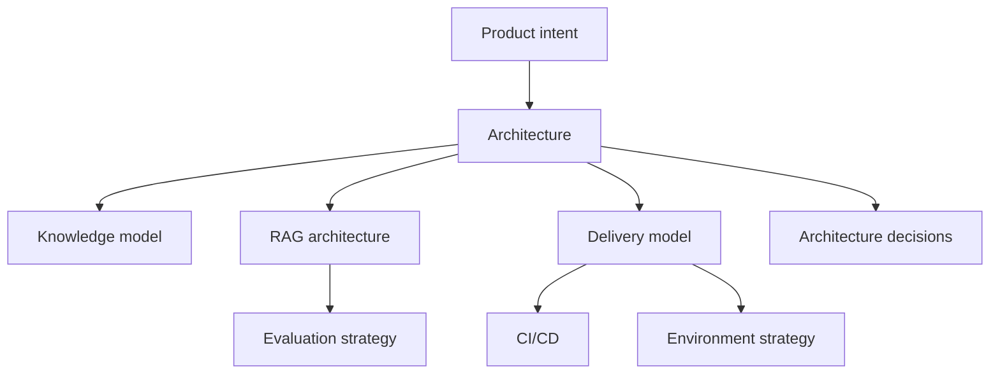
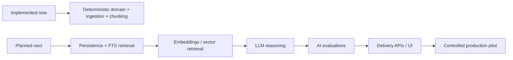

# Tropos Knowledge Map

Tropos documentation is part of the product, not a separate afterthought. These documents explain what the system is, how it is structured, why key decisions were made, how changes move safely toward production, and how quality is measured.

## How to read the docs

| Need | Start here |
| --- | --- |
| Understand the system | `architecture/ARCHITECTURE_OVERVIEW.md` |
| Understand source, evidence, chunks, and lineage | `architecture/KNOWLEDGE_MODEL.md` |
| Understand retrieval and future RAG evolution | `architecture/RAG_ARCHITECTURE.md` |
| Understand deterministic tests vs AI evaluations | `quality/EVAL_STRATEGY.md` |
| Understand GitHub quality gates | `delivery/CI_CD.md` |
| Understand Development → UAT/Staging → Production | `delivery/ENVIRONMENT_STRATEGY.md` |
| Understand why an architecture choice exists | `decisions/` |

## Documentation design principles

1. **Diagram first, prose second.** Important flows should be visible before they are explained.
2. **Theory → practice → Tropos.** Each architecture document connects established engineering ideas to the concrete repository implementation.
3. **Living, not historical.** Update the relevant document in the same change that changes the architecture.
4. **Evidence over assertion.** Link architectural claims to code, tests, evaluations, ADRs, or release evidence.
5. **Progressive depth.** Start with the overview, then move to component-level and playbook-level detail.

## Theory stack used by Tropos

| Theory / practice | Tropos use |
| --- | --- |
| C4 model | Context, container, and component views |
| Hexagonal / Ports-and-Adapters architecture | Keeps domain and use cases independent of infrastructure |
| Domain-driven design, lightweight | Gives business concepts explicit names and boundaries |
| Architecture Decision Records | Preserves context, options, decisions, and consequences |
| Shift-left quality | Runs deterministic checks before integration |
| Continuous Integration | Re-validates every proposed change in GitHub |
| RAG evaluation | Measures retrieval and grounded answer quality separately from code correctness |
| Progressive delivery | Development → UAT/Staging → Production with controlled promotion and rollback |

## Current reality versus target state

Tropos is intentionally documenting **implemented**, **planned**, and **deferred** capabilities separately.

The docs must not describe planned components as if they already exist.
