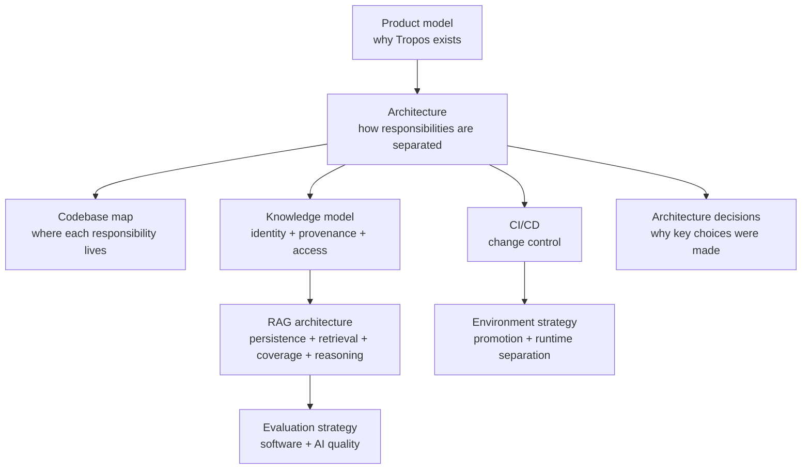
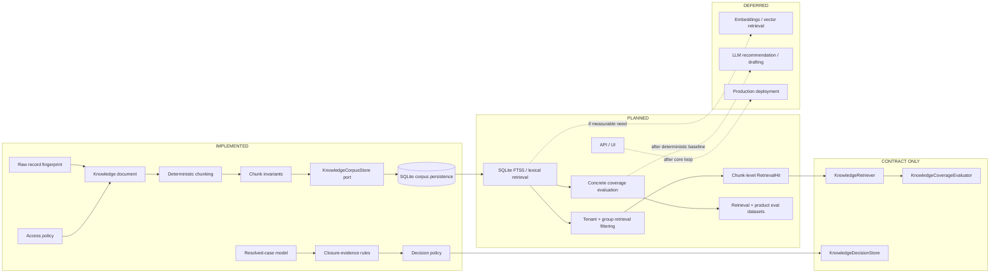

# Tropos Documentation

This is the living knowledge system for Tropos. The goal is not to duplicate the code in prose; it is to make the product, architecture, evidence model, quality model and delivery controls understandable enough that a new engineer can reason about the system before changing it.

**Documentation rule:** diagram first, explanation second, code evidence third.

## System map

## Status legend

Tropos uses these labels consistently so future architecture is not confused with current capability.

| Label | Meaning |
| --- | --- |
| **IMPLEMENTED** | Executable code exists in the repository and is covered by current tests/CI where applicable. |
| **CONTRACT ONLY** | A domain/application contract exists, but no production adapter is implemented yet. |
| **PLANNED** | Agreed direction or next-stage design; not executable today. |
| **DEFERRED** | Deliberately postponed until evidence justifies the complexity. |

## Read by question

| If you want to understand... | Read |
| --- | --- |
| What Tropos is solving and how the four knowledge actions work | [`product/PRODUCT_MODEL.md`](product/PRODUCT_MODEL.md) |
| The architecture and dependency direction | [`architecture/ARCHITECTURE_OVERVIEW.md`](architecture/ARCHITECTURE_OVERVIEW.md) |
| Which file owns which responsibility | [`architecture/CODEBASE_MAP.md`](architecture/CODEBASE_MAP.md) |
| How source identity, access, provenance, chunks and persistence work | [`architecture/KNOWLEDGE_MODEL.md`](architecture/KNOWLEDGE_MODEL.md) |
| What the current and target RAG pipeline actually are | [`architecture/RAG_ARCHITECTURE.md`](architecture/RAG_ARCHITECTURE.md) |
| What is a unit test vs an AI/RAG evaluation | [`quality/EVAL_STRATEGY.md`](quality/EVAL_STRATEGY.md) |
| How code moves safely into protected `main` | [`delivery/CI_CD.md`](delivery/CI_CD.md) |
| How branches differ from runtime environments | [`delivery/ENVIRONMENT_STRATEGY.md`](delivery/ENVIRONMENT_STRATEGY.md) |
| Why a material architecture choice exists | [`decisions/README.md`](decisions/README.md) |

## Current capability boundary

## Documentation quality standard

Every important document should answer six questions:

1. **What problem does this part of the system solve?**
2. **What exists today?**
3. **What is only planned?**
4. **What invariant must remain true?**
5. **What failure mode is the design preventing?**
6. **Where is the executable evidence in the repository?**

Theory is useful only when it explains a concrete Tropos decision. The main ideas currently in use are C4-style system views, modular-monolith boundaries, Hexagonal / Ports-and-Adapters architecture, lightweight domain-driven design, provenance/lineage, content-addressable integrity, transactional persistence, shift-left quality, continuous integration, and progressive delivery.

## Maintenance rule

When a PR changes a boundary, invariant, persistence model, retrieval strategy, access semantics, evaluation gate or release model, update the relevant living document in the same PR. If the change represents a durable architecture decision, add or update an ADR as well.
