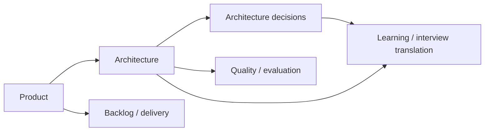

# Tropos documentation

This documentation is organized by **decision purpose**, not by implementation date. Each question should have one canonical place to answer it.

## Start here

| Question | Canonical document |
| --- | --- |
| What is Tropos as a product? | [Tropos platform](product/TROPOS_PLATFORM.md) |
| What does Resolve do? | [Resolve](product/RESOLVE.md) |
| What does Training do? | [Training](product/TRAINING.md) |
| What has already been built and why? | [Build history](product/BUILD_HISTORY.md) |
| What is the current technical architecture? | [Architecture overview](architecture/ARCHITECTURE_OVERVIEW.md) |
| Why were durable design choices made? | [Architecture decisions](decisions/README.md) |
| How is quality/evaluation designed? | [Evaluation strategy](quality/EVAL_STRATEGY.md) |
| What is planned next? | [Master backlog](product/master-backlog.md) |
| How is delivery governed? | [Delivery governance](product/delivery-governance.md) |
| Where are live delivery metrics? | [Delivery metrics](product/delivery-metrics.md) |

## Documentation model

```mermaid
flowchart LR
    Product[Product]
    --> Architecture[Architecture]
    Architecture --> ADR[Architecture decisions]
    Architecture --> Quality[Quality / evaluation]
    Product --> Backlog[Backlog / delivery]
    ADR --> Learning[Learning / interview translation]
    Architecture --> Learning
```

### Product

Product documents define user problems, capability boundaries, product principles, current product maturity, and roadmap.

- [Product entry point](product/PRODUCT_MODEL.md)
- [Tropos platform](product/TROPOS_PLATFORM.md)
- [Resolve](product/RESOLVE.md)
- [Training](product/TRAINING.md)
- [Build history](product/BUILD_HISTORY.md)
- [Master backlog](product/master-backlog.md)

### Architecture

Architecture documents describe the system **as it exists now**. They should not present already implemented features as future work.

- [Architecture overview](architecture/ARCHITECTURE_OVERVIEW.md)
- [Codebase map](architecture/CODEBASE_MAP.md)
- [Source integration](architecture/SOURCE_INTEGRATION.md)
- [Connector reliability](architecture/CONNECTOR_RELIABILITY.md)
- [Ingestion and normalization](architecture/INGESTION_NORMALIZATION.md)
- [Knowledge model](architecture/KNOWLEDGE_MODEL.md)
- [RAG architecture](architecture/RAG_ARCHITECTURE.md)
- [Knowledge Article architecture](architecture/KNOWLEDGE_ARTICLE.md)
- [Evaluation contracts](architecture/EVALUATION_CONTRACTS.md)
- [Evaluation runs](architecture/EVALUATION_RUNS.md)

### Architecture decisions

[Architecture Decision Records](decisions/README.md) preserve durable choices, alternatives, consequences, evidence, and revisit triggers. An accepted ADR remains historical evidence even after a later ADR supersedes it.

### Quality and delivery

- [Evaluation strategy](quality/EVAL_STRATEGY.md)
- [CI/CD](delivery/CI_CD.md)
- [Environment strategy](delivery/ENVIRONMENT_STRATEGY.md)
- [Delivery governance](product/delivery-governance.md)
- [Delivery metrics](product/delivery-metrics.md)

### Learning

Learning material explains concepts, trade-offs and interview translation. It is **not** the authoritative implementation-status source.

- [Learning track](learning/README.md)
- [Decision & trade-off matrix](learning/DECISION_TRADEOFFS.md)
- [Dense Retrieval V1](learning/DENSE_RETRIEVAL_V1.md)
- [Hybrid Retrieval V1](learning/HYBRID_RETRIEVAL_V1.md)
- [Evaluation evidence](learning/EVALUATION_EVIDENCE.md)
- [Enterprise knowledge systems interview guide](learning/ENTERPRISE_KNOWLEDGE_SYSTEMS_INTERVIEW_GUIDE.md)

## Status vocabulary

| Status | Meaning |
| --- | --- |
| **Implemented** | Executable behavior exists in the repository |
| **Implemented baseline / V1** | Executable but deliberately bounded; not production-complete |
| **Contract only** | Stable interface/domain contract exists without the concrete production adapter |
| **Planned** | Prioritized or intended work with no executable implementation |
| **Deferred** | Intentionally postponed until an explicit trigger/evidence justifies it |

## Source-of-truth hierarchy

When documents disagree, reconcile them using this order:

1. executable code and tests establish what behavior exists;
2. living architecture describes the intended current technical state;
3. ADRs explain why durable choices were made;
4. product documents describe capability/product state;
5. backlog/issues describe future work;
6. learning documents explain concepts and may preserve older design discussion.

Stale documentation is a defect. A feature PR that materially changes product capability, architecture, quality boundaries, or a durable trade-off should update the relevant document in the same delivery slice.

## Documentation completeness rule for future builds

A material build should leave behind:

- current product/capability status;
- architecture/runtime change;
- key alternatives and selected trade-off;
- downside/cost;
- revisit trigger;
- tests/evaluation evidence;
- backlog status;
- ADR when the decision is durable.

See [Build history](product/BUILD_HISTORY.md) for the implementation chronology and [Decision & trade-off matrix](learning/DECISION_TRADEOFFS.md) for reusable reasoning.

## Glossary and diagrams

- [Technical glossary](GLOSSARY.md)
- [Archify diagrams](diagrams/archify/README.md)

## Katharo companion project

Katharo has separate documentation under [katharo/docs](../katharo/docs/README.md). Its local cleanup/review workflow is not part of the Tropos ingestion or product architecture.
