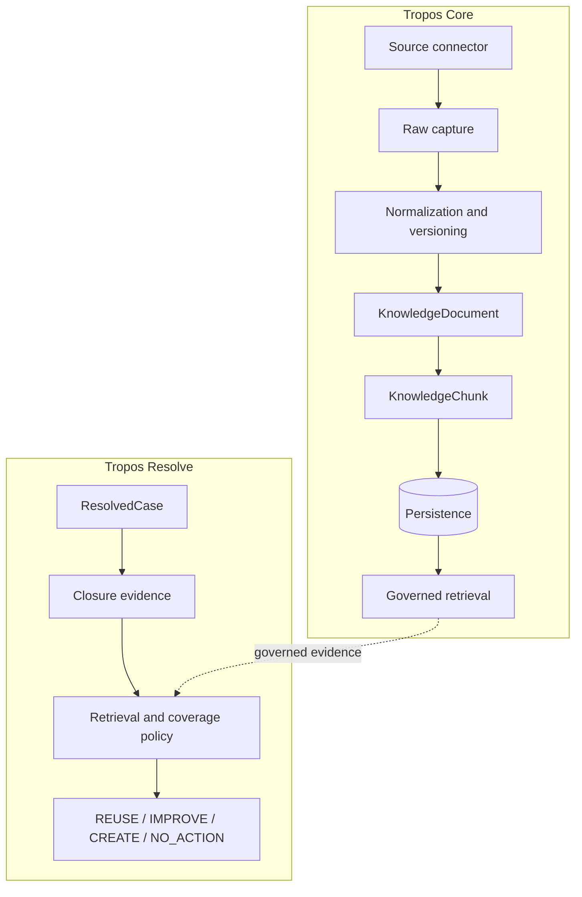
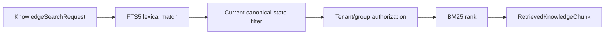

```mermaid
flowchart LR
    Source[(Source system)]
    --> Connector[KnowledgeSourceConnector]
    --> Capture[SourceCapture]
    --> Raw[RawKnowledgeRecord]
    --> Parse[KnowledgeParser]
    --> Extract[ExtractedKnowledgeText]
    --> Norm[Deterministic normalization]
    --> Version[Canonical version resolution]
    --> Doc[KnowledgeDocument]
    --> Chunk[KnowledgeChunk]
    --> Store[(SQLite)]
```

# Architecture overview

Tropos is a modular monolith with Ports-and-Adapters boundaries. The architecture separates reusable governed-knowledge mechanics from capability-specific policy and keeps infrastructure dependencies outside the domain model.

## Module boundaries

`tropos.core` owns reusable source integration, evidence identity, access, parsing, normalization, versioning, chunking, persistence, and retrieval contracts/adapters. `tropos.capabilities.resolve` owns support-case workflow and knowledge-action policy.

## Dependency direction

Domain and application policy do not depend on database sessions, search engines, model SDKs, web frameworks, or source-system clients. Those dependencies belong in adapters or outer composition layers.

## Current implementation

| Boundary | Responsibility | Status |
| --- | --- | --- |
| Core domain | Access policy, canonical knowledge documents, governed chunks | Implemented |
| Core application | Source-capture contracts, ingestion orchestration, normalization/version contracts, retrieval contracts | Implemented |
| Source adapters | Local-file source capture | Implemented |
| Source reliability | Explicit failure taxonomy and bounded retry/backoff decorator | Implemented |
| Parsing adapters | Deterministic plain-text, Markdown, HTML, and DOCX parsing | Implemented |
| Processing adapters | Deterministic normalizer and deterministic chunker | Implemented |
| Persistence | SQLite source/run/canonical document/version/chunk storage | Implemented |
| Retrieval | SQLite FTS5/BM25 over current tenant/group-authorized chunks | Implemented |
| Resolve domain | Resolved-case and knowledge-action policy | Implemented |
| Resolve application | Closure-evaluation orchestration and retrieval/coverage/store ports | Implemented contracts and orchestration |
| Resolve-to-core retrieval adapter | Translate a resolved case into the reusable core search contract | Planned |
| External connectors | SharePoint, Gmail, Jira, Confluence, and similar sources | Planned |
| Coverage | Concrete coverage evaluator | Planned |
| Retrieval evaluation | Labeled query/evidence set and ranking metrics | Planned |
| Model assistance | Embeddings, hybrid retrieval, LLM reasoning/drafting | Deferred until baseline evaluation |
| Presentation/deployment | API, UI, hosted environments | Planned |

## Source and ingestion boundary

Source acquisition and content-format parsing are intentionally separate. A SharePoint connector and a Gmail connector may both produce HTML; they should reuse the same HTML parser rather than duplicating parsing behavior. Conversely, one source system may expose several formats without changing the ingestion orchestrator.

This pipeline keeps these concerns separate:

- source-system acquisition and native identity;
- exact source evidence;
- format interpretation;
- canonical content identity;
- access/governance state;
- normalization strategy;
- chunking strategy;
- durable persistence.

See [Source integration](SOURCE_INTEGRATION.md) for connector boundaries and [Ingestion and normalization](INGESTION_NORMALIZATION.md) for canonicalization/version rules.

## Retrieval boundary

The first retrieval adapter is deliberately lexical. It searches persisted chunks, excludes historical versions by joining against current `knowledge_state`, and applies tenant/group access constraints inside the SQL query before evidence is returned. The strategy is explicitly identified as `sqlite-fts5-bm25-v1` so later retrieval evaluations can be tied to concrete behavior.

See [RAG architecture](RAG_ARCHITECTURE.md) for retrieval semantics and the path toward evaluation and hybrid retrieval.

## Responsibility table

| Layer | Owns | Excludes |
| --- | --- | --- |
| Core domain | Evidence and access invariants | Vendor SDKs, persistence, HTTP clients |
| Core application | Core use cases and replaceable contracts | Vendor-specific behavior |
| Core adapters | Source integrations, deterministic algorithms, persistence and retrieval implementations | Capability-specific policy |
| Capability domain | Capability vocabulary and business rules | Infrastructure |
| Capability application | Capability orchestration | Vendor-specific infrastructure |
| Presentation/bootstrap | Request translation and dependency wiring | Domain decisions |

Presentation/bootstrap are target boundaries; no production API or runtime composition layer exists yet.

## Architectural guarantees

The implemented foundation maintains these guarantees:

1. New source connectors can enter through a stable capture contract without adding source-specific branches to `IngestKnowledge`.
2. Source acquisition is separate from content-format parsing.
3. Raw source identity is separate from canonical content identity.
4. Normalization and version resolution are deterministic and strategy-versioned.
5. Presentation-only changes do not create canonical content versions.
6. Access changes remain independently observable from content changes.
7. Canonical fingerprints and canonical text derive from the same normalized structure.
8. Core retrieval returns only current evidence authorized for the supplied tenant/group context.
9. Retrieval evidence remains traceable to canonical content and captured source state.
10. Capability policy remains isolated from reusable core mechanics.

Changes to these guarantees require an architecture decision record.

## Related documents

- [Codebase map](CODEBASE_MAP.md)
- [Source integration](SOURCE_INTEGRATION.md)
- [Ingestion and normalization](INGESTION_NORMALIZATION.md)
- [Knowledge model](KNOWLEDGE_MODEL.md)
- [RAG architecture](RAG_ARCHITECTURE.md)
- [Architecture decisions](../decisions/README.md)
