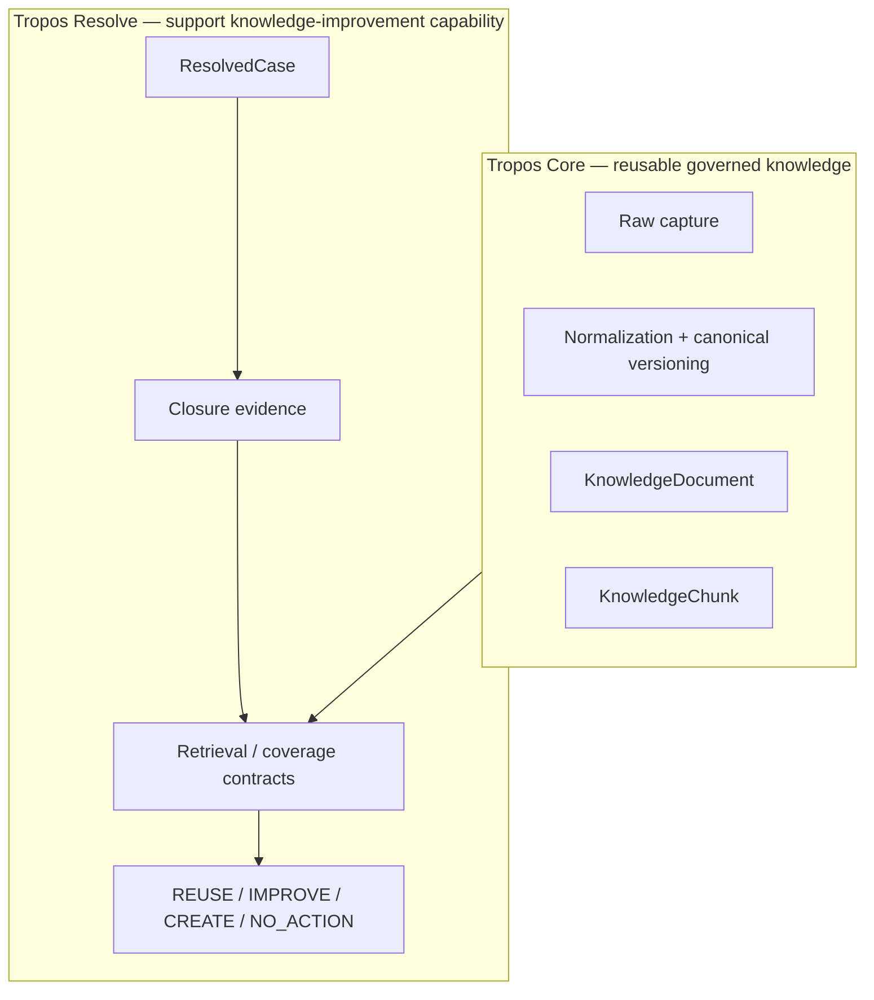
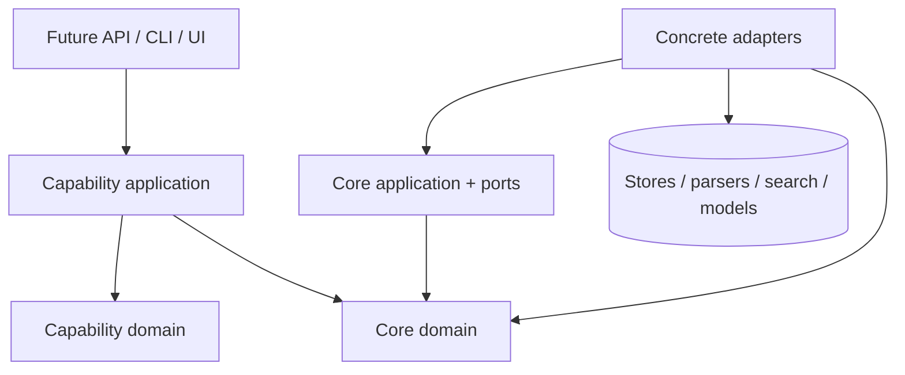
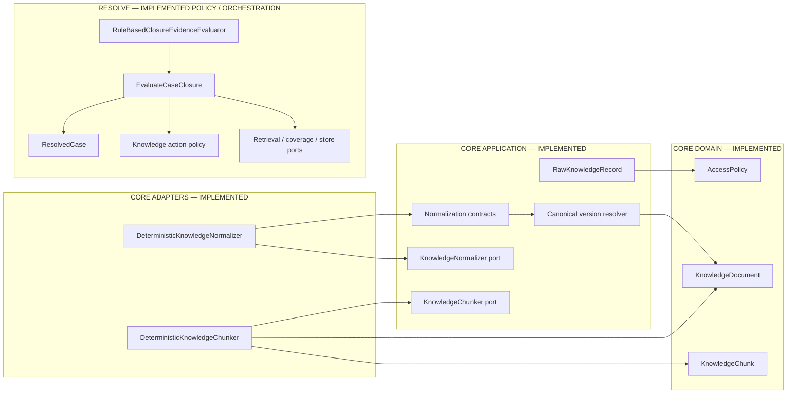
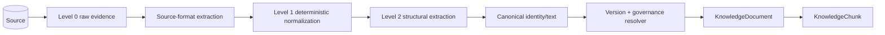
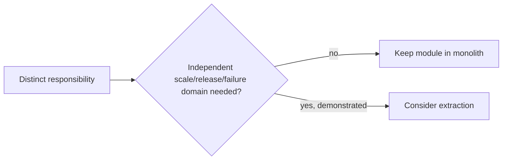
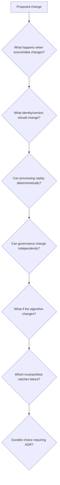
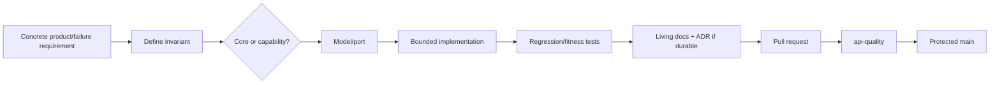

# Architecture Overview

## Architecture goal

Tropos must evolve from deterministic governed knowledge processing into retrieval- and AI-assisted behavior without letting infrastructure choices become the business model. The architecture separates **reusable core evidence mechanics**, **capability-specific policy**, **orchestration/contracts**, and **replaceable implementations**.

The current shape is a **modular monolith** using Ports-and-Adapters / Hexagonal architecture with lightweight domain-driven design.

## Product/module boundary

Core owns reusable evidence identity, access, normalization and chunking. `capabilities/resolve` owns the support-case workflow and decision vocabulary.

## Dependency direction

The governing rule remains:

> Business/domain policy does not import databases, vector stores, model SDKs, web frameworks or source-system clients.

## Current executable architecture

### Deliberate non-claims

Production adapters for persistence, lexical retrieval, knowledge coverage and decision storage do not exist yet. Rich PDF/DOCX/HTML parsers, vector retrieval, LLM adapters, API/UI and production deployment are also not implemented.

## Ingestion boundary in detail

This boundary now explicitly separates:

- exact source evidence;
- source-envelope identity;
- canonical logical content identity;
- access/governance state;
- normalization strategy;
- chunking strategy.

See `INGESTION_NORMALIZATION.md` for the full design.

## Why modular monolith now

Tropos has conceptual boundaries but not independent operational workloads that justify service extraction. Separate services would introduce networking, deployment, tracing, consistency and contract costs before there is evidence of independent scaling/release needs.

## Responsibility model

| Boundary | Owns | Must not own |
| --- | --- | --- |
| Core domain | evidence/access invariants | SDKs, persistence sessions, HTTP clients |
| Core application | ingestion/version policies and replaceable core contracts | vendor-specific parser/store/search behavior |
| Core adapters | deterministic algorithms and future integrations | hidden capability policy |
| Capability domain | capability vocabulary/policy (`Resolve`) | infrastructure |
| Capability application | capability use-case sequencing | vendor-specific infrastructure |
| Presentation/bootstrap | request translation and wiring | domain decisions |

Presentation/bootstrap remain target boundaries.

## Architecture invariants

Unless an ADR changes them:

1. Reusable governed-knowledge concepts stay in `core`; capability-specific behavior stays under `capabilities/<name>`.
2. Domain policy remains infrastructure-independent.
3. Raw source identity and canonical content identity remain separate.
4. Normalization/versioning is deterministic and strategy-versioned.
5. Presentation-only changes do not create canonical content versions.
6. Access/governance can change independently from content and must propagate before retrieval.
7. Canonical fingerprint and canonical text derive from the same normalized structure.
8. Retrieval evidence remains traceable through canonical content to captured source state.
9. AI outputs, when introduced, cross typed/validated contracts before affecting governed state.
10. `main` represents integrated code protected by CI; deployment-environment promotion is separate.

## Failure-oriented architecture review

For any material slice, ask these before choosing components:

This is the mechanism that turned the formatting-only/version-churn scenario into ADR-004, explicit normalization contracts and regression tests.

## Failure modes this architecture prevents

- source-system version IDs becoming the canonical business identity;
- formatting-only edits causing index/embedding churn;
- access changes waiting for content changes;
- model/vendor types leaking into the domain;
- generated text becoming hidden policy;
- vector rows becoming the only evidence/provenance store;
- algorithm changes silently rewriting identity;
- capability-specific concepts polluting reusable core abstractions.

## Current executable evidence

| Concern | Evidence |
| --- | --- |
| Core access/evidence invariants | `apps/api/src/tropos/core/domain/` + `tests/unit/core/domain/` |
| Raw identity | `core/application/ingestion/raw_record.py` + tests |
| Normalization/canonical versioning | `core/application/ingestion/{normalization,versioning}.py`, `core/adapters/normalization/` + tests |
| Governed chunking | `core/adapters/chunking/deterministic.py` + tests |
| Resolve orchestration/policy | `capabilities/resolve/` + tests |
| Architecture decisions | `docs/decisions/ADR-001..004` |
| Integration control | `.github/workflows/ci.yml` + protected `main` |

## Safe extension pattern

