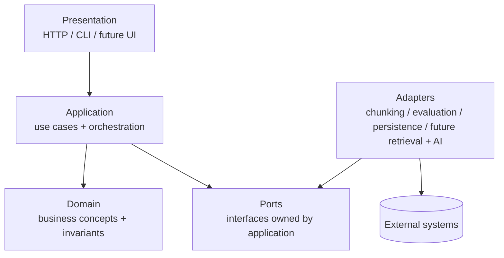
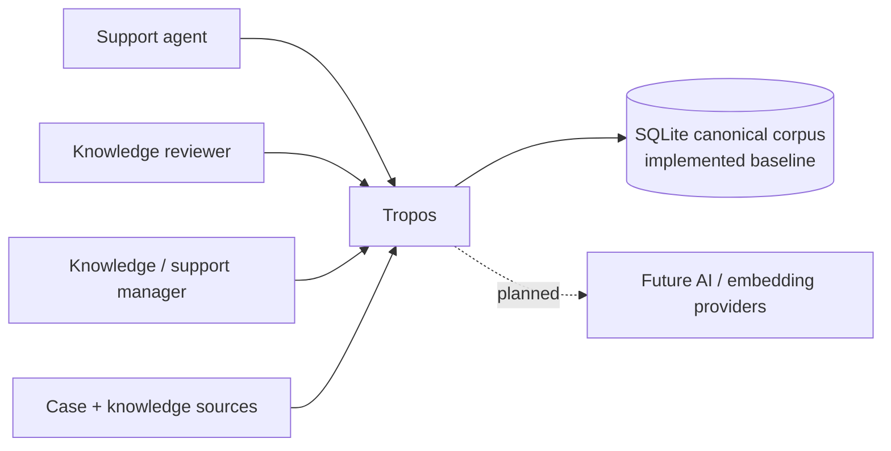
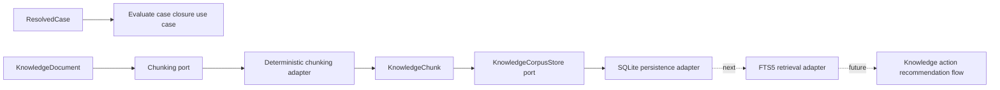
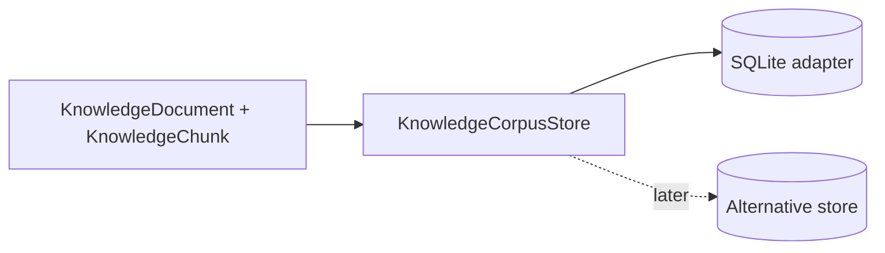
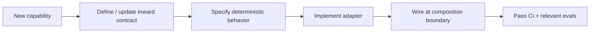

# Architecture Overview

## Purpose

Tropos is a governed knowledge-management system that learns from resolved support cases. The first product capability, **Tropos Resolve**, recommends `REUSE`, `IMPROVE`, `CREATE`, or `NO_ACTION` and preserves the evidence needed for human review, evaluation, and audit.

## Theory foundation

Tropos uses a **modular monolith** with **Hexagonal / Ports-and-Adapters architecture** and lightweight domain-driven design.

The governing dependency rule is:

> Business policy points inward; infrastructure points outward through interfaces.

## C4-style system context

## Current implementation

The repository currently implements a deterministic core plus the first persistence adapter:

- domain concepts for resolved cases, access policy, knowledge, knowledge chunks, and knowledge actions;
- application use cases and ports;
- raw-record ingestion structures;
- deterministic chunking with exact offsets, stable fingerprints, inherited access policy, and source lineage;
- rule-based closure-evidence evaluation;
- `KnowledgeCorpusStore` as the application-owned persistence contract;
- `SQLiteKnowledgeCorpusStore` as the baseline concrete corpus store;
- atomic replacement of the current document/chunk snapshot per `knowledge_id`;
- unit tests around implemented capabilities.

Lexical retrieval, permission-filtered search, concrete coverage evaluation, LLM reasoning, HTTP APIs, UI and runtime deployment are **planned**, not yet implemented.

## Component view

## Why this architecture

| Requirement | Architectural response |
| --- | --- |
| Replace infrastructure without rewriting business rules | Ports + adapters |
| Make knowledge decisions auditable | Explicit domain objects and provenance |
| Persist evidence without making database rows the domain model | `KnowledgeCorpusStore` port + SQLite adapter |
| Evolve from deterministic rules to AI gradually | Separate application contracts from implementations |
| Keep an early-stage codebase simple | Modular monolith rather than distributed services |
| Test business logic cheaply | Pure domain/application logic with adapter boundaries |

## Persistence boundary

SQLite is currently an **adapter choice**, not a domain assumption.

The persisted corpus represents the current retrieval-ready snapshot. It is not an append-only source archive. When a newer canonical version is saved, document and chunk replacement occurs atomically while version/provenance fields remain explicit on the reloaded domain objects.

## Design rules

1. Domain code must not import infrastructure frameworks, database modules, or SDKs.
2. Application use cases depend on ports, not concrete persistence, retrieval, or AI implementations.
3. Adapters satisfy contracts defined inward of them.
4. Source provenance and access policy travel with knowledge through processing and persistence stages.
5. Persistence round-trips must reconstruct valid domain objects rather than expose database records as business objects.
6. AI output must become a validated domain/application contract before it can affect governed state.
7. Architecture changes require an ADR when they change a boundary, dependency direction, persistence strategy, retrieval strategy, or release model.

## Trade-offs

Ports-and-adapters adds interfaces and files compared with a small script. Tropos accepts that cost because persistence, retrieval, source connectors, and AI providers are expected to change independently over time.

The SQLite baseline deliberately chooses a dependency-free, inspectable persistence mechanism for the current single-process stage. The cost is that migration management, concurrency, hosted operation and production scaling are not solved yet. Those concerns should be addressed when a deployable runtime and workload justify them rather than hidden behind premature infrastructure.

## Failure modes this structure is intended to prevent

- database logic leaking into business decisions;
- SQLite row shapes becoming the canonical domain model;
- stale chunks surviving when a newer canonical document snapshot replaces them;
- source/access metadata disappearing during persistence;
- replacing retrieval requiring broad rewrites;
- prompts becoming hidden business policy;
- AI output bypassing validation;
- provenance being lost during transformation.

## How to extend safely

When adding a new external technology, first ask whether Tropos needs a new business concept, a new application port, or only a new adapter.
