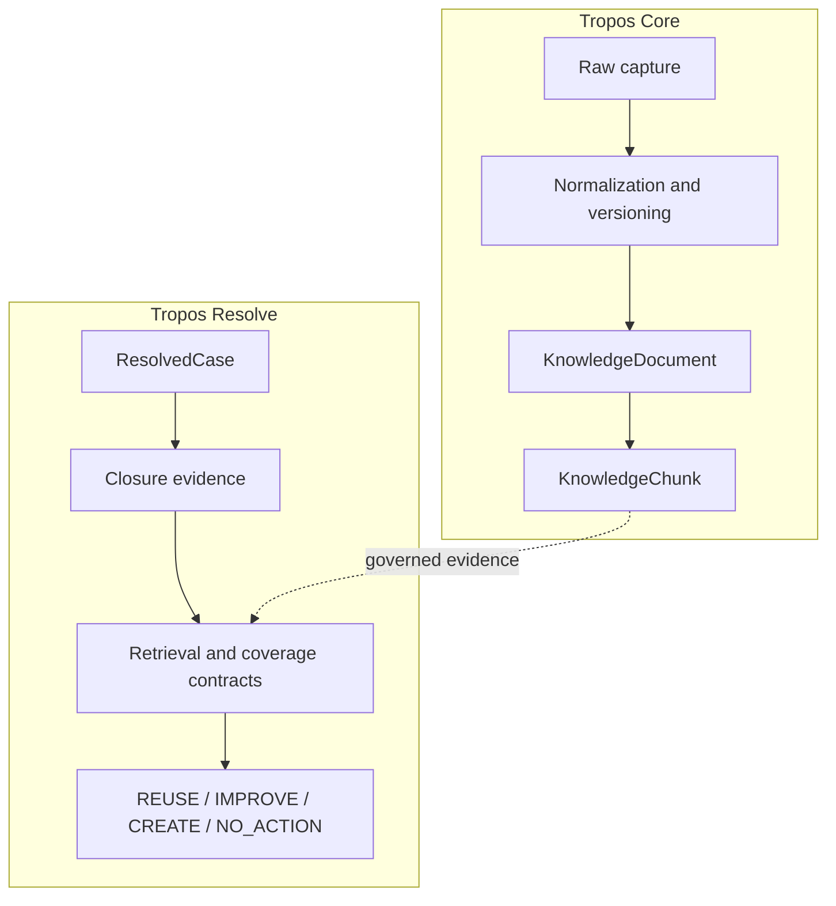
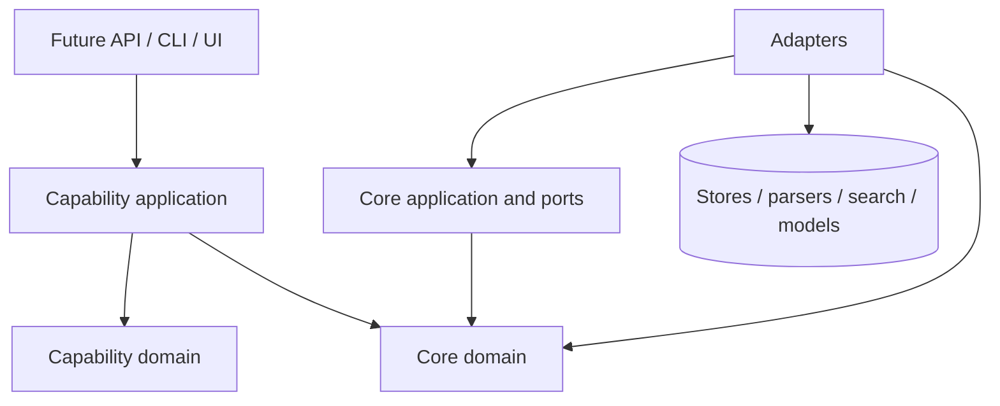
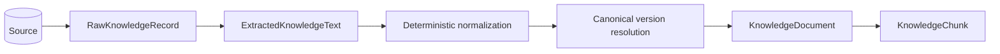

# Architecture overview

Tropos is a modular monolith with Ports-and-Adapters boundaries. The architecture separates reusable governed-knowledge mechanics from capability-specific policy and keeps infrastructure dependencies outside the domain model.

## Module boundaries

`tropos.core` owns reusable evidence identity, access, normalization, versioning, and chunking. `tropos.capabilities.resolve` owns support-case workflow and knowledge-action policy.

## Dependency direction

Domain and application policy do not depend on database sessions, search engines, model SDKs, web frameworks, or source-system clients. Those dependencies belong in adapters or outer composition layers.

## Current implementation

| Boundary | Responsibility | Status |
| --- | --- | --- |
| Core domain | Access policy, canonical knowledge documents, governed chunks | Implemented |
| Core application | Raw ingestion contracts, normalization contracts, version resolution | Implemented |
| Core adapters | Deterministic normalizer and deterministic chunker | Implemented |
| Resolve domain | Resolved-case and knowledge-action policy | Implemented |
| Resolve application | Closure-evaluation orchestration and retrieval/coverage/store ports | Implemented contracts and orchestration |
| Persistence | Canonical document/version/chunk storage | Planned |
| Retrieval | Lexical search and retrieval adapter | Planned |
| Coverage | Concrete coverage evaluator | Planned |
| Model assistance | Embeddings, hybrid retrieval, LLM reasoning/drafting | Deferred until baseline evaluation |
| Presentation/deployment | API, UI, hosted environments | Planned |

## Ingestion boundary

This pipeline keeps five concerns separate:

- exact source evidence;
- canonical content identity;
- access/governance state;
- normalization strategy;
- chunking strategy.

See [Ingestion and normalization](INGESTION_NORMALIZATION.md) for the data contracts and version rules.

## Responsibility table

| Layer | Owns | Excludes |
| --- | --- | --- |
| Core domain | Evidence and access invariants | Vendor SDKs, persistence, HTTP clients |
| Core application | Core use cases and replaceable contracts | Vendor-specific behavior |
| Core adapters | Deterministic algorithms and integrations | Capability-specific policy |
| Capability domain | Capability vocabulary and business rules | Infrastructure |
| Capability application | Capability orchestration | Vendor-specific infrastructure |
| Presentation/bootstrap | Request translation and dependency wiring | Domain decisions |

Presentation/bootstrap are target boundaries; no production API or runtime composition layer exists yet.

## Architectural guarantees

The implemented foundation maintains these guarantees:

1. Raw source identity is separate from canonical content identity.
2. Normalization and version resolution are deterministic and strategy-versioned.
3. Presentation-only changes do not create canonical content versions.
4. Access changes remain independently observable from content changes.
5. Canonical fingerprints and canonical text derive from the same normalized structure.
6. Retrieval evidence remains traceable to canonical content and captured source state.
7. Capability policy remains isolated from reusable core mechanics.

Changes to these guarantees require an architecture decision record.

## Related documents

- [Codebase map](CODEBASE_MAP.md)
- [Ingestion and normalization](INGESTION_NORMALIZATION.md)
- [Knowledge model](KNOWLEDGE_MODEL.md)
- [RAG architecture](RAG_ARCHITECTURE.md)
- [Architecture decisions](../decisions/README.md)
