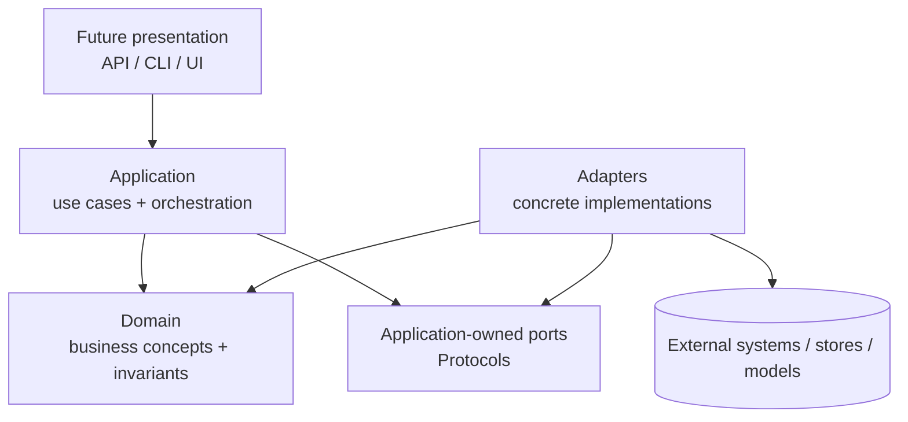
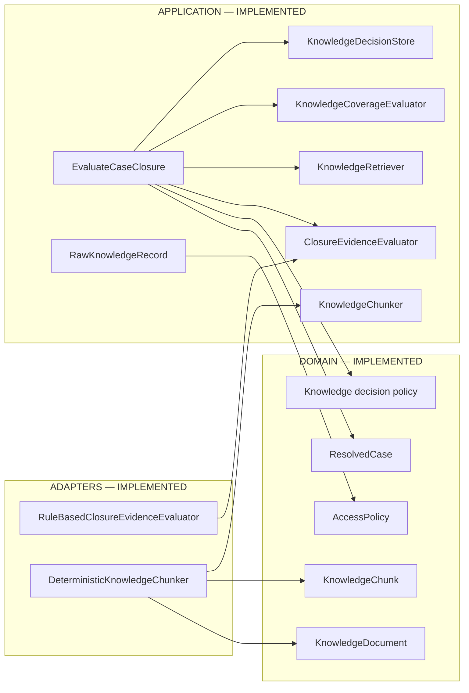
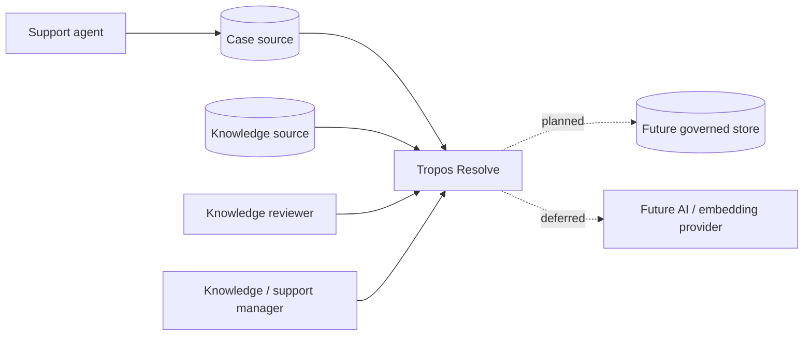
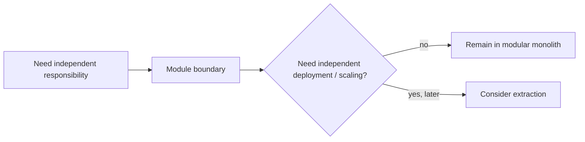
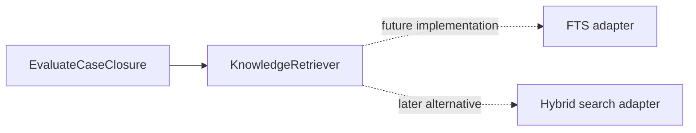
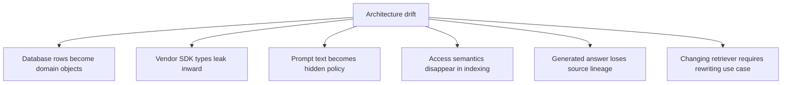
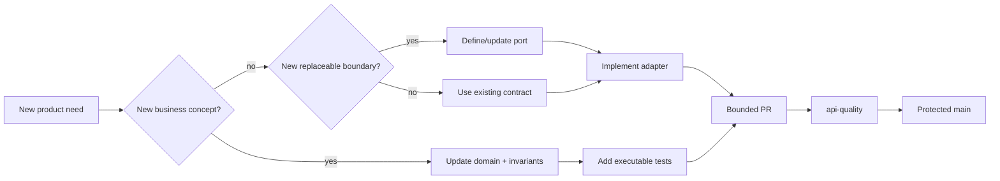

# Architecture Overview

## Architecture goal

Tropos needs to evolve from deterministic rules into retrieval- and AI-assisted behavior without letting infrastructure choices become the business model. The architecture therefore separates **policy**, **orchestration**, **contracts**, and **replaceable implementations**.

The current shape is a **modular monolith** using **Ports-and-Adapters / Hexagonal architecture** with lightweight domain-driven design.

## Dependency direction

The important rule is not the folder structure; it is the **direction of dependency**:

> Business policy does not import databases, vector stores, model SDKs, web frameworks, or source-system clients.

## Current executable architecture

### What this diagram deliberately does not imply

`KnowledgeRetriever`, `KnowledgeCoverageEvaluator`, and `KnowledgeDecisionStore` are currently **contracts**, not production adapters. There is no persistent knowledge repository, lexical index, vector database, LLM adapter, API server, or UI in the codebase today.

## C4-style system context

## Why a modular monolith now

Tropos has multiple conceptual boundaries, but not multiple independent operational workloads yet. Splitting them into services today would add deployment, networking, tracing, consistency and contract-management cost without product evidence that those services need to scale or release independently.

The modular monolith preserves internal separation while keeping execution and testing simple.

## Responsibility model

| Layer | Owns | Must not own |
| --- | --- | --- |
| Domain | business vocabulary, invariants, deterministic decision policy | SDKs, database sessions, HTTP clients |
| Application | use-case sequencing and ports | vendor-specific persistence/retrieval logic |
| Adapters | concrete algorithms and external integration behavior | hidden business policy |
| Presentation | translating external requests into application calls | core decisions |
| Composition/bootstrap | wiring concrete adapters to ports | domain behavior |

The last two rows are target boundaries; presentation/bootstrap modules are not yet implemented.

## Architecture rule in one example

`EvaluateCaseClosure` knows that knowledge must be retrieved, coverage assessed, and a decision saved. It does **not** know whether retrieval uses SQLite FTS, PostgreSQL, OpenSearch, embeddings, or a remote service.

This is the Dependency Inversion Principle applied at the product boundary that is expected to change.

## Architecture invariants

The following should remain true unless an ADR explicitly changes them:

1. Domain policy remains infrastructure-independent.
2. Application orchestration depends on inward contracts, not concrete storage/search/model providers.
3. Access policy and provenance survive transformations into retrieval evidence.
4. Retrieval evidence remains traceable to exact source content.
5. AI outputs, when introduced, must cross a typed/validated contract before affecting governed state.
6. `main` represents integrated code and is protected by required CI; runtime environment promotion is separate.

## Failure modes this structure is preventing

## Current architecture evidence

| Concern | Executable evidence |
| --- | --- |
| Domain invariants | `apps/api/src/tropos/domain/` + `tests/unit/domain/` |
| Case orchestration | `application/evaluate_case_closure.py` + its unit tests |
| Ingestion identity | `application/ingestion/raw_record.py` + ingestion tests |
| Port boundaries | `application/ports/knowledge.py`, `application/ports/chunking.py` |
| Deterministic closure baseline | `adapters/evaluation/rule_based_closure_evidence.py` |
| Governed chunking | `adapters/chunking/deterministic.py` + chunk tests |
| Integration control | `.github/workflows/ci.yml` + protected `main` |

## Safe extension pattern

Material changes to boundaries, persistence, retrieval, access/governance or release topology should be captured as ADRs in `docs/decisions/`.
