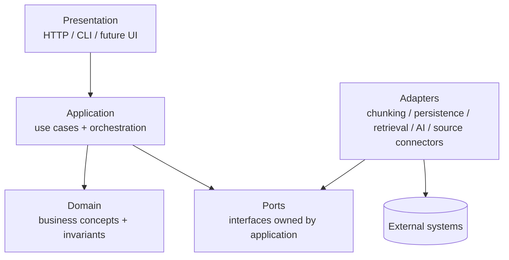
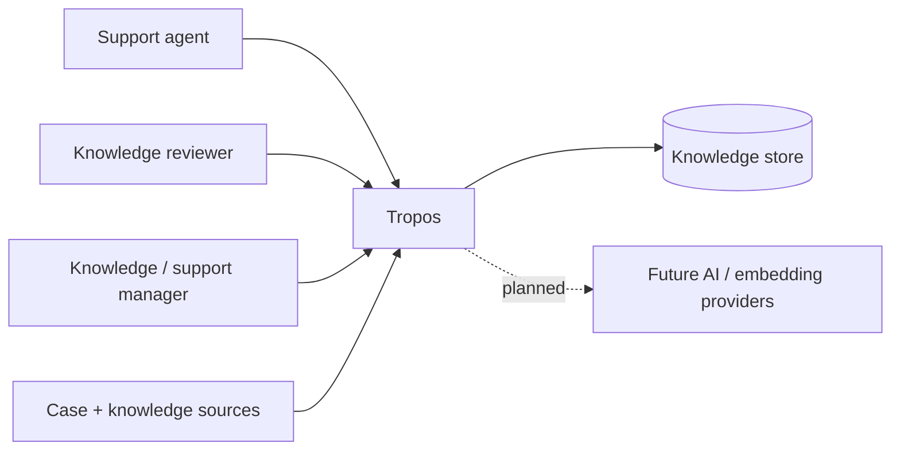
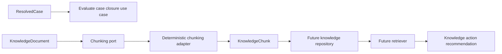
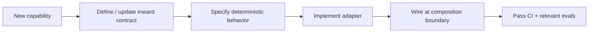

# Architecture Overview

## Purpose

Tropos is a governed knowledge-management system that learns from resolved support cases. The first product capability, **Tropos Resolve**, recommends `REUSE`, `IMPROVE`, `CREATE`, or `NO_ACTION` and preserves the evidence needed for human review, evaluation, and audit.

## Theory foundation

Tropos uses a **modular monolith** with **Hexagonal / Ports-and-Adapters architecture** and lightweight domain-driven design.

The governing dependency rule is:

> Business policy points inward; infrastructure points outward through interfaces.

## C4-style system context

## Current implementation

The repository currently implements a deterministic core, including:

- domain concepts for resolved cases, access policy, knowledge, knowledge chunks, and knowledge actions;
- application use cases and ports;
- raw-record ingestion structures;
- deterministic chunking with exact offsets, stable fingerprints, inherited access policy, and source lineage;
- rule-based closure-evidence evaluation;
- unit tests around the implemented capabilities.

The web application, production persistence, semantic retrieval, LLM reasoning, and AI evaluation are **planned**, not yet implemented.

## Component view

## Why this architecture

| Requirement | Architectural response |
| --- | --- |
| Replace infrastructure without rewriting business rules | Ports + adapters |
| Make knowledge decisions auditable | Explicit domain objects and provenance |
| Evolve from deterministic rules to AI gradually | Separate application contracts from implementations |
| Keep an early-stage codebase simple | Modular monolith rather than distributed services |
| Test business logic cheaply | Pure domain/application logic with adapter boundaries |

## Design rules

1. Domain code must not import infrastructure frameworks or SDKs.
2. Application use cases depend on ports, not concrete persistence, retrieval, or AI implementations.
3. Adapters satisfy contracts defined inward of them.
4. Source provenance and access policy travel with knowledge through processing stages.
5. AI output must become a validated domain/application contract before it can affect governed state.
6. Architecture changes require an ADR when they change a boundary, dependency direction, persistence strategy, retrieval strategy, or release model.

## Trade-offs

Ports-and-adapters adds interfaces and files compared with a small script. Tropos accepts that cost because retrieval, persistence, source connectors, and AI providers are expected to change independently over time.

## Failure modes this structure is intended to prevent

- database logic leaking into business decisions;
- vendor SDKs becoming the domain model;
- replacing retrieval requiring broad rewrites;
- prompts becoming hidden business policy;
- AI output bypassing validation;
- provenance being lost during transformation.

## How to extend safely

When adding a new external technology, first ask whether Tropos needs a new business concept, a new application port, or only a new adapter.
