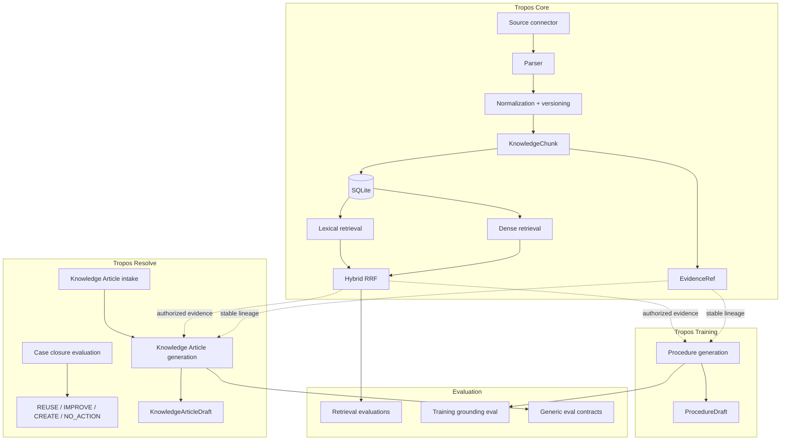
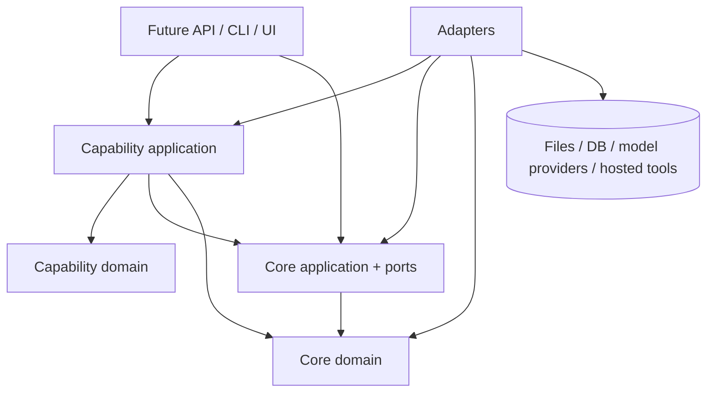
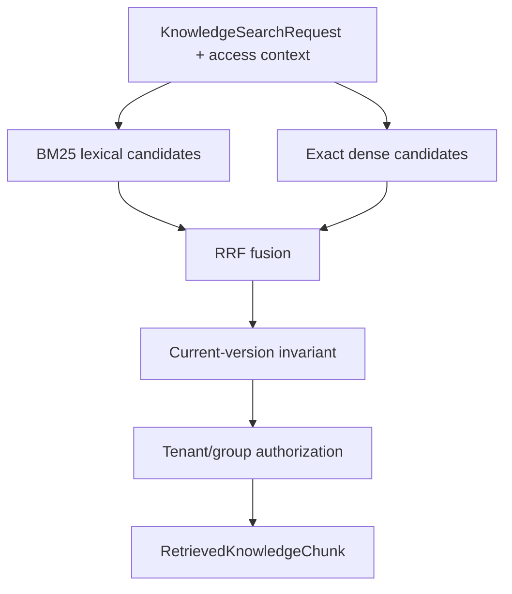
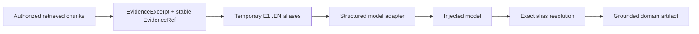
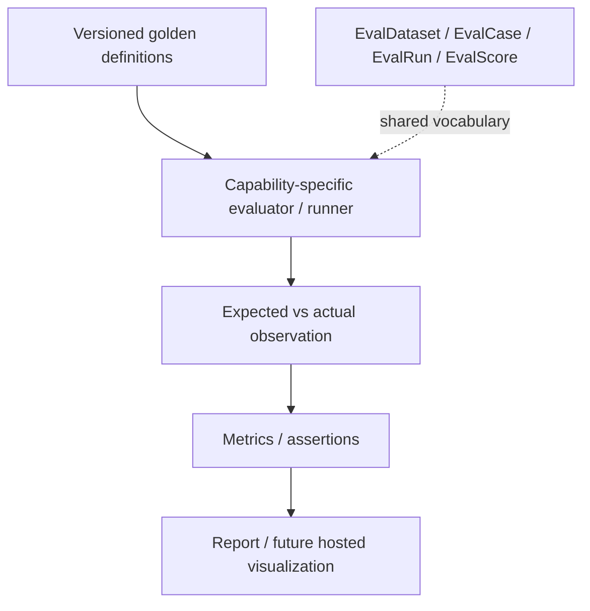

# Architecture overview

Tropos is a modular monolith using Ports-and-Adapters boundaries. The architecture separates reusable governed-knowledge mechanics from capability-specific business policy and keeps databases, model frameworks, providers, and hosted tools outside the domain model.

## Current system shape


```mermaid
flowchart TB
    subgraph Core[Tropos Core]
      Source[Source connector]
      Parse[Parser]
      Norm[Normalization + versioning]
      Chunk[KnowledgeChunk]
      Persist[(SQLite)]
      Lex[Lexical retrieval]
      Dense[Dense retrieval]
      Hybrid[Hybrid RRF]
      Evidence[EvidenceRef]

      Source --> Parse --> Norm --> Chunk --> Persist
      Persist --> Lex
      Persist --> Dense
      Lex --> Hybrid
      Dense --> Hybrid
      Chunk --> Evidence
    end

    subgraph Resolve[Tropos Resolve]
      Closure[Case closure evaluation]
      Action[REUSE / IMPROVE / CREATE / NO_ACTION]
      Intake[Knowledge Article intake]
      KAGen[Knowledge Article generation]
      KA[KnowledgeArticleDraft]

      Closure --> Action
      Intake --> KAGen --> KA
    end

    subgraph Training[Tropos Training]
      Procedure[Procedure generation]
      Draft[ProcedureDraft]
      Procedure --> Draft
    end

    subgraph Quality[Evaluation]
      RetEval[Retrieval evaluations]
      TrainEval[Training grounding eval]
      EvalContracts[Generic eval contracts]
    end

    Hybrid -. authorized evidence .-> KAGen
    Hybrid -. authorized evidence .-> Procedure
    Evidence -. stable lineage .-> KAGen
    Evidence -. stable lineage .-> Procedure
    KAGen --> EvalContracts
    Procedure --> TrainEval
    Hybrid --> RetEval
```

## Dependency direction


```mermaid
flowchart TB
    Presentation[Future API / CLI / UI]
    CapApp[Capability application]
    CapDomain[Capability domain]
    CoreApp[Core application + ports]
    CoreDomain[Core domain]
    Adapters[Adapters]
    External[(Files / DB / model providers / hosted tools)]

    Presentation --> CapApp
    Presentation --> CoreApp
    CapApp --> CapDomain
    CapApp --> CoreApp
    CapApp --> CoreDomain
    CoreApp --> CoreDomain
    Adapters --> CapApp
    Adapters --> CoreApp
    Adapters --> CoreDomain
    Adapters --> External
```

Domain and application policy do not depend on database sessions, model SDKs, web frameworks, or hosted evaluation tools. Concrete integrations implement Tropos-owned ports.

## Current implementation matrix

| Boundary | Responsibility | Status |
| --- | --- | --- |
| Core domain | Access policy, canonical knowledge, governed chunks, stable evidence refs, Knowledge Article artifact | Implemented |
| Core ingestion application | Capture, parse, normalize, version, lifecycle and chunk orchestration | Implemented |
| Source adapter | Local-file source capture | Implemented baseline |
| Source reliability | Failure taxonomy and bounded transient retry | Implemented |
| Parsing | TXT, Markdown, HTML, DOCX deterministic parsing | Implemented baseline |
| Persistence | SQLite source/run/canonical state/version/chunk/embedding state | Implemented baseline |
| Lexical retrieval | FTS5/BM25 over current authorized chunks | Implemented |
| Dense retrieval | Exact cosine over persisted versioned embeddings | Implemented V1 |
| Hybrid retrieval | Reciprocal Rank Fusion over lexical+dense ranks | Implemented V1 |
| Retrieval evaluation | Golden corpora, ranking metrics, saved run evidence | Implemented |
| Generic evaluation contracts | Dataset/case/run/observation/score/provenance vocabulary | Implemented |
| Resolve closure decision | Evidence sufficiency + REUSE/IMPROVE/CREATE/NO_ACTION policy | Implemented baseline |
| Resolve Knowledge Article | Typed artifact, bounded intake, governed retrieval trigger, structured generation | Implemented baseline |
| Training generation | Structured procedure draft with stable evidence refs | Implemented baseline |
| Training grounding evaluation | Deterministic synthetic golden cases | Implemented baseline |
| Hosted API/UI | Runtime/product surface | Planned |
| Postgres production persistence | Hosted serving persistence | Planned |
| External enterprise connectors/sync | Gmail/SharePoint/Jira/etc. durable synchronization | Planned |
| Human approval lifecycle | Review/approve/publish operational artifacts | Planned |
| Case classification / NBA | Live service-resolution intelligence | Planned |
| Hosted observability/eval adapter | LangSmith/Langfuse/Phoenix/etc. | Planned |

## Ingestion path


```mermaid
flowchart LR
    Source[(Source system)]
    --> Connector[KnowledgeSourceConnector]
    --> Capture[SourceCapture]
    --> Raw[RawKnowledgeRecord]
    --> Parse[KnowledgeParser]
    --> Extract[ExtractedKnowledgeText]
    --> Norm[Deterministic normalization]
    --> Version[Canonical version resolution]
    --> Doc[KnowledgeDocument]
    --> Chunk[KnowledgeChunk]
    --> Store[(SQLite)]
```

Key separation:

- source identity is not content identity;
- raw/source state is not canonical knowledge state;
- content change is not access-policy change;
- embeddings are derived retrieval state, not canonical knowledge;
- source acquisition is not format parsing.

## Retrieval path


```mermaid
flowchart TB
    Query[KnowledgeSearchRequest + access context]
    --> Lex[BM25 lexical candidates]
    Query --> Dense[Exact dense candidates]
    Lex --> Hybrid[RRF fusion]
    Dense --> Hybrid
    Hybrid --> Current[Current-version invariant]
    Current --> Authorized[Tenant/group authorization]
    Authorized --> Result[RetrievedKnowledgeChunk]
```

The shared retrieval contract is strategy-neutral. Concrete strategies currently include:

- `sqlite-fts5-bm25-v1`;
- exact dense retrieval over versioned embeddings;
- hybrid Reciprocal Rank Fusion.

Authorization is a retrieval invariant, not a presentation filter. Unauthorized evidence must not cross the governed retrieval boundary.

See [RAG architecture](RAG_ARCHITECTURE.md).

## Grounded-generation path

Resolve Knowledge Articles and Training use the same architectural pattern:


```mermaid
flowchart LR
    Retrieved[Authorized retrieved chunks]
    --> Excerpts[EvidenceExcerpt + stable EvidenceRef]
    --> Alias[Temporary E1..EN aliases]
    --> Adapter[Structured model adapter]
    --> Model[Injected model]
    --> ResolveAlias[Exact alias resolution]
    --> Artifact[Grounded domain artifact]
```

The model does not own evidence identity. Prompt-local aliases exist only for one invocation and are resolved back to stable `EvidenceRef` objects before the domain artifact is constructed.

The resolver proves that a reference came from the supplied evidence set. It does **not** prove semantic entailment; that is an evaluation concern.

## Resolve architecture

Resolve contains two implemented vertical slices.

### Closure knowledge decision

```text
ResolvedCase
→ closure evidence evaluation
→ related-knowledge/coverage ports
→ deterministic knowledge action
→ future decision persistence
```

### Knowledge Article generation

```text
KnowledgeArticleGenerationRequest
→ deterministic retrieval intent/query
→ governed KnowledgeChunkRetriever
→ EvidenceRef-rich excerpts
→ KnowledgeArticleGenerator port
→ LangChain structured adapter
→ KnowledgeArticleDraft
```

Business-editable generation fields are intentionally bounded; grounding, access, conflict handling and fixed article structure remain system-owned.

See [Knowledge Article architecture](KNOWLEDGE_ARTICLE.md).

## Training architecture

Training uses governed evidence to generate a structured procedure artifact:

```text
governed retrieval
→ evidence excerpts
→ ProcedureExtractor port
→ LangChain structured adapter
→ stable evidence resolution
→ ProcedureDraft
→ deterministic grounding eval
```

This slice established the evidence-backed generation pattern later reused in Resolve.

## Evaluation architecture

Tropos has two evaluation layers today:

1. **Specialized executable evaluators** for retrieval and Training.
2. **Reusable vendor-neutral contracts** for future cross-capability datasets, runs, scores, provenance and experiment comparisons.


```mermaid
flowchart TB
    Gold[Versioned golden definitions]
    --> Runner[Capability-specific evaluator / runner]
    --> Observation[Expected vs actual observation]
    --> Score[Metrics / assertions]
    --> Report[Report / future hosted visualization]

    Contracts[EvalDataset / EvalCase / EvalRun / EvalScore]
    -. shared vocabulary .-> Runner
```

Hosted tools are future adapters. Tropos remains the source of truth for approved golden cases, expected behavior, evaluator semantics and release gates.

See [Evaluation contracts](EVALUATION_CONTRACTS.md), [Evaluation runs](EVALUATION_RUNS.md), and [Evaluation strategy](../quality/EVAL_STRATEGY.md).

## Architectural guarantees

The current foundation protects these invariants:

1. source-system acquisition is separated from content parsing;
2. raw source identity is separated from canonical content identity;
3. normalization and version resolution are deterministic and versioned;
4. presentation-only changes do not automatically create business-content versions;
5. governance/access evolution can be observed independently of content changes;
6. embeddings remain derived processing state;
7. retrieval returns only current evidence authorized for the supplied access context;
8. retrieval strategies remain replaceable behind the same contract;
9. stable evidence identity survives model-prompt projection;
10. capability policy remains outside reusable core mechanics;
11. model/framework SDKs remain adapters rather than domain dependencies;
12. evaluation definitions and score meaning remain Tropos-owned.

Changes to these guarantees should be captured through an ADR.

## Deliberately deferred complexity

- ANN/HNSW or managed vector infrastructure before exact-search scale/latency proves the need;
- cross-encoder reranking before hybrid evidence indicates value;
- LangGraph before durable branching/checkpoint/HITL requirements exist;
- generic multi-agent orchestration;
- production Postgres/hosted serving stack before multi-consumer runtime exists;
- hosted observability vendor lock-in;
- autonomous publishing.

## Related documents

- [Tropos platform](../product/TROPOS_PLATFORM.md)
- [Resolve](../product/RESOLVE.md)
- [Training](../product/TRAINING.md)
- [Build history](../product/BUILD_HISTORY.md)
- [Codebase map](CODEBASE_MAP.md)
- [Source integration](SOURCE_INTEGRATION.md)
- [Ingestion and normalization](INGESTION_NORMALIZATION.md)
- [Knowledge model](KNOWLEDGE_MODEL.md)
- [RAG architecture](RAG_ARCHITECTURE.md)
- [Knowledge Article architecture](KNOWLEDGE_ARTICLE.md)
- [Evaluation contracts](EVALUATION_CONTRACTS.md)
- [Architecture decisions](../decisions/README.md)
