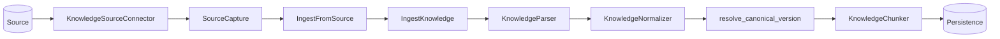
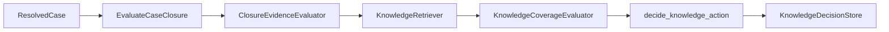

# Codebase map

This page maps repository paths to responsibilities. For design rationale, use the architecture documents and ADRs.

## Source layout

```text
apps/api/
├── src/tropos/
│   ├── core/
│   │   ├── domain/
│   │   │   ├── access.py
│   │   │   ├── knowledge.py
│   │   │   └── knowledge_chunk.py
│   │   ├── application/
│   │   │   ├── ingestion/
│   │   │   │   ├── ingest_from_source.py
│   │   │   │   ├── ingest_knowledge.py
│   │   │   │   ├── raw_record.py
│   │   │   │   ├── parsing.py
│   │   │   │   ├── normalization.py
│   │   │   │   ├── run_state.py
│   │   │   │   └── versioning.py
│   │   │   └── ports/
│   │   │       ├── sources.py
│   │   │       ├── chunking.py
│   │   │       ├── normalization.py
│   │   │       └── persistence.py
│   │   └── adapters/
│   │       ├── sources/local_file.py
│   │       ├── parsing/deterministic.py
│   │       ├── normalization/deterministic.py
│   │       ├── chunking/deterministic.py
│   │       └── persistence/sqlite.py
│   └── capabilities/
│       └── resolve/
│           ├── domain/
│           ├── application/
│           └── adapters/
└── tests/unit/
    ├── core/
    └── capabilities/resolve/
```

## Ownership

| Path | Responsibility |
| --- | --- |
| `core/domain/access.py` | Tenant/group access semantics and indexability |
| `core/domain/knowledge.py` | Canonical `KnowledgeDocument` model |
| `core/domain/knowledge_chunk.py` | `KnowledgeChunk` model and chunk-set invariants |
| `core/application/ports/sources.py` | Source connector contract and common `SourceCapture` envelope |
| `core/application/ingestion/ingest_from_source.py` | Bridge a replaceable connector into the stable ingestion workflow |
| `core/application/ingestion/ingest_knowledge.py` | Synchronous ingestion workflow order, branching, idempotency, and failure recording |
| `core/application/ingestion/raw_record.py` | Immutable source envelope and raw/ingestion fingerprints |
| `core/application/ingestion/parsing.py` | Parser contract and parsing errors |
| `core/application/ingestion/normalization.py` | Extracted/normalized data contracts and document materialization |
| `core/application/ingestion/run_state.py` | Ingestion workflow stages and outcomes |
| `core/application/ingestion/versioning.py` | Canonical content and governance change resolution |
| `core/application/ports/normalization.py` | Normalizer contract |
| `core/application/ports/chunking.py` | Chunker contract |
| `core/application/ports/persistence.py` | Source capture, ingestion-run, and canonical-state persistence ports |
| `core/adapters/sources/local_file.py` | Local-file source capture adapter |
| `core/adapters/parsing/deterministic.py` | Deterministic text/Markdown/HTML/DOCX parsing |
| `core/adapters/normalization/deterministic.py` | Deterministic text normalization and structural extraction |
| `core/adapters/chunking/deterministic.py` | Deterministic, lossless chunk generation |
| `core/adapters/persistence/sqlite.py` | SQLite source/run/version/chunk persistence |
| `capabilities/resolve/domain/` | Resolved-case and knowledge-action vocabulary/policy |
| `capabilities/resolve/application/` | Resolve orchestration and retrieval/coverage/store contracts |
| `capabilities/resolve/adapters/` | Replaceable Resolve-specific implementations |

## Source-to-ingestion flow



`IngestFromSource` is intentionally thin. It validates connector source identity, translates `SourceCapture` into `IngestKnowledgeCommand`, and delegates all canonical processing to the existing orchestrator.

## Resolve flow



The retriever, coverage evaluator, and decision store are contracts; production adapters are not implemented.

## Tests

Tests mirror the source boundaries under `apps/api/tests/unit/`:

- `core/domain/` for access and evidence invariants;
- `core/application/ingestion/` for raw identity and version resolution;
- `core/adapters/sources/` for source-connector behavior and source-to-ingestion integration;
- `core/adapters/parsing/` for deterministic format parsing;
- `core/adapters/normalization/` for canonicalization behavior;
- `core/adapters/chunking/` for chunk identity and lossless coverage;
- `core/adapters/persistence/` for durable ingestion workflow behavior;
- `capabilities/resolve/` for decision policy and orchestration.
