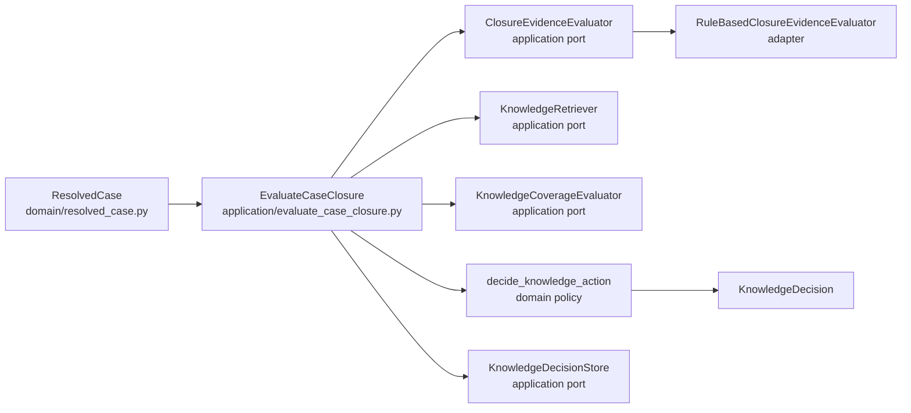
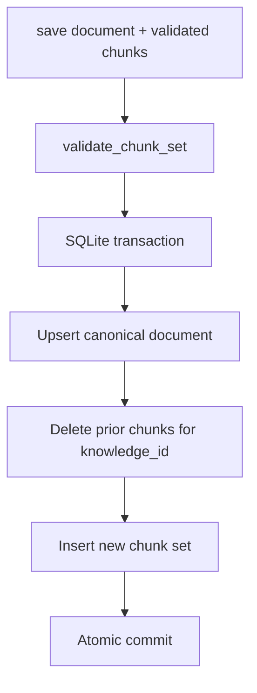
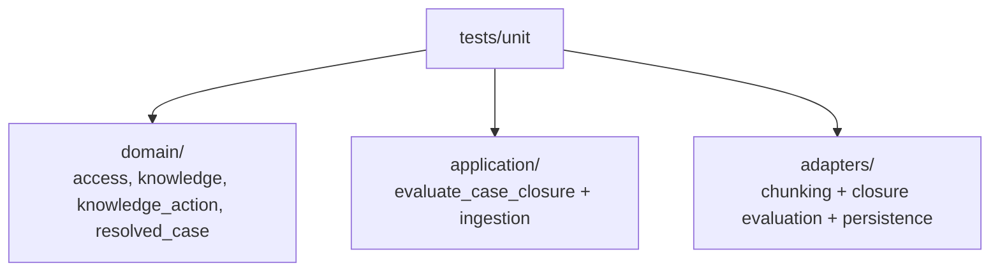
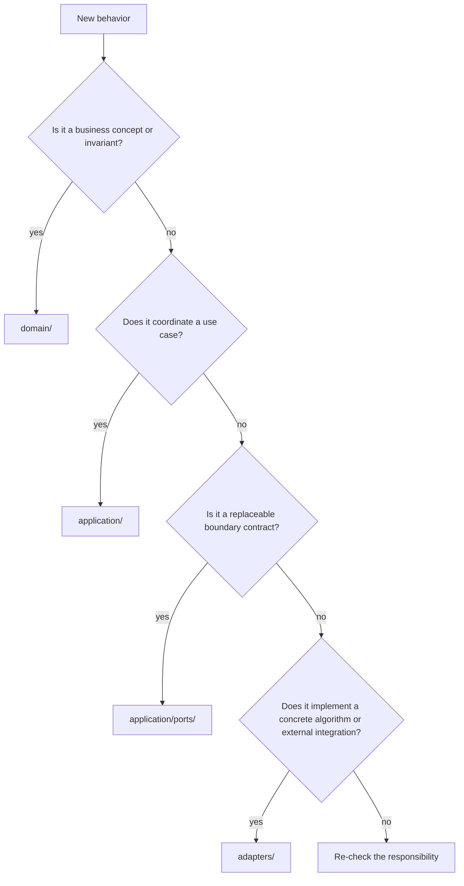

# Codebase Map

This document answers one question: **where does each Tropos responsibility live today?**

## Repository structure

```text
apps/api/
├── src/tropos/
│   ├── domain/
│   │   ├── access.py
│   │   ├── knowledge.py
│   │   ├── knowledge_action.py
│   │   ├── knowledge_chunk.py
│   │   └── resolved_case.py
│   ├── application/
│   │   ├── evaluate_case_closure.py
│   │   ├── ingestion/
│   │   │   └── raw_record.py
│   │   └── ports/
│   │       ├── chunking.py
│   │       ├── knowledge.py
│   │       └── persistence.py
│   └── adapters/
│       ├── chunking/
│       │   └── deterministic.py
│       ├── evaluation/
│       │   └── rule_based_closure_evidence.py
│       └── persistence/
│           └── sqlite.py
└── tests/unit/
    ├── domain/
    ├── application/
    └── adapters/
        ├── chunking/
        ├── evaluation/
        └── persistence/
```

## Ownership map

| File / module | Responsibility | Status |
| --- | --- | --- |
| `domain/resolved_case.py` | Canonical resolved-case data accepted by the core | IMPLEMENTED |
| `domain/access.py` | Canonical access scope, tenant/group rules and indexability | IMPLEMENTED |
| `domain/knowledge.py` | Canonical knowledge document and normalized document-level retrieval result | IMPLEMENTED |
| `domain/knowledge_chunk.py` | Exact chunk evidence + chunk-set invariants | IMPLEMENTED |
| `domain/knowledge_action.py` | Knowledge decision vocabulary and deterministic policy | IMPLEMENTED |
| `application/evaluate_case_closure.py` | Orchestrates closure evaluation, retrieval, coverage and decision persistence | IMPLEMENTED |
| `application/ingestion/raw_record.py` | Immutable inbound knowledge record + stable source fingerprint | IMPLEMENTED |
| `application/ports/knowledge.py` | Contracts for closure evaluation, retrieval, coverage and decision storage | IMPLEMENTED CONTRACTS |
| `application/ports/chunking.py` | Contract for turning a canonical document into governed chunks | IMPLEMENTED CONTRACT |
| `application/ports/persistence.py` | Contract for persisting/reloading the current canonical corpus | IMPLEMENTED CONTRACT |
| `adapters/evaluation/rule_based_closure_evidence.py` | Deterministic closure-evidence baseline | IMPLEMENTED |
| `adapters/chunking/deterministic.py` | Lossless structural/character chunking algorithm | IMPLEMENTED |
| `adapters/persistence/sqlite.py` | Transactional SQLite persistence for documents + chunks | IMPLEMENTED |

## Decision path through the code



The use case owns the sequence. The domain owns the final policy. Adapters provide replaceable mechanics.

## Knowledge-ingestion and persistence path

```mermaid
flowchart LR
    Raw[RawKnowledgeRecord<br/>application/ingestion/raw_record.py]
    --> Normalize[Normalization adapter<br/>PLANNED]
    --> Doc[KnowledgeDocument<br/>domain/knowledge.py]
    --> Port[KnowledgeChunker<br/>application port]
    --> Chunker[DeterministicKnowledgeChunker<br/>adapter]
    --> Chunk[KnowledgeChunk set<br/>domain/knowledge_chunk.py]
    --> StorePort[KnowledgeCorpusStore<br/>application/ports/persistence.py]
    --> SQLite[(SQLiteKnowledgeCorpusStore<br/>adapter)]
    SQLite -. next .-> FTS[FTS5 retrieval<br/>PLANNED]
```



The normalization adapter is still planned. Persistence now exists for canonical documents/chunks, but lexical retrieval does not.

## Persistence behavior

The SQLite adapter stores the **current retrieval snapshot** for each `knowledge_id`.



A newer source version replaces the previous persisted retrieval snapshot atomically. Tropos is not using this table as a historical archive; source/version lineage remains on every canonical object so historical/audit storage can be added separately when needed.

## Domain invariants by object

### `ResolvedCase`

- `case_id`, `source_system`, and `source_record_id` cannot be blank;
- `resolved_at` must be timezone-aware.

### `AccessPolicy`

- tenant ID cannot be blank;
- restricted scope requires at least one allowed group;
- non-restricted scopes cannot carry allowed groups;
- groups are normalized, unique, and sorted;
- unresolved access is not indexable.

### `KnowledgeDocument`

- identity/content fields cannot be blank;
- access policy must already be resolved/indexable;
- source fingerprint must be a valid SHA-256 hex digest;
- captured/source-updated timestamps must be timezone-aware;
- optional source URI cannot be blank when present.

### `KnowledgeChunk`

- chunk identity/provenance fields cannot be blank;
- offsets must describe a non-empty exact range;
- text length must equal the offset span;
- content fingerprint must match exact text;
- source fingerprint must be valid SHA-256;
- access must remain indexable.

### `KnowledgeDecisionInput`

- sufficient closure evidence requires knowledge coverage;
- insufficient closure evidence forbids knowledge coverage;
- impossible combinations are rejected before the policy executes.

### `SQLiteKnowledgeCorpusStore`

- persisted chunks are accepted only after full chunk-set validation;
- document + chunk replacement occurs inside one database transaction;
- persisted access/provenance metadata is reconstructed into domain objects on read;
- chunk reads are ordered by `sequence_number`;
- blank knowledge identities are rejected before database access;
- missing identities return `None` / empty chunk tuples rather than fabricated data.

## Where tests prove the current behavior



The persistence tests prove exact document/chunk round-trip, source/access preservation, atomic snapshot replacement, isolation between knowledge items, missing-record behavior and pre-persistence validation.

The current test suite is intentionally unit-focused. Retrieval integration/evaluation tests become necessary once FTS5 is introduced.

## How to decide where new code belongs



A useful smell: if `domain/` starts importing SQLite, a database ORM, HTTP client, vector store, model SDK or web framework, the dependency direction is probably wrong.
