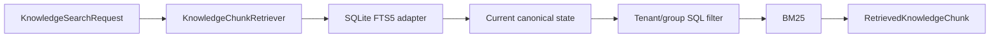
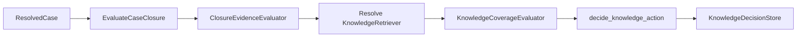

# Codebase map

This page maps repository paths to responsibilities. For design rationale, use the architecture documents and ADRs.

## Source layout

```text
apps/api/
├── evals/
│   └── retrieval/golden_v1.json
├── src/tropos/
│   ├── evals/
│   │   └── retrieval.py
│   ├── core/
│   │   ├── domain/
│   │   │   ├── access.py
│   │   │   ├── knowledge.py
│   │   │   └── knowledge_chunk.py
│   │   ├── application/
│   │   │   ├── ingestion/
│   │   │   │   ├── ingest_from_source.py
│   │   │   │   ├── ingest_knowledge.py
│   │   │   │   ├── raw_record.py
│   │   │   │   ├── parsing.py
│   │   │   │   ├── normalization.py
│   │   │   │   ├── run_state.py
│   │   │   │   └── versioning.py
│   │   │   ├── retrieval/
│   │   │   │   └── models.py
│   │   │   ├── sources/
│   │   │   │   └── reliability.py
│   │   │   └── ports/
│   │   │       ├── sources.py
│   │   │       ├── retrieval.py
│   │   │       ├── chunking.py
│   │   │       ├── normalization.py
│   │   │       └── persistence.py
│   │   └── adapters/
│   │       ├── sources/local_file.py
│   │       ├── parsing/deterministic.py
│   │       ├── normalization/deterministic.py
│   │       ├── chunking/deterministic.py
│   │       ├── persistence/sqlite.py
│   │       └── retrieval/sqlite_fts.py
│   └── capabilities/
│       └── resolve/
│           ├── domain/
│           ├── application/
│           └── adapters/
└── tests/
    ├── unit/
    │   ├── core/
    │   └── capabilities/resolve/
    └── integration/evals/
        └── test_retrieval_golden_v1.py
```

## Ownership

| Path | Responsibility |
| --- | --- |
| `evals/retrieval/golden_v1.json` | Versioned synthetic retrieval corpus and relevance/access labels |
| `tropos/evals/retrieval.py` | Strategy-neutral deterministic retrieval metrics and case reports |
| `core/domain/access.py` | Tenant/group access semantics and indexability |
| `core/domain/knowledge.py` | Canonical `KnowledgeDocument` model |
| `core/domain/knowledge_chunk.py` | `KnowledgeChunk` model and chunk-set invariants |
| `core/application/ports/sources.py` | Source connector contract, source failure taxonomy, and common `SourceCapture` envelope |
| `core/application/sources/reliability.py` | Bounded retry policy and reusable source-connector reliability decorator |
| `core/application/ingestion/ingest_from_source.py` | Bridge a replaceable connector into the stable ingestion workflow |
| `core/application/ingestion/ingest_knowledge.py` | Synchronous ingestion workflow order, branching, idempotency, and failure recording |
| `core/application/ingestion/raw_record.py` | Immutable source envelope and raw/ingestion fingerprints |
| `core/application/ingestion/parsing.py` | Parser contract and parsing errors |
| `core/application/ingestion/normalization.py` | Extracted/normalized data contracts and document materialization |
| `core/application/ingestion/run_state.py` | Ingestion workflow stages and outcomes |
| `core/application/ingestion/versioning.py` | Canonical content and governance change resolution |
| `core/application/retrieval/models.py` | Strategy-neutral authorized search request/access context and retrieved-chunk result contracts |
| `core/application/ports/retrieval.py` | Reusable governed chunk-retrieval port |
| `core/application/ports/normalization.py` | Normalizer contract |
| `core/application/ports/chunking.py` | Chunker contract |
| `core/application/ports/persistence.py` | Source capture, ingestion-run, and canonical-state persistence ports |
| `core/adapters/sources/local_file.py` | Local-file source capture adapter |
| `core/adapters/parsing/deterministic.py` | Deterministic text/Markdown/HTML/DOCX parsing |
| `core/adapters/normalization/deterministic.py` | Deterministic text normalization and structural extraction |
| `core/adapters/chunking/deterministic.py` | Deterministic, lossless chunk generation |
| `core/adapters/persistence/sqlite.py` | SQLite source/run/version/chunk persistence |
| `core/adapters/retrieval/sqlite_fts.py` | SQLite FTS5/BM25 retrieval over current tenant/group-authorized chunks |
| `capabilities/resolve/domain/` | Resolved-case and knowledge-action vocabulary/policy |
| `capabilities/resolve/application/` | Resolve orchestration and retrieval/coverage/store contracts |
| `capabilities/resolve/adapters/` | Replaceable Resolve-specific implementations |

## Source-to-ingestion flow

```mermaid
flowchart LR
    Source[(Source)]
    --> Connector[KnowledgeSourceConnector]
    --> Reliable[RetryingSourceConnector]
    --> Capture[SourceCapture]
    --> SourceUseCase[IngestFromSource]
    --> Ingestion[IngestKnowledge]
    --> Parser[KnowledgeParser]
    --> Normalizer[KnowledgeNormalizer]
    --> Version[resolve_canonical_version]
    --> Chunker[KnowledgeChunker]
    --> Store[(Persistence)]
```



`RetryingSourceConnector` is optional composition around a connector. It retries only explicitly transient source failures. `IngestFromSource` remains intentionally thin: it validates connector source identity, translates `SourceCapture` into `IngestKnowledgeCommand`, and delegates all canonical processing to the existing orchestrator.

## Core retrieval flow



The port is strategy-neutral. The current adapter is `sqlite-fts5-bm25-v1`; future vector or hybrid adapters may implement the same boundary.

## Retrieval evaluation flow

```mermaid
flowchart LR
    Corpus[golden_v1.json]
    --> Ingest[Governed ingestion]
    --> Retriever[Versioned retriever]
    --> Eval[Retrieval evaluator]
    --> Metrics[Recall@1/3/5, Precision@5, MRR, no-answer]
```

Evaluation labels are knowledge-level in V1 and the corpus is synthetic. The integration test establishes a reproducible development/regression baseline, not a production benchmark.

## Resolve flow



Resolve still owns a capability-specific retrieval contract because it starts from a `ResolvedCase`. An adapter from that case contract to the reusable core chunk retriever is not implemented yet. The coverage evaluator and decision store also remain contract-only.

## Tests

Unit tests mirror code boundaries under `apps/api/tests/unit/`. Cross-boundary executable quality checks live under `apps/api/tests/integration/`.

The retrieval golden-set integration test exercises the real ingestion and SQLite retrieval adapters together and measures the labeled corpus while preserving separate zero-tolerance assertions for tenant and restricted-group boundaries.
