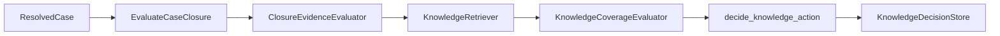

# Codebase map

This page maps repository paths to responsibilities. For design rationale, use the architecture documents and ADRs.

## Source layout

```text
apps/api/
├── src/tropos/
│   ├── core/
│   │   ├── domain/
│   │   │   ├── access.py
│   │   │   ├── knowledge.py
│   │   │   └── knowledge_chunk.py
│   │   ├── application/
│   │   │   ├── ingestion/
│   │   │   │   ├── raw_record.py
│   │   │   │   ├── normalization.py
│   │   │   │   └── versioning.py
│   │   │   └── ports/
│   │   │       ├── chunking.py
│   │   │       └── normalization.py
│   │   └── adapters/
│   │       ├── chunking/deterministic.py
│   │       └── normalization/deterministic.py
│   └── capabilities/
│       └── resolve/
│           ├── domain/
│           │   ├── knowledge_action.py
│           │   └── resolved_case.py
│           ├── application/
│           │   ├── evaluate_case_closure.py
│           │   └── ports/knowledge.py
│           └── adapters/evaluation/
│               └── rule_based_closure_evidence.py
└── tests/unit/
    ├── core/
    └── capabilities/resolve/
```

## Ownership

| Path | Responsibility |
| --- | --- |
| `core/domain/access.py` | Tenant/group access semantics and indexability |
| `core/domain/knowledge.py` | Canonical `KnowledgeDocument` model |
| `core/domain/knowledge_chunk.py` | `KnowledgeChunk` model and chunk-set invariants |
| `core/application/ingestion/raw_record.py` | Immutable source envelope and raw/ingestion fingerprints |
| `core/application/ingestion/normalization.py` | Extracted/normalized data contracts and document materialization |
| `core/application/ingestion/versioning.py` | Canonical content and governance change resolution |
| `core/application/ports/normalization.py` | Normalizer contract |
| `core/application/ports/chunking.py` | Chunker contract |
| `core/adapters/normalization/deterministic.py` | Deterministic text normalization and structural extraction |
| `core/adapters/chunking/deterministic.py` | Deterministic, lossless chunk generation |
| `capabilities/resolve/domain/resolved_case.py` | Resolved support-case input model |
| `capabilities/resolve/domain/knowledge_action.py` | Knowledge-action vocabulary and deterministic policy |
| `capabilities/resolve/application/evaluate_case_closure.py` | Resolve use-case orchestration |
| `capabilities/resolve/application/ports/knowledge.py` | Retrieval, coverage, and decision-store contracts |
| `capabilities/resolve/adapters/evaluation/rule_based_closure_evidence.py` | Rule-based closure-evidence baseline |

## Core ingestion flow

```mermaid
flowchart LR
    Raw[RawKnowledgeRecord]
    --> Extracted[ExtractedKnowledgeText]
    --> Normalizer[KnowledgeNormalizer]
    --> Candidate[NormalizedKnowledge]
    --> Version[resolve_canonical_version]
    --> Document[KnowledgeDocument]
    --> Chunker[KnowledgeChunker]
    --> Chunks[KnowledgeChunk[]]
```

Rich source parsing is not implemented. `ExtractedKnowledgeText` is the boundary at which a future PDF, DOCX, HTML, or connector-specific parser supplies text and format metadata.

## Resolve flow



The retriever, coverage evaluator, and decision store are contracts; production adapters are not implemented.

## Tests

Tests mirror the source boundaries under `apps/api/tests/unit/`:

- `core/domain/` for access and evidence invariants;
- `core/application/ingestion/` for raw identity and version resolution;
- `core/adapters/normalization/` for canonicalization behavior;
- `core/adapters/chunking/` for chunk identity and lossless coverage;
- `capabilities/resolve/` for decision policy and orchestration.
