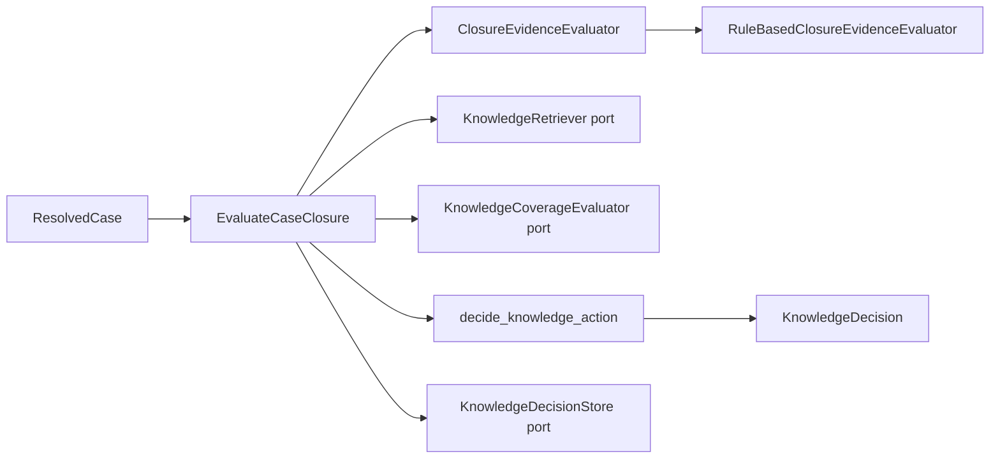
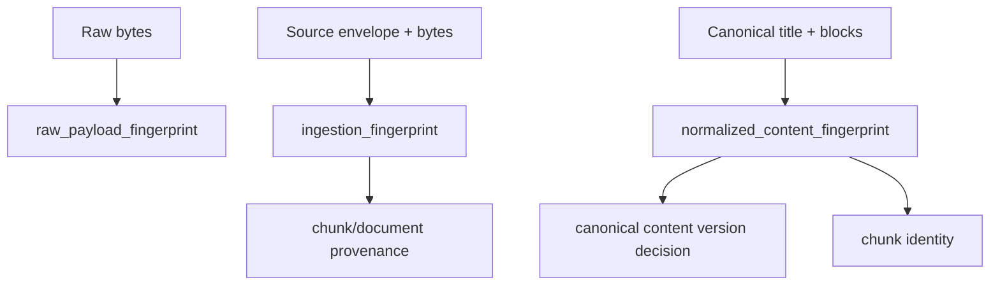
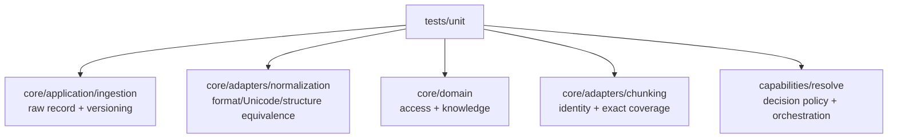
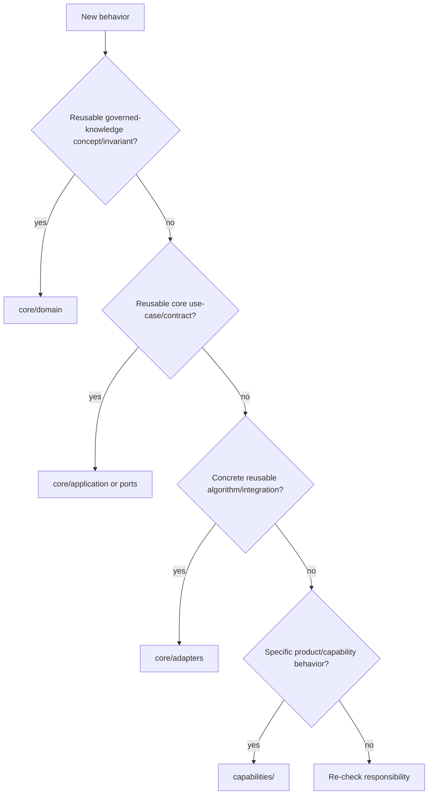

# Codebase Map

This document answers one question: **where does each Tropos responsibility live today?**

Tropos now separates reusable governed-knowledge infrastructure in `core/` from domain capabilities such as `resolve/`.

## Repository structure

```text
apps/api/
├── src/tropos/
│   ├── core/
│   │   ├── domain/
│   │   │   ├── access.py
│   │   │   ├── knowledge.py
│   │   │   └── knowledge_chunk.py
│   │   ├── application/
│   │   │   ├── ingestion/
│   │   │   │   ├── raw_record.py
│   │   │   │   ├── normalization.py
│   │   │   │   └── versioning.py
│   │   │   └── ports/
│   │   │       ├── chunking.py
│   │   │       └── normalization.py
│   │   └── adapters/
│   │       ├── chunking/deterministic.py
│   │       └── normalization/deterministic.py
│   └── capabilities/
│       └── resolve/
│           ├── domain/
│           │   ├── knowledge_action.py
│           │   └── resolved_case.py
│           ├── application/
│           │   ├── evaluate_case_closure.py
│           │   └── ports/knowledge.py
│           └── adapters/evaluation/
│               └── rule_based_closure_evidence.py
└── tests/unit/
    ├── core/
    └── capabilities/resolve/
```

## Ownership map

| File / module | Responsibility | Status |
| --- | --- | --- |
| `core/domain/access.py` | Canonical tenant/group access semantics and indexability | IMPLEMENTED |
| `core/domain/knowledge.py` | Canonical knowledge document + retrieval wrapper | IMPLEMENTED |
| `core/domain/knowledge_chunk.py` | Exact canonical chunk evidence + set invariants | IMPLEMENTED |
| `core/application/ingestion/raw_record.py` | Immutable inbound source envelope; raw and ingestion fingerprints | IMPLEMENTED |
| `core/application/ingestion/normalization.py` | Normalization/structure data contracts + document materialization | IMPLEMENTED |
| `core/application/ingestion/versioning.py` | Canonical content/access/normalizer-version decision policy | IMPLEMENTED |
| `core/application/ports/normalization.py` | Replaceable deterministic normalizer contract | IMPLEMENTED CONTRACT |
| `core/application/ports/chunking.py` | Canonical document → governed chunks contract | IMPLEMENTED CONTRACT |
| `core/adapters/normalization/deterministic.py` | Level-1 normalization + Level-2 structural extraction | IMPLEMENTED |
| `core/adapters/chunking/deterministic.py` | Lossless structural/character chunking | IMPLEMENTED |
| `capabilities/resolve/domain/resolved_case.py` | Canonical resolved support-case input | IMPLEMENTED |
| `capabilities/resolve/domain/knowledge_action.py` | `REUSE/IMPROVE/CREATE/NO_ACTION` vocabulary and policy | IMPLEMENTED |
| `capabilities/resolve/application/evaluate_case_closure.py` | Closure → retrieval → coverage → decision orchestration | IMPLEMENTED |
| `capabilities/resolve/application/ports/knowledge.py` | Retrieval, coverage and decision-storage contracts | CONTRACT ONLY for production adapters |
| `capabilities/resolve/adapters/evaluation/rule_based_closure_evidence.py` | Deterministic closure-evidence baseline | IMPLEMENTED |

## Core ingestion path

```mermaid
flowchart LR
    Raw[RawKnowledgeRecord]
    --> Extract[ExtractedKnowledgeText]
    --> Norm[KnowledgeNormalizer port]
    --> DN[DeterministicKnowledgeNormalizer]
    --> Candidate[NormalizedKnowledge]
    --> VR[resolve_canonical_version]
    --> Doc[KnowledgeDocument]
    --> CP[KnowledgeChunker port]
    --> Chunker[DeterministicKnowledgeChunker]
    --> Chunk[KnowledgeChunk]
    --> Store[(Persistence<br/>PLANNED)]
```



`ExtractedKnowledgeText` currently represents text already obtained from a source-format parser/connector. Rich DOCX/PDF/HTML extraction is **PLANNED** and should enter before deterministic normalization.

## Resolve decision path



The reusable knowledge pipeline belongs to `core`. Support-case-specific decision policy belongs to the `resolve` capability.

## Identity and version flow



Do not collapse these identities back into a generic `source_fingerprint`; they answer different lifecycle questions.

## Key invariants

### `RawKnowledgeRecord`

- source identifiers/version/content type are non-blank;
- payload is non-empty;
- access policy is typed;
- capture time is timezone-aware;
- raw fingerprint depends only on exact payload bytes;
- ingestion fingerprint is deterministic for source-envelope + bytes.

### `NormalizedKnowledge`

- source/title/text are non-empty;
- at least one structural block exists;
- canonical serialization deterministically matches its fingerprint;
- normalization strategy version is explicit;
- canonical text is rendered from the same structure used for content identity.

### Canonical version resolver

- first-seen or changed canonical content → `CREATE_VERSION`;
- same canonical content → `NO_CONTENT_VERSION`;
- same content but changed access → `REFRESH_GOVERNANCE`;
- changed normalizer version → `REBASELINE_REQUIRED`;
- upstream source-version churn alone does not create a canonical content version.

### `KnowledgeDocument`

- content/access/provenance fields are valid;
- access must be indexable;
- raw, ingestion and normalized fingerprints are valid SHA-256 values;
- normalization strategy is explicit;
- timestamps are timezone-aware.

### `KnowledgeChunk`

- exact text matches offsets and chunk text fingerprint;
- chunks exactly and contiguously reconstruct canonical document content;
- canonical identity, processing lineage and access policy match the document;
- `chunk_id` derives from canonical content + processing strategy, not source-version churn.

## Test evidence



Integration tests become necessary when persistence, real parsers/connectors and retrieval adapters exist.

## Placement decision



A useful smell remains: domain code importing database sessions, model SDKs, HTTP clients or source-system libraries means the dependency direction is probably wrong.
