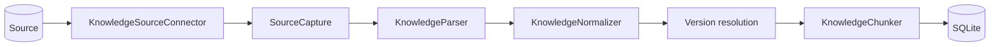
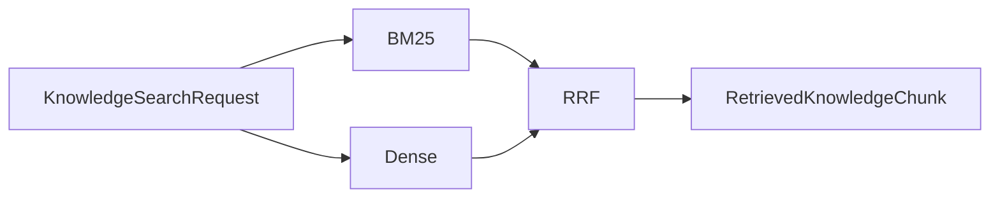
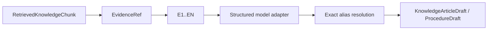

# Codebase map

This page maps repository paths to responsibilities. It is a navigation/reference page, not the place for design rationale.

## Repository layout

```text
apps/api/
├── evals/
│   ├── retrieval/
│   │   ├── golden_v1.json
│   │   └── catalogue_v2.json
│   └── training/
│       └── procedure_grounding_v1.json
├── src/tropos/
│   ├── core/
│   │   ├── domain/
│   │   │   ├── access.py
│   │   │   ├── evidence.py
│   │   │   ├── knowledge.py
│   │   │   ├── knowledge_chunk.py
│   │   │   └── knowledge_article.py
│   │   ├── application/
│   │   │   ├── ingestion/
│   │   │   ├── embeddings/
│   │   │   ├── retrieval/
│   │   │   ├── sources/
│   │   │   └── ports/
│   │   └── adapters/
│   │       ├── sources/
│   │       ├── parsing/
│   │       ├── normalization/
│   │       ├── chunking/
│   │       ├── persistence/
│   │       ├── embeddings/
│   │       └── retrieval/
│   ├── capabilities/
│   │   ├── resolve/
│   │   │   ├── domain/
│   │   │   ├── application/
│   │   │   └── adapters/
│   │   └── training/
│   └── evals/
│       ├── contracts.py
│       ├── catalogue.py
│       ├── execution.py
│       ├── fixtures.py
│       ├── retrieval.py
│       ├── training.py
│       ├── run_store.py
│       └── reporting.py
└── tests/
    ├── unit/
    └── integration/
```

## Core domain

| Path | Responsibility |
| --- | --- |
| `core/domain/access.py` | Tenant/group access semantics and indexability |
| `core/domain/knowledge.py` | Canonical KnowledgeDocument model |
| `core/domain/knowledge_chunk.py` | Governed KnowledgeChunk and chunk invariants |
| `core/domain/evidence.py` | Stable EvidenceRef shared by generated artifacts |
| `core/domain/knowledge_article.py` | Shared fixed Knowledge Article artifact contracts |

## Ingestion and source integration

| Path | Responsibility |
| --- | --- |
| `core/application/ports/sources.py` | Source connector contract and SourceCapture envelope |
| `core/application/sources/reliability.py` | Bounded retry policy |
| `core/application/ingestion/ingest_from_source.py` | Connector → ingestion bridge |
| `core/application/ingestion/ingest_knowledge.py` | Ingestion orchestration |
| `core/application/ingestion/raw_record.py` | Raw source envelope and ingestion fingerprints |
| `core/application/ingestion/parsing.py` | Parser contract |
| `core/application/ingestion/normalization.py` | Normalized structures/document materialization |
| `core/application/ingestion/versioning.py` | Canonical content/governance change resolution |
| `core/application/ingestion/lifecycle.py` | Knowledge lifecycle/tombstone behavior |
| `core/adapters/sources/local_file.py` | Local-file connector |
| `core/adapters/parsing/deterministic.py` | TXT/Markdown/HTML/DOCX parsing |
| `core/adapters/normalization/deterministic.py` | Deterministic normalization |
| `core/adapters/chunking/deterministic.py` | Deterministic chunking |
| `core/adapters/persistence/sqlite.py` | SQLite persistence |

## Embeddings and retrieval

| Path | Responsibility |
| --- | --- |
| `core/application/ports/embeddings.py` | Embedding provider/repository boundaries |
| `core/application/embeddings/materialize.py` | Derived embedding materialization |
| `core/application/ports/retrieval.py` | Governed strategy-neutral retriever contract |
| `core/application/retrieval/models.py` | Search/access/result contracts |
| `core/adapters/embeddings/openai.py` | OpenAI-compatible embedding provider adapter |
| `core/adapters/embeddings/sqlite.py` | SQLite embedding persistence |
| `core/adapters/retrieval/sqlite_fts.py` | FTS5/BM25 lexical retrieval |
| `core/adapters/retrieval/exact_vector.py` | Exact dense/cosine retrieval |
| `core/adapters/retrieval/hybrid_rrf.py` | Reciprocal Rank Fusion hybrid retrieval |

## Resolve

| Path | Responsibility |
| --- | --- |
| `capabilities/resolve/domain/resolved_case.py` | Resolved-case vocabulary |
| `capabilities/resolve/domain/knowledge_action.py` | REUSE/IMPROVE/CREATE/NO_ACTION policy |
| `capabilities/resolve/application/evaluate_case_closure.py` | Closure decision orchestration |
| `capabilities/resolve/application/knowledge_article_request.py` | Bounded business intake and system-owned prompt policy |
| `capabilities/resolve/application/generate_knowledge_article.py` | Governed retrieval → article-generation orchestration |
| `capabilities/resolve/application/ports/knowledge_article.py` | Provider-neutral KnowledgeArticleGenerator port |
| `capabilities/resolve/adapters/langchain_knowledge_article_generator.py` | LangChain structured-output adapter |
| `capabilities/resolve/adapters/evaluation/rule_based_closure_evidence.py` | Deterministic closure-evidence evaluator |

## Training

| Path | Responsibility |
| --- | --- |
| `capabilities/training/procedure.py` | ProcedureDraft, steps, exceptions and typed gaps |
| `capabilities/training/generate_procedure.py` | Governed retrieval → procedure generation |
| `capabilities/training/langchain_extractor.py` | LangChain structured-output adapter and alias resolution |

## Evaluation

| Path | Responsibility |
| --- | --- |
| `evals/contracts.py` | Vendor-neutral EvalDataset/EvalCase/EvalRun/EvalObservation/EvalScore contracts |
| `evals/catalogue.py` | Retrieval evaluation dataset validation/versioning |
| `evals/execution.py` | Retrieval evaluation execution |
| `evals/fixtures.py` | Isolated retrieval evaluation composition |
| `evals/retrieval.py` | Retrieval metrics |
| `evals/training.py` | Deterministic Training grounding evaluation |
| `evals/run_store.py` | Saved run/observation persistence |
| `evals/reporting.py` | Evaluation reporting |

## Runtime flows

### Ingestion


```mermaid
flowchart LR
    Source[(Source)]
    --> Connector[KnowledgeSourceConnector]
    --> Capture[SourceCapture]
    --> Parse[KnowledgeParser]
    --> Normalize[KnowledgeNormalizer]
    --> Version[Version resolution]
    --> Chunk[KnowledgeChunker]
    --> Persist[(SQLite)]
```

### Retrieval


```mermaid
flowchart LR
    Request[KnowledgeSearchRequest]
    --> Lex[BM25]
    Request --> Dense[Dense]
    Lex --> Hybrid[RRF]
    Dense --> Hybrid
    Hybrid --> Result[RetrievedKnowledgeChunk]
```

### Grounded generation


```mermaid
flowchart LR
    Result[RetrievedKnowledgeChunk]
    --> Ref[EvidenceRef]
    --> Alias[E1..EN]
    --> Model[Structured model adapter]
    --> Resolve[Exact alias resolution]
    --> Artifact[KnowledgeArticleDraft / ProcedureDraft]
```

## Tests

Unit tests mirror the domain/application/adapter boundaries. Integration tests cover cross-boundary behavior such as ingestion + persistence + retrieval, evaluation baselines, and grounded generation with fake structured models.

Live provider credentials are not required for normal CI tests.

## Related documents

- [Architecture overview](ARCHITECTURE_OVERVIEW.md)
- [RAG architecture](RAG_ARCHITECTURE.md)
- [Knowledge Article architecture](KNOWLEDGE_ARTICLE.md)
- [Evaluation contracts](EVALUATION_CONTRACTS.md)
- [Build history](../product/BUILD_HISTORY.md)
