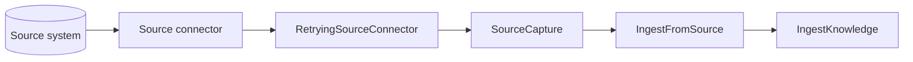

# Connector reliability

Tropos treats source reliability as an explicit application concern around source adapters. Connectors translate vendor-specific failures into a small Tropos failure taxonomy; retry policy then decides whether and when capture should be attempted again.

## Current execution model



The reliability wrapper does not parse documents, normalize content, persist knowledge, refresh credentials, or interpret vendor SDK exceptions. Those responsibilities remain with the relevant adapter or downstream component.

## Failure taxonomy

| Failure | Retry classification | Meaning |
| --- | --- | --- |
| `SourceUnavailableError` | Retryable | Temporary network or source-service failure |
| `SourceRateLimitedError` | Retryable | Source throttled the request; may include a retry-after hint |
| `SourceAuthenticationError` | Terminal at this boundary | Adapter could not recover authentication |
| `SourceConfigurationError` | Terminal | Connector setup is invalid or unsafe |
| `SourceRecordNotFoundError` | Terminal | Requested source record does not exist |
| `UnsupportedSourceArtifactError` | Terminal | Connector cannot map the artifact to a supported format |
| `SourceIdentityMismatchError` | Terminal | Connector output violates its configured source namespace |

A source adapter may internally refresh an expired access token. If authentication still cannot be recovered, it raises `SourceAuthenticationError`; the generic retry wrapper does not repeatedly retry invalid credentials.

## Retry policy

`SourceRetryPolicy` provides bounded exponential backoff. The current defaults are:

```text
maximum attempts: 3
initial backoff: 1 second
multiplier: 2
maximum computed backoff: 30 seconds
```

For ordinary transient failures this produces delays of 1 second, then 2 seconds before the third attempt. A `SourceRateLimitedError` may carry a source-provided `retry_after_seconds` value; that value takes precedence over computed backoff.

Only errors derived from `RetryableSourceError` are retried. The wrapper deliberately does not use a broad `except Exception: retry` policy.

## Why retry is a decorator

The base connector remains responsible only for source-native capture. Reliability can be composed around any connector:

```text
SharePointConnector
        ↓
RetryingSourceConnector
        ↓
IngestFromSource
```

This prevents source-specific retry loops from leaking into `IngestFromSource` or `IngestKnowledge`, and allows tests to exercise retry behavior independently from vendor SDKs.

## Implemented guarantees

The current baseline guarantees that:

1. Retryable and terminal source failures are explicitly distinguishable.
2. Transient source capture retries are bounded by attempt count.
3. Backoff grows exponentially and is capped for computed delays.
4. Source-provided rate-limit retry hints are honored.
5. Terminal failures are surfaced immediately without retry.
6. Retry behavior can be tested without sleeping in real time through an injected sleeper.

## Not implemented yet

The current connector API captures one record at a time. The following operational capabilities remain planned for real external-source sync:

- durable connector sync runs and checkpoints;
- incremental source cursors/delta tokens;
- bulk backfill orchestration;
- partial-batch replay and failed-item storage;
- proactive request-rate limiting and concurrency control;
- metrics, alerts, health state, and freshness SLOs;
- process-crash recovery for long-running syncs;
- deletion/tombstone propagation;
- jitter for highly concurrent distributed retries.

Those concerns should be added when Tropos introduces a source connector that performs multi-record or long-running synchronization.
