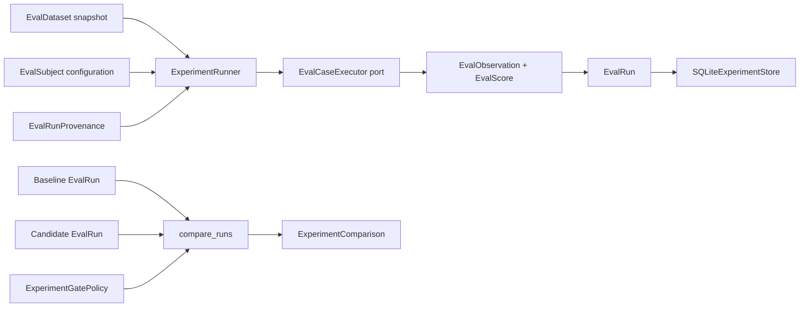

# Evaluation experiments and regression comparison

Status: Implemented baseline / V1  
Scope: Generic experiment execution, immutable run evidence, baseline-versus-candidate comparison, uncertainty, and gate-policy vocabulary.

## Business problem

A model, prompt, retrieval strategy, or evaluator can change while the test dataset remains the same. A single aggregate score cannot tell the team which cases regressed, which improved, whether the comparison is paired, or whether a security invariant failed even though an average increased.

QE-103 adds a vendor-neutral experiment layer above the shared evaluation contracts so Tropos can compare two configurations without requiring LangSmith or another hosted evaluation product.

The V1 design answers four questions:

1. What exact dataset, subject configuration, code revision, and dependency state produced a run?
2. Which individual cases changed from baseline to candidate?
3. How did shared numeric dimensions move on the same cases?
4. Did a hard invariant fail, or did a decision metric exceed an allowed regression?

It does **not** make the current small datasets statistically sufficient for release decisions. Benchmark size, locked holdout data, retrieval abstention, production gates, and calibrated semantic judges are separate backlog items.

## Implemented flow



The executor is deliberately a port. Retrieval, Knowledge Article, Training, or future capability-specific code can execute one case and return the shared `EvalObservation` contract without moving capability semantics into the experiment runner.

## Run identity

An `EvalRun` carries four separate identities:

| Identity | Purpose |
| --- | --- |
| `EvalDatasetRef` | exact immutable case snapshot |
| `EvalSubject` | model/prompt/retrieval/configuration being evaluated |
| `EvalRunProvenance` | code revision, dependency digest, runtime metadata |
| `baseline_run_id` | optional comparison lineage |

A subject configuration can record fields such as model identifier, prompt version, retrieval strategy, or other bounded configuration. The generic runner does not interpret those fields.

Execution completion and quality success remain separate. A run can complete while individual cases fail or error.

## Experiment execution

`ExperimentRunner` executes every case in dataset order and requires a terminal observation for the same case ID.

Expected terminal states are:

- `PASSED`
- `FAILED`
- `ERROR`

An exception raised by a case executor becomes an `ERROR` observation containing only the exception type. A malformed executor result, such as returning the wrong case ID or a non-terminal state, is treated as an experiment-infrastructure defect and raises immediately.

The runner can write the completed run to an injected `EvalRunSink`. V1 includes `SQLiteExperimentStore`.

## Persistence

`SQLiteExperimentStore` stores:

- run identity and provenance;
- subject configuration;
- baseline lineage;
- one immutable row per case observation;
- one immutable row per score/evaluator/version.

Update and delete triggers protect stored experiment evidence through the normal repository API.

This is a local auditability mechanism, not a tamper-proof compliance ledger.

### Why a separate store exists beside retrieval catalogue runs

The existing retrieval catalogue runner has a richer retrieval-specific persistence model containing hits, assertions, fixture state, and retrieval metrics. QE-103 operates on the cross-capability `EvalRun / EvalObservation / EvalScore` contracts.

V1 therefore keeps the generic experiment store separate rather than forcing the retrieval-specific schema into a premature universal model.

Revisit this boundary when QE-108/QE-110 require one reporting surface across retrieval and generation experiments.

## Baseline-versus-candidate comparison

`compare_runs` requires:

- both runs to be completed;
- exactly the same `EvalDatasetRef`;
- exactly the same case IDs;
- candidate baseline lineage, when supplied, to point to the compared baseline.

Case outcome classification is deterministic:

| Baseline | Candidate | Classification |
| --- | --- | --- |
| passed | failed/error | regression |
| failed/error | passed/non-error | improvement |
| same state | same state | unchanged |
| other non-terminal mismatch | incomparable |

Numeric scores with the same metric name are compared **pairwise on the same case IDs**. The report retains:

- pair count;
- baseline mean;
- candidate mean;
- mean delta;
- optional paired-bootstrap confidence interval.

Boolean scores are not averaged as numeric metrics. They can participate in hard-invariant gating through their explicit `passed` field.

## Paired uncertainty

The comparison uses a deterministic paired bootstrap of:

```text
candidate case score - baseline case score
```

rather than bootstrapping two independent populations. This preserves the fact that both configurations ran on the same cases.

V1 defaults to withholding the interval when fewer than 20 paired observations exist. This is intentional: the mechanism should not make a tiny dataset look statistically authoritative.

The bootstrap seed is derived deterministically from the configured seed plus metric name so the same comparison is reproducible.

## Gate policy

V1 separates two rule types.

### Hard invariant

A hard invariant requires every candidate score for that metric to exist and explicitly set `passed=True`.

Examples later may include:

- access isolation;
- evidence integrity;
- stale-evidence rejection;
- critical policy/safety checks.

One failure blocks the gate even if averages improve elsewhere.

### Decision metric

A decision metric compares the paired mean delta with an allowed regression budget.

Example:

```text
quality mean delta = -0.015
allowed regression = 0.020
→ decision metric passes
```

This is only gate-policy vocabulary in QE-103. QE-110 will define which real metrics become PR, nightly, or release gates.

## Existing capability evaluators

Tropos already has component-specific evaluation methods:

- retrieval: Recall@K, Precision@5, MRR, no-answer behavior;
- Training: step coverage, citation alignment, exception separation, gap coverage;
- Knowledge Article: section coverage, citation alignment, typed gap handling, forbidden behavior.

QE-103 does not silently rewrite those evaluators. Capability-specific executors can adapt their outputs into shared `EvalObservation / EvalScore` objects when experiment wiring is added.

## Deliberately not implemented here

- larger retrieval benchmark and locked holdout — QE-108;
- calibrated retrieval abstention — QE-109;
- PR/nightly/release workflow thresholds — QE-110;
- calibrated semantic/LLM judge — QE-111;
- production-derived online evaluation;
- hosted evaluation vendor integration.

## Interview translation

A concise explanation:

> We separated experiment execution from quality semantics. Every run pins the dataset snapshot, subject configuration and code/dependency provenance. Baseline and candidate are compared case-by-case on the same dataset; pass-to-fail changes are explicit, numeric metrics use paired deltas with optional bootstrap uncertainty, and hard invariants are gated separately from aggregate decision metrics.
