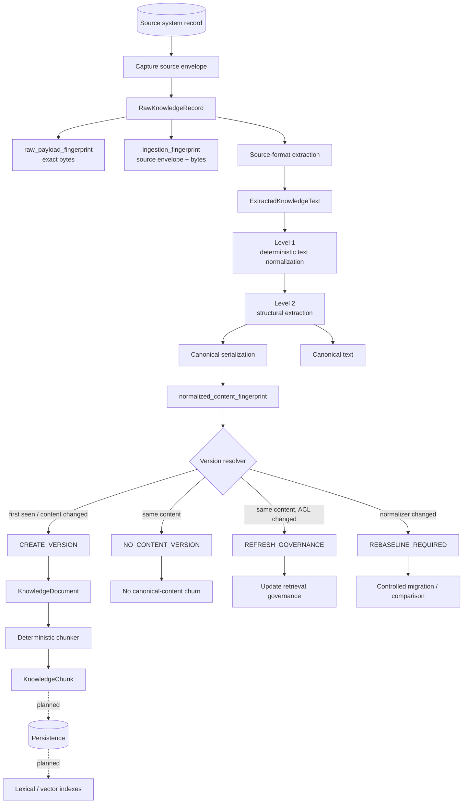
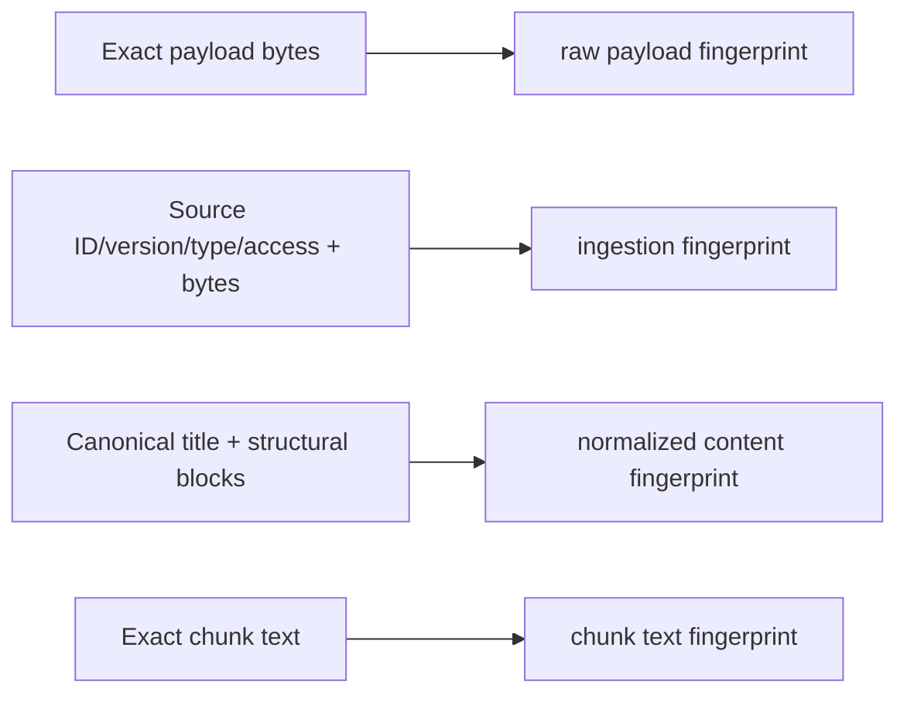
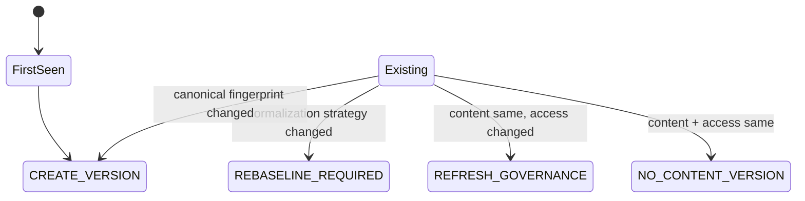
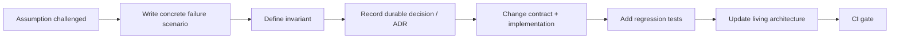

# Ingestion, Normalization and Canonical Versioning

**Status:** IMPLEMENTED foundation  
**Last architecture change:** 2026-09-21

Tropos must distinguish an exact source change from a meaningful knowledge change. A file can change because of line endings, whitespace, list markers or source-system metadata while the knowledge remains the same. Conversely, a one-character business change such as `90 days` to `60 days` must create a new canonical content version.

The ingestion design therefore keeps raw evidence, deterministic normalization, structural extraction, content-version resolution and chunking as separate responsibilities.

## End-to-end architecture



`Source-format extraction` is a boundary, not permission to use an LLM. Today Tropos accepts already extracted text plus a basic format hint (`PLAIN` or `MARKDOWN`). Rich parsers for DOCX/PDF/HTML and source connectors remain **PLANNED**.

## Why there are multiple fingerprints



| Identity | Question answered | Used for canonical content versioning? |
| --- | --- | --- |
| `raw_payload_fingerprint` | Did the exact captured bytes change? | No |
| `ingestion_fingerprint` | Did the captured source envelope change? | No |
| `normalized_content_fingerprint` | Did canonical knowledge content/structure change under this normalizer? | **Yes** |
| chunk `content_fingerprint` | Is this exact evidence span intact? | No; it protects chunk integrity |

Upstream `source_version` remains provenance. It is deliberately **not** trusted as the Tropos content-version decision by itself.

## Level 0 — raw evidence

`RawKnowledgeRecord` preserves:

- source system, source record and source version;
- content type;
- exact payload bytes;
- captured access policy;
- capture time;
- exact-payload and ingestion-envelope fingerprints.

This is the audit/replay boundary. Normalization never destroys the fact that a different raw artifact was captured.

## Level 1 — deterministic normalization

The current `canonical-text-v1` normalizer performs only deterministic transformations:

- Unicode NFC normalization;
- byte-order-mark removal from extracted text;
- CRLF/CR to LF line-ending normalization;
- removal of trailing horizontal whitespace;
- collapse of repeated blank lines;
- leading/trailing text trim;
- stable inline whitespace normalization for titles and extracted structural labels.

The invariant is:

> Equivalent presentation should produce the same Level-1 representation without rewriting meaning.

There is no LLM paraphrasing, summarization or semantic rewriting in this identity path.

## Level 2 — deterministic structural extraction

Tropos currently preserves a deliberately small structural vocabulary:

```text
StructuralBlock
├── HEADING(level 1..6)
├── PARAGRAPH
└── LIST_ITEM
```

For Markdown input, ATX headings and list items are recognized. Ordered and unordered list markers are canonicalized into one list-item representation. Other text is kept as paragraphs. Plain text is treated conservatively; Tropos does not invent semantic headings.

The ordered block sequence plus normalized title is serialized as stable, sorted-key JSON. SHA-256 of that serialization becomes the normalized content fingerprint.

The same blocks are also rendered into deterministic `canonical_text`. `KnowledgeDocument.content` stores this text, so a candidate considered canonically identical cannot later produce different chunk boundaries merely because its source formatting differed.

## Version resolution



The comparison state contains three values:

```text
CanonicalKnowledgeState
├── content_fingerprint
├── normalization_strategy_version
└── access_fingerprint
```

Access is intentionally independent of content. If an article becomes restricted without changing its words, Tropos must update retrieval governance immediately but should not fabricate a new content version.

A normalizer-version change is also intentionally not treated as proof that the knowledge changed. The result is `REBASELINE_REQUIRED`, forcing a controlled comparison/migration instead of silently churning the corpus.

## Failure questions that drive the design

These questions are now part of architecture review for ingestion changes.

| Failure question | Required behavior |
| --- | --- |
| What if only spaces, line endings or list markers change? | Raw identity may change; canonical content version must not. |
| What if `90 days` becomes `60 days`? | Canonical fingerprint changes; create a content version. |
| What if the source system increments its own version but text is unchanged? | Preserve provenance; do not create a Tropos content version. |
| What if access changes but text does not? | Refresh governance without content-version churn. |
| What if the normalization algorithm changes? | Require rebaseline/migration; do not call it a business-content change automatically. |
| Can the same input produce different identity on replay? | No; normalization/version resolution must be deterministic. |
| What if normalization removes everything? | Reject the candidate. |
| What if access is unresolved? | It must not become an indexable `KnowledgeDocument`. |
| Can a chunk be traced to canonical and raw state? | Yes; it carries normalized and ingestion lineage plus source metadata. |

## Chunk identity after normalization

Chunk identity is now based on canonical evidence, not noisy upstream state:

```text
knowledge_id
+ normalized_content_fingerprint
+ normalization_strategy_version
+ chunking_strategy_version
+ start_offset
+ end_offset
+ exact_chunk_text_fingerprint
```

`source_version` and `ingestion_fingerprint` are still retained as lineage, but do not randomize chunk IDs when canonical content is unchanged.

## Architectural invariants

1. Raw evidence is preserved before normalization.
2. Canonical content identity is deterministic and separate from source-envelope identity.
3. Presentation-only changes do not create canonical content versions.
4. Meaning-bearing text or structural changes do create a canonical content version.
5. Access changes are independently observable and enforceable.
6. Normalization behavior is explicitly versioned.
7. Canonical text and canonical fingerprint derive from the same normalized structure.
8. Chunk identity derives from canonical content identity, while raw/source metadata remains provenance.
9. No LLM output participates in identity/versioning unless a future ADR explicitly changes this rule.

## How mature teams handle a discovered architecture gap

Finding this after initial chunking work is normal evolutionary architecture. The professional response is not to hide the miss; it is to convert the newly discovered failure mode into an explicit control.



For Tropos the triggering scenario was: **a formatting-only source edit could have caused a new source fingerprint, new chunk IDs and eventually unnecessary re-indexing/embedding work.** The correction separates source identity from canonical content identity before persistence and retrieval make the mistake expensive.

This follows several established engineering ideas:

- **canonicalization** — compare stable representations rather than incidental source formatting;
- **content-addressable integrity** — fingerprints identify exact normalized evidence;
- **idempotent processing** — replaying the same logical input produces the same result;
- **evolutionary architecture** — refine boundaries when concrete failure modes appear;
- **architecture fitness functions** — unit tests encode invariants such as formatting equivalence and deterministic replay;
- **ADRs** — preserve the reason and trade-off behind a durable design choice.

## Executable evidence

Implementation:

- `apps/api/src/tropos/core/application/ingestion/raw_record.py`
- `apps/api/src/tropos/core/application/ingestion/normalization.py`
- `apps/api/src/tropos/core/application/ingestion/versioning.py`
- `apps/api/src/tropos/core/application/ports/normalization.py`
- `apps/api/src/tropos/core/adapters/normalization/deterministic.py`
- `apps/api/src/tropos/core/domain/knowledge.py`
- `apps/api/src/tropos/core/domain/knowledge_chunk.py`
- `apps/api/src/tropos/core/adapters/chunking/deterministic.py`

Regression evidence:

- `tests/unit/core/adapters/normalization/test_normalization.py`
- `tests/unit/core/application/ingestion/test_versioning.py`
- updated raw-record, knowledge-document and chunking unit tests.

Decision record: [`../decisions/ADR-004-deterministic-normalization-and-content-versioning.md`](../decisions/ADR-004-deterministic-normalization-and-content-versioning.md).
