# Ingestion and normalization

Tropos separates exact source capture from parser output and canonical knowledge identity. A source artifact can change because of formatting or metadata without changing the knowledge it represents, while a small business-content change must create a new canonical version.

## Pipeline

```mermaid
flowchart LR
    S[(Source record)]
    --> R[RawKnowledgeRecord]
    --> O[IngestKnowledge]
    --> P[DeterministicKnowledgeParser]
    --> E[ExtractedKnowledgeText]
    --> N[DeterministicKnowledgeNormalizer]
    --> C[NormalizedKnowledge]
    --> V[Version resolver]
    --> D[KnowledgeDocument]
    --> H[DeterministicKnowledgeChunker]
    --> K[KnowledgeChunk]
    --> DB[(SQLite persistence)]
```



`IngestKnowledge` is the synchronous application orchestrator. It owns sequencing and branching but delegates parsing, normalization, version rules, chunking, and persistence behavior to their respective components and ports.

Parsing v1 routes by normalized MIME content type and supports UTF-8 plain text, Markdown, HTML, and DOCX. PDF, OCR, scanned-document extraction, and multimodal parsing are not implemented yet.

## Parsing

`DeterministicKnowledgeParser` keeps canonical ingestion deterministic and source-aware.

| Source | Strategy | Output format |
| --- | --- | --- |
| Plain text | UTF-8 decode with invalid-byte rejection | Plain text |
| Markdown | Preserve source Markdown and derive title from heading when available | Markdown |
| HTML | Deterministic HTML parsing; remove executable/noise tags; preserve headings, paragraphs, and list semantics | Markdown |
| DOCX | Parse OOXML package; preserve headings, lists, table row text, and document title | Markdown |

Unsupported formats fail closed with `UnsupportedContentTypeError`. Malformed supported documents raise `KnowledgeParseError` rather than silently degrading or replacing source bytes.

HTML and DOCX are rendered into Markdown because the current normalization contract already understands explicit headings and ordered/unordered list markers. DOCX table cells are currently retained as textual rows; tables are not yet first-class canonical blocks.

No model call participates in parsing v1. A future probabilistic parser must define how its output is validated before it can affect canonical identity.

## Identity layers

| Identity | Input | Purpose | Drives canonical content version? |
| --- | --- | --- | --- |
| `raw_payload_fingerprint` | Exact payload bytes | Artifact integrity and replay | No |
| `ingestion_fingerprint` | Source envelope + exact bytes | Captured-state identity and provenance | No |
| `normalized_content_fingerprint` | Canonical title + ordered structural blocks | Logical knowledge identity | Yes |
| Chunk `content_fingerprint` | Exact canonical chunk text | Evidence-span integrity | No |

The upstream `source_version` remains provenance. It does not create a Tropos content version by itself.

## Raw capture

`RawKnowledgeRecord` stores the inbound source envelope:

- source system, record ID, and source version;
- content type;
- exact payload bytes;
- access policy;
- capture timestamp;
- raw-payload and ingestion fingerprints.

The raw record remains immutable so parsing and canonicalization do not erase what Tropos received. The SQLite persistence adapter stores exact source captures separately from canonical document versions.

## Orchestration and durable state

The orchestrator executes one explicit workflow:

```text
capture source
→ parse
→ normalize
→ load previous canonical state
→ resolve content and governance actions
→ refresh governance when required
→ materialize and chunk only for CREATE_VERSION
→ persist outcome
```

Workflow state is persisted through `IngestionRunStore`. Runs record a durable stage such as `PARSING`, `NORMALIZING`, `DECIDING`, `CHUNKING`, or `PERSISTING`, and failed runs retain the error type and stage for diagnosis.

A completed immutable capture is idempotent. If the same `knowledge_id` and `ingestion_fingerprint` are submitted again, Tropos returns the previous completed result as a replay instead of creating a duplicate content version.

`KnowledgeStateRepository` uses expected-state checks for version and governance writes. If canonical state changes after the orchestrator reads it, the write fails with `ConcurrentKnowledgeUpdateError` rather than silently overwriting a newer state.

The first adapter is SQLite. It persists source captures, ingestion runs, canonical current state, document versions, and chunks. A new version's document, chunks, and current-state pointer are committed in one SQLite transaction.

## Deterministic normalization

`canonical-text-v1` applies deterministic transformations only:

- Unicode NFC normalization;
- UTF byte-order-mark removal from extracted text;
- CRLF/CR to LF line-ending normalization;
- trailing horizontal-whitespace removal;
- repeated blank-line collapse;
- stable inline whitespace for titles, paragraphs, and list items;
- leading/trailing trim.

No model call, paraphrasing, summarization, or semantic rewriting participates in canonical identity.

## Structural extraction

The current structural vocabulary is intentionally small:

```text
StructuralBlock
├── HEADING(level 1..6)
├── PARAGRAPH
├── UNORDERED_LIST_ITEM
└── ORDERED_LIST_ITEM
```

ATX headings are recognized only when `TextFormat.MARKDOWN` is supplied. Ordered and unordered list markers are recognized for both supported format hints. Equivalent marker styles within the same list type are normalized, while ordered and unordered lists remain distinct. Plain text does not infer headings.

The normalized title and ordered block sequence are serialized as stable JSON. SHA-256 of that serialization becomes `normalized_content_fingerprint`. The same blocks render the canonical text stored in `KnowledgeDocument.content`.

This coupling means equal canonical fingerprints under the same strategy also produce equal canonical text for downstream chunking.

## Version resolution

The persisted comparison state is:

```text
CanonicalKnowledgeState
├── content_fingerprint
├── normalization_strategy_version
└── access_fingerprint
```

The resolver returns a primary content action and an independent governance-refresh signal.

| Candidate state | Primary action | Governance refresh |
| --- | --- | --- |
| First observed content | `CREATE_VERSION` | No separate refresh |
| Same canonical content and same access | `NO_CONTENT_VERSION` | No |
| Same canonical content, access changed | `REFRESH_GOVERNANCE` | Yes |
| Canonical content changed | `CREATE_VERSION` | Yes if access also changed |
| Normalization strategy changed | `REBASELINE_REQUIRED` | Yes if access also changed |

A normalization-strategy change is not treated as proof that business content changed. It requires an explicit rebaseline because a new algorithm can change canonical identity across the corpus.

## Governance changes

Content and authorization have separate lifecycles. A document can change content and access policy in the same source update.

`VersionDecision.requires_governance_refresh` preserves that second obligation even when the primary action is `CREATE_VERSION` or `REBASELINE_REQUIRED`. The orchestrator applies the new governance state to the currently persisted version before continuing new-version work when both dimensions change.

Governance refresh and subsequent new-version creation are intentionally separate transactions. If the later version commit fails, the old version remains restricted by the new access policy rather than retaining stale broader access.

## Chunk identity

Chunk identity derives from canonical evidence rather than noisy upstream state:

```text
knowledge_id
+ normalized_content_fingerprint
+ normalization_strategy_version
+ chunking_strategy_version
+ start_offset
+ end_offset
+ exact_chunk_text_fingerprint
```

`source_version` and `ingestion_fingerprint` remain lineage fields. Formatting-only source churn therefore does not create unrelated chunk IDs when canonical content is unchanged.

## Guarantees

The implemented ingestion foundation guarantees that:

1. Exact source evidence remains separately identifiable and durably captured by the SQLite baseline.
2. Supported source formats are parsed deterministically before normalization.
3. Unsupported or malformed sources fail explicitly and the failed workflow stage is recorded.
4. Canonical identity is deterministic for a given normalization strategy.
5. Presentation-only changes covered by the normalizer do not create content versions.
6. Meaning-bearing text or structural changes change canonical identity.
7. Access changes remain independently observable and persistable from content changes.
8. Normalizer changes require explicit rebaselining.
9. Canonical text and canonical fingerprint derive from the same structural representation.
10. Chunk identity derives from canonical content identity while raw/source state remains provenance.
11. Duplicate completed immutable captures are idempotent.
12. A new document version, its chunks, and its current-state pointer are committed atomically in SQLite.
13. Stale concurrent canonical writes fail instead of overwriting newer persisted state.

## Known limits

Parsing v1 does not support PDF, OCR, scanned documents, images, or multimodal extraction. DOCX tables are retained as text rather than canonical table objects.

`canonical-text-v1` does not yet provide first-class semantics for tables, code blocks, embedded objects, or images, and it does not attempt semantic equivalence between genuinely different wording.

The orchestrator is synchronous. It does not yet provide automatic retry/backoff, queue-based execution, worker resumption after process termination, or distributed compensation. SQLite is the first local durable adapter, not a production-scale persistence commitment.

## Implementation

- `apps/api/src/tropos/core/application/ingestion/raw_record.py`
- `apps/api/src/tropos/core/application/ingestion/parsing.py`
- `apps/api/src/tropos/core/adapters/parsing/deterministic.py`
- `apps/api/src/tropos/core/application/ingestion/normalization.py`
- `apps/api/src/tropos/core/application/ingestion/versioning.py`
- `apps/api/src/tropos/core/application/ingestion/run_state.py`
- `apps/api/src/tropos/core/application/ingestion/ingest_knowledge.py`
- `apps/api/src/tropos/core/application/ports/persistence.py`
- `apps/api/src/tropos/core/adapters/persistence/sqlite.py`
- `apps/api/src/tropos/core/adapters/normalization/deterministic.py`
- `apps/api/src/tropos/core/domain/knowledge.py`
- `apps/api/src/tropos/core/domain/knowledge_chunk.py`
- `apps/api/src/tropos/core/adapters/chunking/deterministic.py`

Related decisions:

- [ADR-004: Deterministic normalization and content versioning](../decisions/ADR-004-deterministic-normalization-and-content-versioning.md)
- [ADR-005: Independent governance refresh signal](../decisions/ADR-005-independent-governance-refresh-signal.md)
- [ADR-006: Deterministic format-aware parsing](../decisions/ADR-006-deterministic-format-aware-parsing.md)
- [ADR-007: Synchronous ingestion orchestration and SQLite persistence](../decisions/ADR-007-synchronous-ingestion-orchestration-and-sqlite-persistence.md)
