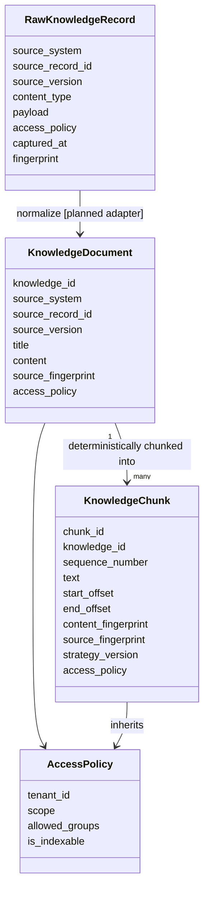
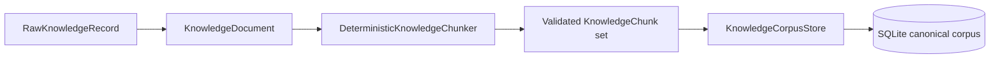
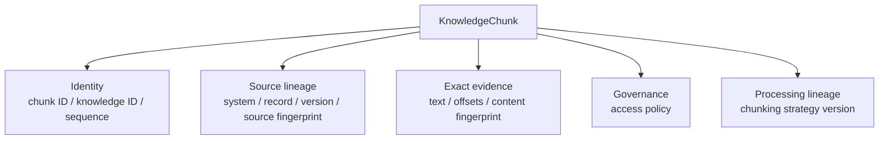
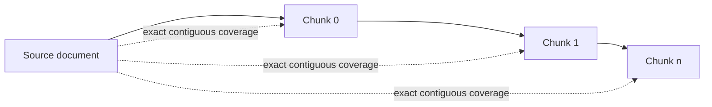
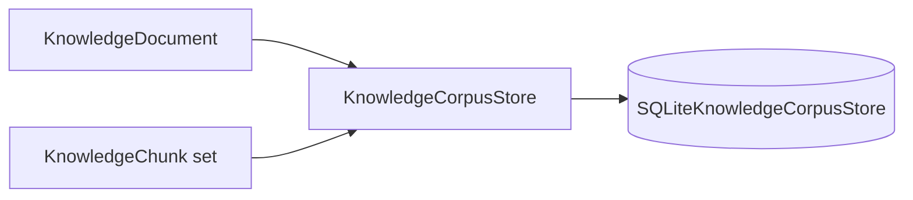
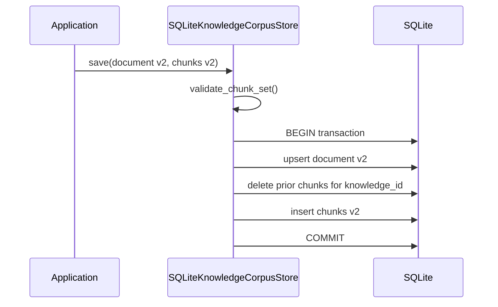
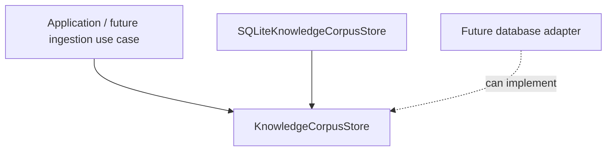
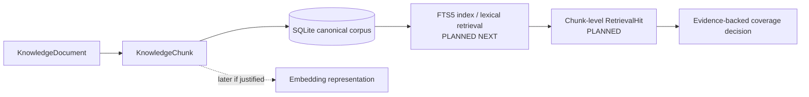

# Knowledge Model

## Purpose

Tropos treats knowledge as governed evidence, not just text. A knowledge unit must retain identity, exact source lineage, access policy, processing lineage and persistence fidelity so later retrieval and recommendations can be traced back to source material.

## Theory foundation

This design combines five ideas:

- **Information architecture** — knowledge objects have explicit identities and relationships.
- **Data provenance / lineage** — transformations retain where data came from and how it changed.
- **Content-addressable verification** — fingerprints make exact content changes detectable.
- **Policy inheritance** — access constraints follow the knowledge they govern.
- **Transactional persistence** — one canonical snapshot is replaced atomically so stale chunks cannot coexist with a newer document state.

## Core model

## Evidence path implemented today

The normalization step from raw payload to canonical `KnowledgeDocument` is still planned. Once a canonical document exists, chunking and SQLite persistence are executable today.

## Why a chunk is more than text

This structure supports a key Tropos invariant: **retrieved evidence must remain explainable as an exact occurrence within a governed source version**.

## Deterministic chunking invariants

Tropos currently validates that a generated chunk set:

- is non-empty;
- has contiguous sequence numbers;
- contains unique chunk IDs;
- has no gaps or overlaps;
- exactly matches the corresponding source ranges;
- inherits source metadata and access policy;
- uses one chunking strategy version across the set;
- covers the complete document.

## Why offsets + fingerprints both exist

| Mechanism | What it proves |
| --- | --- |
| `start_offset` / `end_offset` | Where the evidence occurs in the source text |
| `content_fingerprint` | The exact chunk text has not silently changed |
| `source_fingerprint` | The chunk is tied to a specific source content state |
| `source_version` | The upstream system's version identity |
| `strategy_version` | Which chunking behavior produced the chunk |

No one field is sufficient by itself. Together they provide stronger traceability.

## Persistence model

Tropos now persists the current canonical retrieval snapshot through an inward application contract:

The SQLite schema stores documents and chunks separately, preserving:

- stable knowledge and chunk IDs;
- source system / record / version;
- exact document/chunk text;
- source/content fingerprints;
- offsets and sequence number;
- tenant, access scope and allowed groups;
- chunking strategy version;
- captured/source-updated timestamps and source URI.

### Current-snapshot semantics

The persistence adapter is not an archive of every historical source version. `knowledge_id` identifies the current canonical retrieval snapshot.

The important invariant is that a reader must not observe a new document paired with an old chunk set after a successful save.

Historical source retention, event sourcing, content archival and source-system audit history are separate concerns and remain outside this current corpus-store slice.

## Persistence port versus SQLite adapter

This keeps SQLite from becoming a business-model assumption. The domain has no database imports and does not know how evidence is stored.

## Best-practice mapping

| Best practice | Tropos implementation |
| --- | --- |
| Preserve provenance | Source system, record, version, fingerprint |
| Make transformations reproducible | Deterministic chunker + strategy version |
| Keep evidence locatable | Character offsets |
| Prevent accidental evidence drift | Content fingerprint validation |
| Respect information governance | Access policy inherited by chunks and persisted explicitly |
| Separate domain semantics from retrieval technology | Chunk is a domain object, not a search-index row |
| Separate persistence contract from database choice | `KnowledgeCorpusStore` port + SQLite adapter |
| Avoid partial snapshot updates | One SQLite transaction replaces document + chunks |

## Retrieval extension

Persistence is now the foundation for the next stage, not the retrieval mechanism itself.

A future FTS row or embedding is therefore an **indexing representation of a governed chunk**, not the source of truth for the chunk itself.

## Failure modes to avoid

- storing only vectors and losing exact source evidence;
- generating chunk IDs randomly so re-indexing produces unrelated identities;
- allowing ACLs to disappear between source, persistence and index;
- using chunk text without source version/fingerprint;
- changing chunking behavior without versioning the strategy;
- partially updating a document while leaving stale chunks behind;
- treating SQLite rows as the domain contract;
- conflating source documents, chunks, persistence records, retrieval hits, and generated answers into one model.
