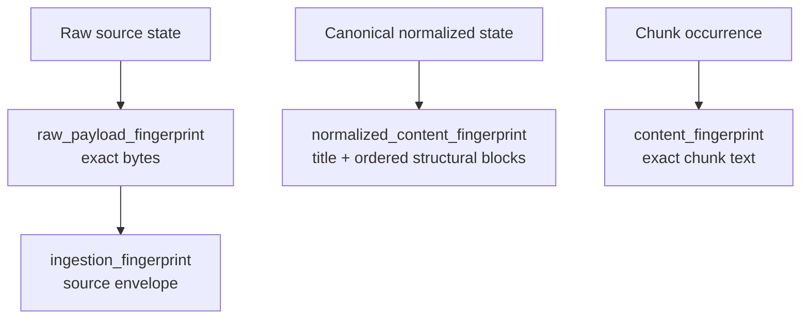
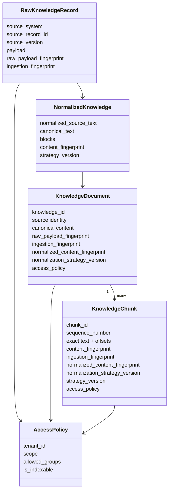
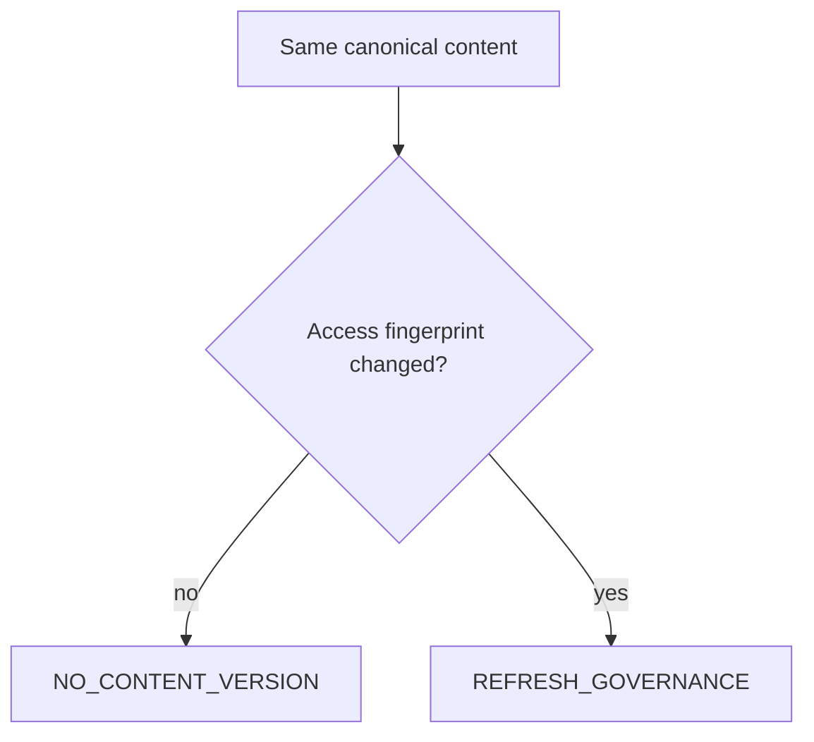
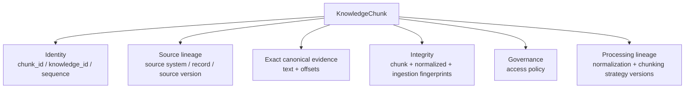
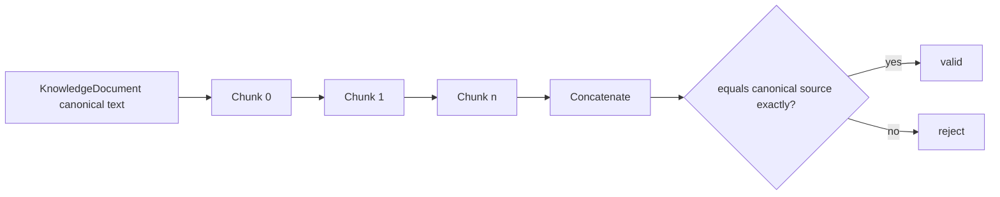
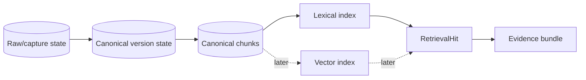

# Knowledge Model

Tropos treats knowledge as **governed evidence**, not just text. Every transformation must preserve enough identity, provenance, access and processing lineage to answer: *what exact artifact arrived, what logical knowledge did Tropos derive, who may retrieve it, which processing strategies produced it, and what evidence was ultimately used?*

## End-to-end evidence lineage

```mermaid
flowchart LR
    Source[(Source record)]
    --> Raw[RawKnowledgeRecord]
    --> Extract[ExtractedKnowledgeText]
    --> Normalize[Deterministic normalization]
    --> Candidate[NormalizedKnowledge]
    --> Version[Canonical version resolver]
    --> Doc[KnowledgeDocument]
    --> Chunker[Deterministic chunker]
    --> Chunk[KnowledgeChunk]
    --> Index[(Search index<br/>PLANNED)]
    --> Evidence[Retrieved evidence<br/>PLANNED]
    --> Decision[Resolve decision]
```



## Identity layers



These are intentionally not synonyms.

| Identity | Stable across formatting-only source change? | Purpose |
| --- | --- | --- |
| raw payload | No | Exact artifact integrity |
| ingestion envelope | No | Idempotent captured-state identity + provenance |
| normalized content | **Yes, when normalization says equivalent** | Canonical knowledge versioning |
| chunk content | Depends on canonical chunk text | Exact evidence integrity |

## Core relationships



## Access is an independent lifecycle dimension

`AccessPolicy` models `UNRESOLVED`, `TENANT` and `RESTRICTED`. Unresolved knowledge cannot become an indexable document or chunk.



This matters because confidentiality can change without the words changing. Security cannot wait for a fake content version.

## Canonical content representation

The current normalizer converts extracted text into a small ordered structural model:

```text
HEADING(level)
PARAGRAPH
LIST_ITEM
```

The canonical title + ordered blocks produce a stable JSON serialization and SHA-256 normalized-content fingerprint. The same blocks render deterministic canonical text used by `KnowledgeDocument.content` and later chunking.

That creates a strong invariant:

> If two candidates have the same normalized content fingerprint under the same normalization strategy, Tropos also gives downstream chunking the same canonical text.

## Canonical content version state

```text
CanonicalKnowledgeState
├── normalized content fingerprint
├── normalization strategy version
└── access fingerprint
```

The resolver produces four explicit outcomes:

| Outcome | Meaning |
| --- | --- |
| `CREATE_VERSION` | First content or materially changed canonical content |
| `NO_CONTENT_VERSION` | Canonical content and access unchanged |
| `REFRESH_GOVERNANCE` | Content unchanged but access changed |
| `REBASELINE_REQUIRED` | Normalization algorithm/version changed |

Source-system versions and ingestion fingerprints remain provenance but do not independently create canonical content versions.

## A chunk is canonical evidence, not a vector row



An embedding or search-index row may later represent a chunk for retrieval; it does not replace the governed evidence object.

## Deterministic chunk identity

```text
knowledge_id
+ normalized_content_fingerprint
+ normalization_strategy_version
+ chunking_strategy_version
+ start_offset
+ end_offset
+ exact text fingerprint
```

This means source-version or raw-formatting churn alone does not change a chunk ID. A true canonical content change, normalizer change, chunker change, boundary change or exact chunk-text change does.

## Lossless canonical chunking

The chunker still prefers boundaries in this order:

```text
paragraph break → line break → sentence-space → space → hard boundary
```

But readability never overrides canonical evidence fidelity.



## Why strategy versions matter

There are now two processing strategies with different responsibilities:

| Strategy | Governs |
| --- | --- |
| `normalization_strategy_version` | What source variations count as the same canonical knowledge representation |
| chunk `strategy_version` | How canonical text is divided into retrieval evidence units |

Changing the normalizer can alter identity for the whole corpus, so Tropos requires explicit rebaseline. Changing the chunker can alter evidence boundaries, so chunks carry their chunking strategy version and retrieval evaluation should compare strategies.

## Invariants / fitness functions

- raw evidence remains separately identifiable;
- canonical identity is deterministic;
- formatting-only equivalence is regression-tested;
- meaningful content/structure changes alter canonical identity;
- access changes remain independently observable;
- canonical fingerprint and canonical text derive from the same structure;
- chunks reconstruct canonical text exactly;
- chunk IDs are stable across upstream-only churn;
- all retrieval evidence preserves access and provenance.

## Next model additions

**PLANNED:** persistence should store raw/source lineage, canonical versions, governance state and chunks without collapsing them into one table/object. Retrieval/index representations should reference canonical chunk identity.



See [`INGESTION_NORMALIZATION.md`](INGESTION_NORMALIZATION.md) and [`../decisions/ADR-004-deterministic-normalization-and-content-versioning.md`](../decisions/ADR-004-deterministic-normalization-and-content-versioning.md).
