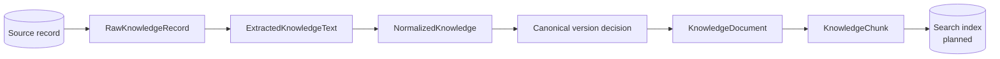
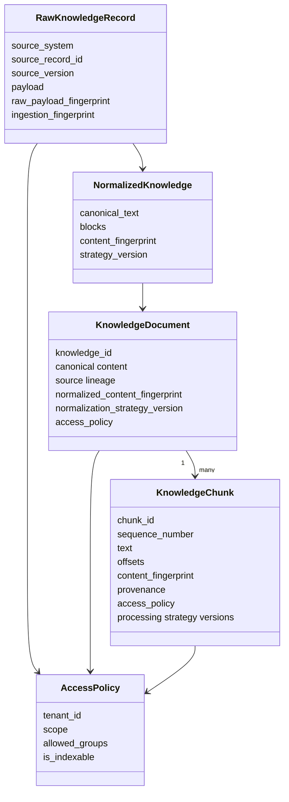
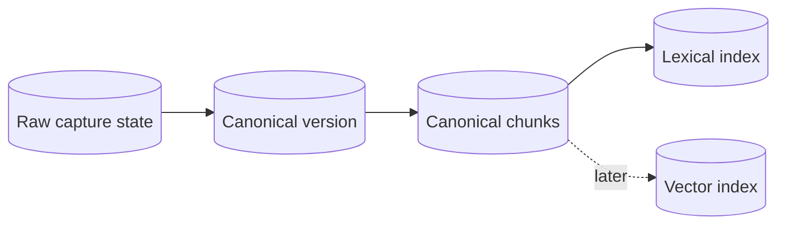

# Knowledge model

Tropos treats knowledge as governed evidence. The model preserves identity, provenance, access, and processing lineage from source capture through canonical chunks.

## Entity flow



## Core entities



## Identity

Tropos uses separate fingerprints because each answers a different lifecycle question.

| Identity | Meaning |
| --- | --- |
| `raw_payload_fingerprint` | SHA-256 of the exact captured bytes |
| `ingestion_fingerprint` | Stable fingerprint of the captured source envelope plus bytes |
| `normalized_content_fingerprint` | Stable fingerprint of canonical title and ordered structural blocks |
| Chunk `content_fingerprint` | SHA-256 of exact canonical chunk text |

Only the normalized-content fingerprint drives canonical content-version decisions. Raw and ingestion identities remain audit and provenance signals.

## Canonical version state

```text
CanonicalKnowledgeState
├── content_fingerprint
├── normalization_strategy_version
└── access_fingerprint
```

The version resolver returns:

| Action | Meaning |
| --- | --- |
| `CREATE_VERSION` | First content or changed canonical content |
| `NO_CONTENT_VERSION` | Canonical content and access are unchanged |
| `REFRESH_GOVERNANCE` | Content is unchanged but access changed |
| `REBASELINE_REQUIRED` | Normalization strategy changed |

Access refresh can also be required alongside `CREATE_VERSION` or `REBASELINE_REQUIRED`; this is carried by `VersionDecision.requires_governance_refresh`.

## Access policy

`AccessPolicy` supports three scopes:

- `UNRESOLVED` — not safe to index;
- `TENANT` — available within a tenant;
- `RESTRICTED` — available only to specified groups.

Unresolved content cannot become an indexable `KnowledgeDocument` or `KnowledgeChunk`.

Search indexes are secondary representations. Future retrieval adapters must enforce access using the governed policy carried by canonical evidence; model reasoning must not be used as a post-hoc authorization filter.

## KnowledgeDocument

`KnowledgeDocument` is the canonical document representation after normalization and version resolution. It carries:

- stable knowledge identity;
- source system, record, and source version;
- canonical text;
- raw, ingestion, and normalized-content fingerprints;
- normalization strategy version;
- access policy;
- capture/source timestamps and source URI when available.

Its content is the canonical text rendered from the same structural blocks used to compute normalized identity.

## KnowledgeChunk

`KnowledgeChunk` is the canonical retrieval evidence unit. It carries:

- `chunk_id`, `knowledge_id`, and sequence number;
- exact canonical text and offsets;
- exact chunk-content fingerprint;
- source and ingestion lineage;
- normalized-content identity;
- normalization and chunking strategy versions;
- inherited access policy.

An embedding or search-index row can represent a chunk for retrieval, but it does not replace the canonical evidence object.

### Chunk identity

```text
knowledge_id
+ normalized_content_fingerprint
+ normalization_strategy_version
+ chunking_strategy_version
+ start_offset
+ end_offset
+ exact_chunk_text_fingerprint
```

Source-version and raw-formatting changes do not affect chunk identity unless they change canonical content.

## Chunk-set invariants

A valid chunk set must:

- use contiguous sequence numbers;
- contain unique chunk IDs;
- have no text gaps or overlaps;
- match exact offsets into canonical document text;
- reconstruct the canonical document exactly when concatenated;
- preserve document access policy and provenance;
- use one chunking strategy version for the set.

`validate_chunk_set` enforces these constraints.

## Persistence model

Persistence is not implemented yet. The planned store must keep source/capture state, canonical version state, governance state, and chunk state distinct rather than collapsing them into one opaque search row.



See [Ingestion and normalization](INGESTION_NORMALIZATION.md) for canonicalization rules and [ADR-002](../decisions/ADR-002-governed-evidence-and-deterministic-chunking.md) for the chunk evidence decision.
