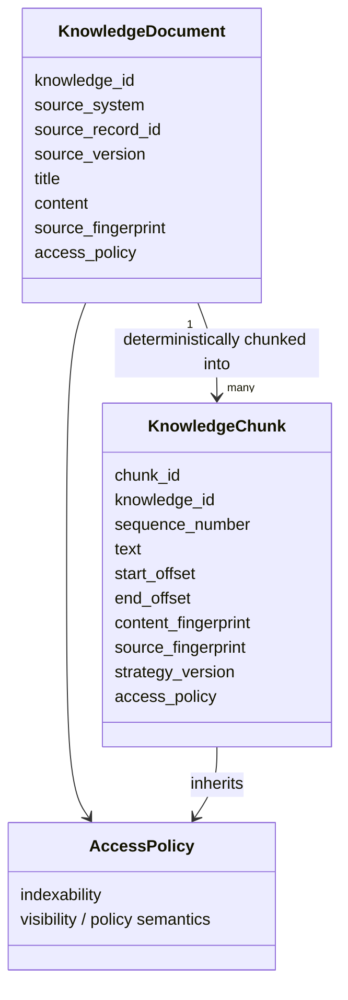
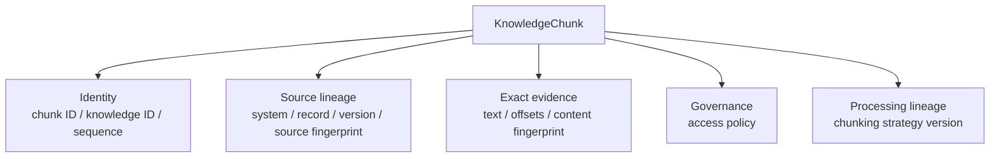
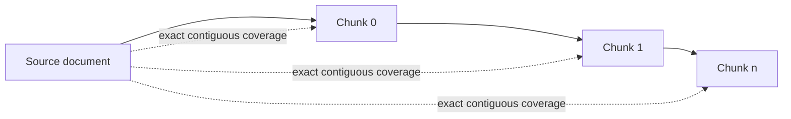
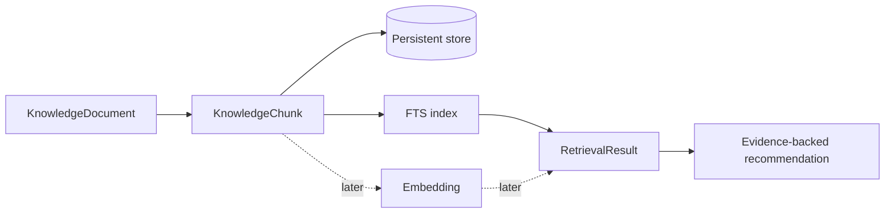

# Knowledge Model

## Purpose

Tropos treats knowledge as governed evidence, not just text. A knowledge unit must retain identity, exact source lineage, access policy, and processing lineage so later retrieval and recommendations can be traced back to source material.

## Theory foundation

This design combines four ideas:

- **Information architecture** — knowledge objects have explicit identities and relationships.
- **Data provenance / lineage** — transformations retain where data came from and how it changed.
- **Content-addressable verification** — fingerprints make exact content changes detectable.
- **Policy inheritance** — access constraints follow the knowledge they govern.

## Core model

## Why a chunk is more than text

This structure supports a key Tropos invariant: **retrieved evidence must remain explainable as an exact occurrence within a governed source version**.

## Deterministic chunking invariants

Tropos currently validates that a generated chunk set:

- is non-empty;
- has contiguous sequence numbers;
- contains unique chunk IDs;
- has no gaps or overlaps;
- exactly matches the corresponding source ranges;
- inherits source metadata and access policy;
- uses one chunking strategy version across the set;
- covers the complete document.

## Why offsets + fingerprints both exist

| Mechanism | What it proves |
| --- | --- |
| `start_offset` / `end_offset` | Where the evidence occurs in the source text |
| `content_fingerprint` | The exact chunk text has not silently changed |
| `source_fingerprint` | The chunk is tied to a specific source content state |
| `source_version` | The upstream system's version identity |
| `strategy_version` | Which chunking behavior produced the chunk |

No one field is sufficient by itself. Together they provide stronger traceability.

## Best-practice mapping

| Best practice | Tropos implementation |
| --- | --- |
| Preserve provenance | Source system, record, version, fingerprint |
| Make transformations reproducible | Deterministic chunker + strategy version |
| Keep evidence locatable | Character offsets |
| Prevent accidental evidence drift | Content fingerprint validation |
| Respect information governance | Access policy inherited by chunks |
| Separate domain semantics from retrieval technology | Chunk is a domain object, not a vector-database row |

## Future extension

Persistence and retrieval should enrich this model rather than replace it.

A future embedding is therefore an **indexing representation of a chunk**, not the source of truth for the chunk itself.

## Failure modes to avoid

- storing only vectors and losing exact source evidence;
- generating chunk IDs randomly so re-indexing produces unrelated identities;
- allowing ACLs to disappear between source and index;
- using chunk text without source version/fingerprint;
- changing chunking behavior without versioning the strategy;
- conflating source documents, chunks, retrieval results, and generated answers into one model.
