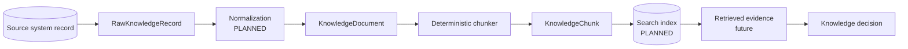
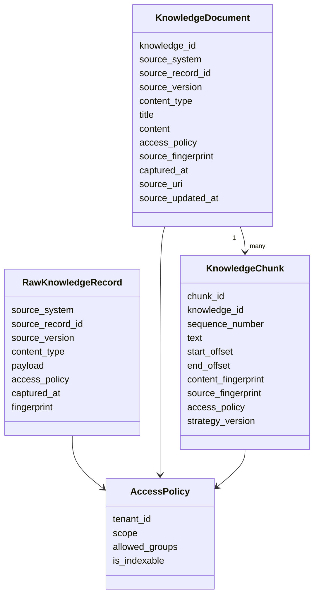
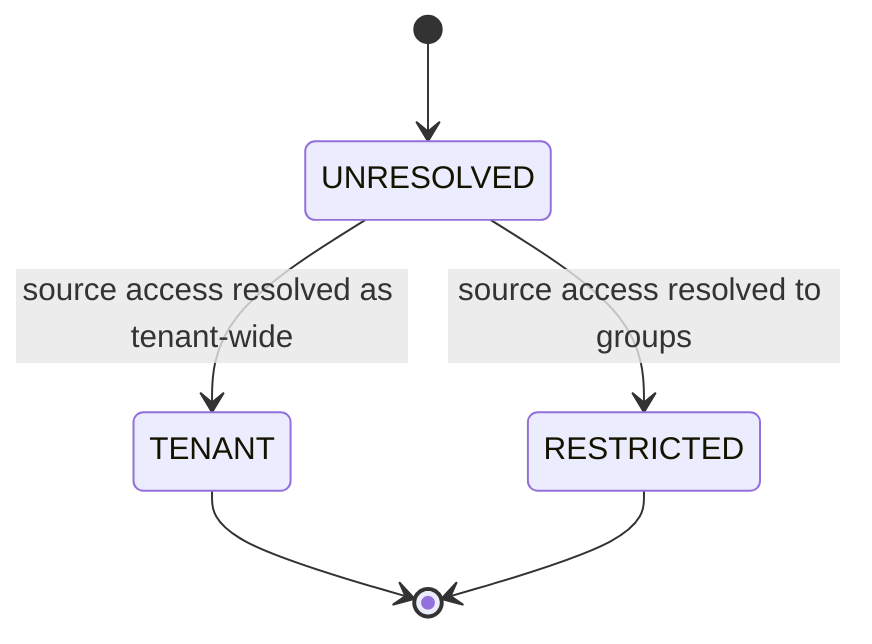
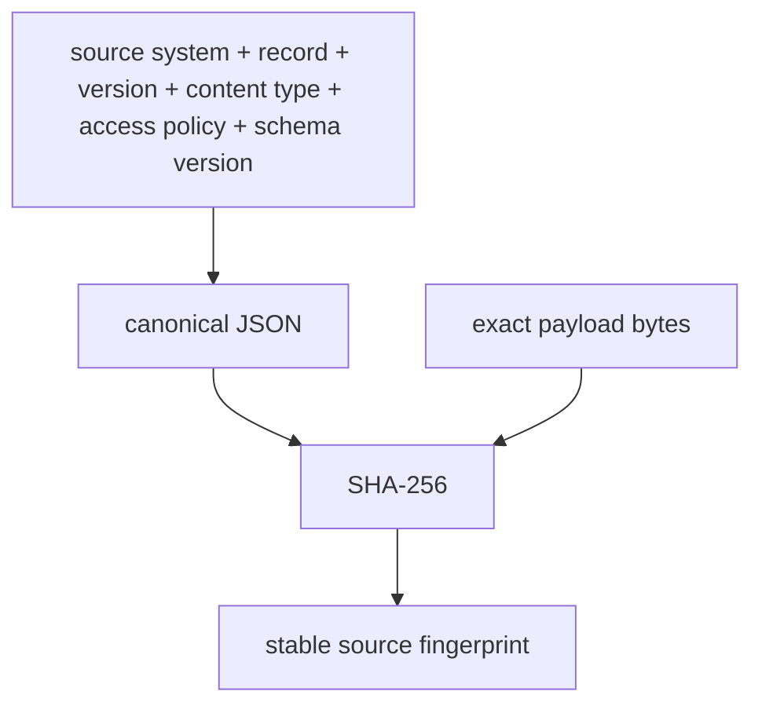
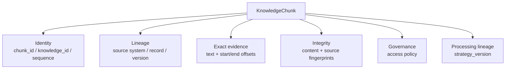
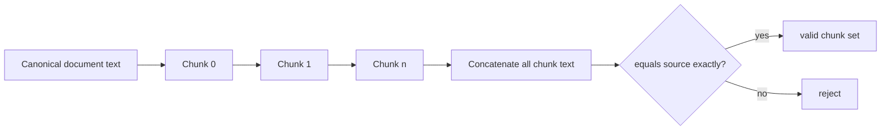
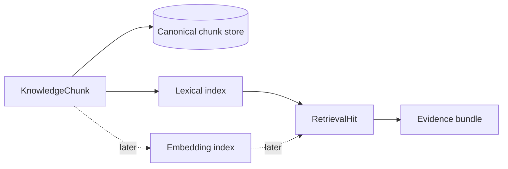

# Knowledge Model

Tropos treats knowledge as **governed evidence**, not just text. Every transformation must preserve enough identity, provenance and access information to answer: *what source did this come from, what exact content was used, who may access it, and how was this evidence produced?*

## End-to-end evidence lineage



Today, the implemented evidence model covers the raw record, canonical document, access policy and deterministic chunk.

## Core object relationships



## Access policy is data, not an afterthought

`AccessPolicy` currently models three states:



| Scope | Meaning | Indexable? |
| --- | --- | --- |
| `UNRESOLVED` | Tropos does not yet know the allowed audience | No |
| `TENANT` | Available within the tenant | Yes |
| `RESTRICTED` | Available only to named groups | Yes, with groups |

A `KnowledgeDocument` cannot be created with unresolved access, and a `KnowledgeChunk` cannot carry unresolved access. This pushes access resolution **before indexing**, reducing the risk of retrieving evidence that should never have entered a searchable corpus.

## Raw-record identity and idempotency

`RawKnowledgeRecord.fingerprint` hashes canonical metadata plus raw payload bytes.



The fingerprint schema is explicitly versioned. This matters because changing what participates in identity is itself a compatibility decision.

## Canonical knowledge document

`KnowledgeDocument` is the retrieval-ready canonical source representation. It separates the upstream source identity from future search/index representations.

Important fields include:

- `knowledge_id` — Tropos identity;
- source system / record / source version — upstream lineage;
- `source_fingerprint` — exact source-state integrity;
- `captured_at` and optional `source_updated_at` — temporal provenance;
- `access_policy` — retrieval governance;
- canonical `title` and `content` — evidence text that later chunking must preserve.

## A chunk is an evidence occurrence, not a text fragment



The design deliberately avoids treating a vector-store row as the canonical evidence object. An embedding may later represent a chunk for search, but the chunk remains the governed source of retrieval evidence.

## Deterministic chunk identity

The current chunker derives `chunk_id` from:

```text
knowledge_id
+ source_version
+ source_fingerprint
+ chunking strategy version
+ start offset
+ end offset
+ exact text fingerprint
```

This means rerunning the same strategy over the same source state produces the same chunk IDs; changing source content, offsets or strategy changes identity.

## Lossless chunking invariant

The current chunker prefers human-readable boundaries in this order:

```text
paragraph break → line break → sentence-space → space → hard boundary
```

But readability never overrides source fidelity.



`validate_chunk_set` proves that the set is non-empty, sequenced contiguously, gap/overlap free, metadata-consistent, strategy-consistent, and covers the complete document exactly.

## Why offsets and fingerprints both exist

| Mechanism | What it answers |
| --- | --- |
| `start_offset` / `end_offset` | Where exactly did this evidence occur? |
| `content_fingerprint` | Has the chunk text changed? |
| `source_fingerprint` | Which exact source state produced it? |
| `source_version` | Which upstream version did the source system report? |
| `strategy_version` | Which processing behavior produced this chunk boundary? |

These mechanisms overlap intentionally. Version IDs alone may be unreliable; fingerprints alone do not tell you where text occurred; offsets alone do not prove content integrity.

## Failure modes prevented

- silent evidence mutation;
- re-indexing that produces unrelated random chunk identities;
- source version drift without detection;
- loss of access policy between source and index;
- citations that cannot be traced back to exact source text;
- embedding/vector metadata becoming the only copy of provenance;
- changing chunking behavior without being able to identify which strategy produced a result.

## Next model additions

The next persistence/retrieval slice should add explicit storage/index representations **around** these domain objects, not replace them. A useful target is:



The canonical chunk remains the object that carries the evidence and access semantics.
