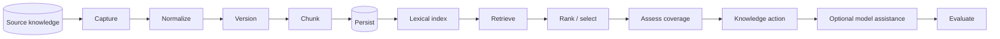
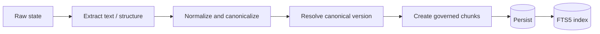
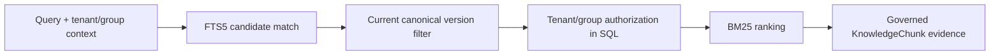
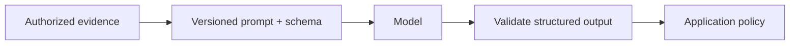

# RAG architecture

Tropos is building toward retrieval-augmented knowledge decisions. The implemented baseline now spans governed ingestion, durable SQLite persistence, and access-controlled lexical retrieval over current canonical chunks. It is not yet a production RAG service: there is no public API, hosted runtime, external enterprise connector, vector retrieval, or model-answering layer.

## End-to-end target



## Capability status

| Stage | Status | Notes |
| --- | --- | --- |
| Raw capture and access policy | Implemented | Exact payload and source-envelope identity |
| Deterministic normalization | Implemented | Canonical text and structural identity |
| Canonical version resolution | Implemented | Content, access, and normalizer changes separated |
| Deterministic chunking | Implemented | Governed, lossless evidence units |
| SQLite persistence | Implemented | Source captures, runs, canonical state, versions, and chunks |
| Lexical/full-text retrieval | Implemented | SQLite FTS5 + BM25 over current authorized chunks |
| Resolve decision policy | Implemented | `REUSE / IMPROVE / CREATE / NO_ACTION` |
| Resolve retrieval adapter | Planned | Resolve still needs an adapter from a resolved case to the reusable core retriever |
| Coverage evaluation | Contract only / planned adapter | Separate from retrieval ranking |
| Retrieval evaluation | Planned | Labeled cases and ranking metrics |
| Embeddings and hybrid retrieval | Deferred | Add only if lexical evaluation exposes a measurable semantic-recall gap |
| LLM reasoning or drafting | Deferred | Must consume authorized, provenance-rich evidence |
| Gateway, routing, semantic cache | Deferred | Scale/runtime concern, not an ingestion prerequisite |

## Ingestion path



Ingestion distinguishes source-byte changes, canonical-content changes, access-policy changes, and processing-strategy changes. That separation controls reprocessing, governance refresh, and retrieval freshness.

## Query path



Authorization is part of retrieval itself. Unauthorized chunks are not returned to a later filtering stage.

The reusable core contract accepts a `KnowledgeSearchRequest` containing the query, tenant/group access context, and result limit. Results are `RetrievedKnowledgeChunk` values that preserve chunk provenance, access policy, rank, strategy-native score, and retrieval strategy version.

## Lexical baseline

The first concrete retrieval strategy is `sqlite-fts5-bm25-v1`.

- Index: SQLite FTS5 over chunk title and text.
- Ranking: BM25, with title weighted above body text.
- Corpus: persisted `KnowledgeChunk` rows.
- Freshness: only chunks matching `knowledge_state` are eligible, so historical versions may remain stored without being retrievable.
- Isolation: tenant equality is mandatory.
- Restricted access: group intersection is evaluated inside the SQL query.
- Index maintenance: SQLite triggers add/delete text rows when persisted chunks change.
- Score semantics: strategy-native ranking score; not a normalized 0-to-1 relevance probability.

```mermaid
flowchart LR
    Chunks[Canonical chunks]
    --> FTS[SQLite FTS5 / BM25]
    --> Dataset[Retrieval eval set]
    --> Measure[Recall@k / MRR baseline]
    --> Gap{Material semantic gap?}
    Gap -- no --> Keep[Keep lexical baseline]
    Gap -- yes --> Vector[Add embeddings / hybrid retrieval]
```

The next quality slice is a labeled retrieval evaluation set. Vector search, reranking, and embedding infrastructure remain deferred until the lexical baseline is measured.

## Access and isolation

`AccessPolicy` remains the authorization source carried by canonical evidence.

- `tenant` evidence is retrievable only inside the matching tenant.
- `restricted` evidence additionally requires at least one matching principal group.
- `unresolved` evidence is never indexable as a `KnowledgeChunk` and is not accepted by retrieval.

Access changes can refresh chunk authorization state without creating a content version. Retrieval reads the current persisted authorization values at query time.

## Freshness

A source update does not always require a content re-index.

| Version result | Retrieval consequence |
| --- | --- |
| `NO_CONTENT_VERSION` | No new chunk/index content |
| `REFRESH_GOVERNANCE` | Retrieval immediately uses refreshed authorization state |
| `CREATE_VERSION` | Persist new chunks; FTS triggers index them; `knowledge_state` selects the new current version |
| `REBASELINE_REQUIRED` | Run a controlled corpus migration/rebaseline before replacing current state |

## Evaluation

Retrieval changes are evaluated separately from model output. Primary retrieval measures are expected to include `Recall@k`, Precision@k, MRR, and nDCG where the labeled dataset supports them. Model-assisted behavior, when introduced, will additionally require groundedness/faithfulness and task-specific decision evaluation.

See [Evaluation strategy](../quality/EVAL_STRATEGY.md).

## Model boundary

Model assistance remains downstream of authorized evidence and validated contracts.



Canonical identity, access enforcement, and the core knowledge-action vocabulary remain deterministic unless a future ADR changes those boundaries.
