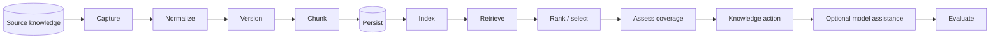
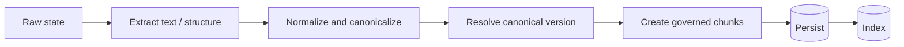
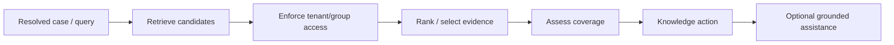
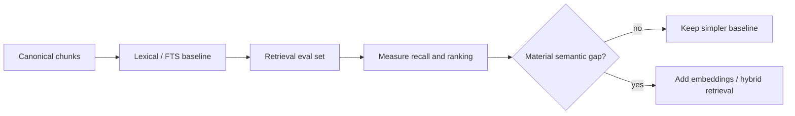
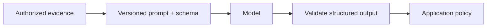

# RAG architecture

Tropos is building toward retrieval-augmented knowledge decisions. The repository does not yet contain a production RAG stack; it contains the governed ingestion and decision foundation that retrieval will use.

## End-to-end target

## Capability status

| Stage | Status | Notes |
| --- | --- | --- |
| Raw capture and access policy | Implemented | Exact payload and source-envelope identity |
| Deterministic normalization | Implemented | Canonical text and structural identity |
| Canonical version resolution | Implemented | Content, access, and normalizer changes separated |
| Deterministic chunking | Implemented | Governed, lossless evidence units |
| Resolve decision policy | Implemented | `REUSE / IMPROVE / CREATE / NO_ACTION` |
| Persistence | Planned | Canonical documents, versions, chunks, decisions |
| Lexical/full-text retrieval | Planned | First retrieval baseline |
| Coverage evaluation | Contract only / planned adapter | Separate from retrieval ranking |
| Retrieval evaluation | Planned | Labeled cases and ranking metrics |
| Embeddings and hybrid retrieval | Deferred | Add only if the lexical baseline exposes a measurable semantic-recall gap |
| LLM reasoning or drafting | Deferred | Must consume authorized, provenance-rich evidence |
| Gateway, routing, semantic cache | Deferred | Scale/runtime concern, not an ingestion prerequisite |

## Ingestion path

Ingestion distinguishes four changes that a single "document updated" signal would otherwise conflate:

- source bytes changed;
- canonical knowledge changed;
- access policy changed;
- processing strategy changed.

This distinction controls reprocessing, governance refresh, and future index freshness.

## Query path

Retrieval and coverage have different responsibilities. Retrieval finds potentially relevant evidence; coverage determines whether that evidence is sufficient for the case.

## Retrieval baseline

The first retrieval implementation is planned as lexical/full-text search over governed chunks.

This sequencing creates a measurable baseline before adding vector search, reranking, or embedding infrastructure.

## Access and isolation

Authorization must be enforced before evidence reaches coverage or model reasoning.

Future retrieval adapters must filter by the `AccessPolicy` carried by canonical evidence. Access changes can require an immediate governance refresh even when canonical content remains unchanged.

## Freshness

A source update does not always require a content re-index.

| Version result | Retrieval consequence |
| --- | --- |
| `NO_CONTENT_VERSION` | No content re-index |
| `REFRESH_GOVERNANCE` | Refresh authorization state |
| `CREATE_VERSION` | Persist and index the new canonical version |
| `REBASELINE_REQUIRED` | Run a controlled corpus migration/rebaseline |

When content and access change together, the new access state remains an independent obligation.

## Evaluation

Retrieval changes will be evaluated separately from model output.

Primary retrieval measures are expected to include `Recall@k`, `Precision@k`, MRR, and nDCG where the labeled dataset supports them. Model-assisted behavior, when introduced, will additionally require groundedness/faithfulness and task-specific decision evaluation.

See [Evaluation strategy](../quality/EVAL_STRATEGY.md).

## Model boundary

Model assistance is downstream of authorized evidence and validated contracts.

Canonical identity, access enforcement, and the core knowledge-action vocabulary remain deterministic unless a future ADR changes those boundaries.
