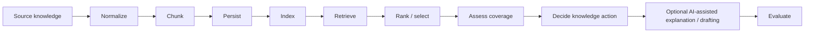
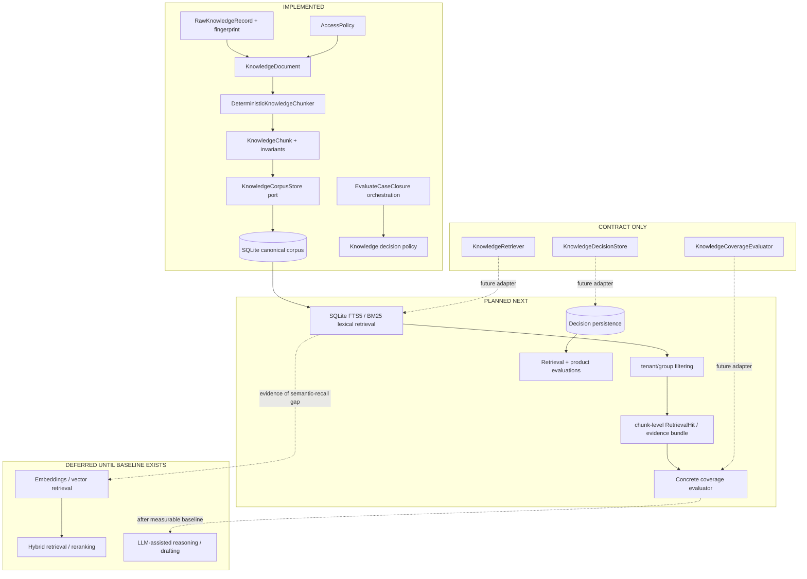
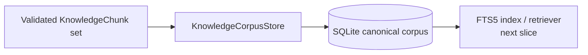
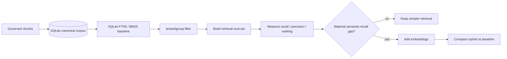
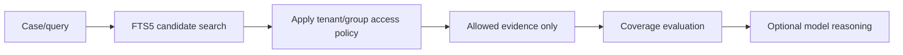
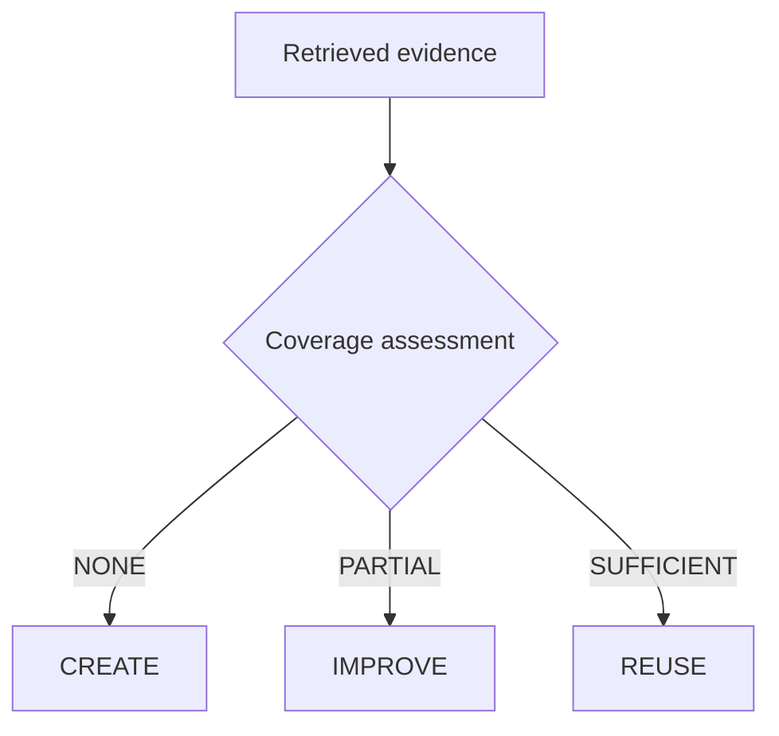
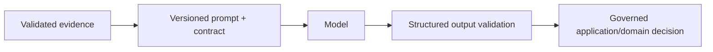
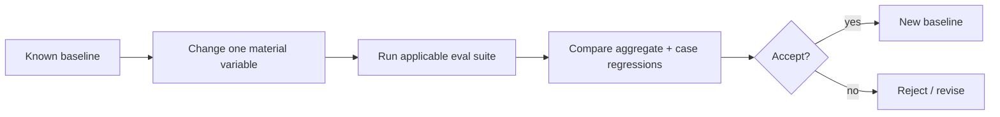

# RAG Architecture

Tropos is being designed toward retrieval-augmented decision support, but the repository is **not yet a full RAG system**. The correct way to understand the current state is to separate the implemented evidence foundation from the planned retrieval and reasoning layers.

## Target RAG pipeline



## What exists today



## What changed with persistence

The pipeline now has an executable boundary between governed chunks and future retrieval:



The persistence adapter is deliberately **not** called a retriever. It stores and reconstructs exact governed evidence. Retrieval will be a separate adapter with its own ranking, permission filtering and evaluation behavior.

## Why the stages are separate

A fluent final answer can hide failures earlier in the pipeline. Tropos therefore treats persistence, retrieval, coverage, decision policy and generation as separate quality surfaces.

| Stage | Question | Typical failure |
| --- | --- | --- |
| Normalization | Did source content become a correct canonical document? | lost fields / corrupted text / lost ACL |
| Chunking | Is the evidence unit faithful and reproducible? | fragmentation / citation drift |
| Persistence | Can canonical evidence be reconstructed by stable identity? | stale or partial snapshot |
| Retrieval | Did we fetch relevant candidates? | low recall |
| Ranking | Are the useful candidates near the top? | noisy top-k |
| Coverage | Is existing knowledge enough to resolve the case? | wrong `CREATE/IMPROVE/REUSE` input |
| Decision policy | Given validated facts, is the action deterministic? | hidden policy drift |
| Generation | Is any explanation/draft grounded in evidence? | hallucination |
| Evaluation | Did a change improve behavior without serious regressions? | aggregate score hides failures |

## Retrieval baseline: lexical before vector

The next retrieval strategy remains intentionally incremental.



This is not an anti-vector position. It is an experimental-design choice: add complexity only after a baseline can show what problem the complexity solves.

## Access filtering belongs before model reasoning

Tropos already makes unresolved access non-indexable and now persists tenant/scope/group metadata beside each chunk. Future retrieval must preserve that principle:



A model should never be used as the mechanism for deciding whether retrieved evidence was authorized in the first place.

## Planned retrieval contract

The current domain has `RetrievedKnowledge(document, score)`, while the chunk-level retrieval path will need a richer evidence contract carrying exact chunk IDs and provenance.

A target shape is conceptually:

```text
RetrievalHit
├── chunk_id
├── knowledge_id
├── score
├── rank
├── source identity / version
├── exact text offsets
├── access policy reference
└── retrieval strategy/version
```

This is **PLANNED**, not implemented. The purpose is to keep the retrieval representation explicitly tied to the governed `KnowledgeChunk`.

## Coverage is its own decision stage

Retrieval answers *what might be relevant*. Coverage answers *whether the evidence is sufficient*.



Conflating retrieval score with coverage would be a design error. A highly similar article can still be incomplete; several moderately ranked chunks can collectively provide sufficient coverage.

## LLM role — deliberately downstream

When an LLM is introduced, Tropos should use it for bounded tasks behind validated contracts, for example:

- semantic coverage assessment after evidence retrieval;
- evidence-backed rationale;
- suggested article improvement/draft;
- reviewer assistance.

The LLM should not own the stable action vocabulary or bypass access/provenance controls.



## RAG change isolation

To diagnose regressions, avoid changing chunking, retrieval, embedding model, reranker and prompt in one experiment.



## Release consequence

Once retrieval or model reasoning becomes executable product behavior, a green software CI run will be necessary but not sufficient. Relevant retrieval/AI eval gates must also pass before release eligibility.

See `../quality/EVAL_STRATEGY.md` for the evaluation model.
