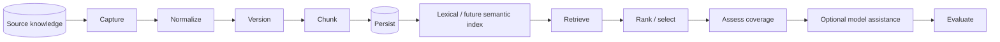
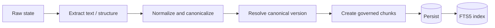
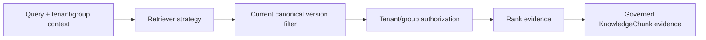
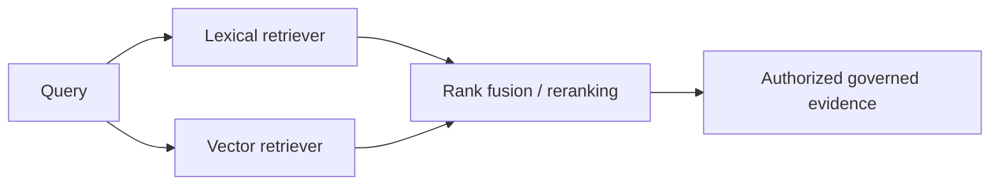
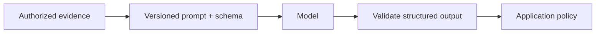

# RAG architecture

Tropos is building toward retrieval-augmented knowledge decisions. The implemented baseline now spans governed ingestion, durable SQLite persistence, access-controlled lexical retrieval over current canonical chunks, and a labeled retrieval-evaluation seed. It is not yet a production RAG service: there is no public API, hosted runtime, external enterprise connector, vector retrieval, prompt-augmentation layer, or model-answering layer.

## End-to-end target



## Capability status

| Stage | Status | Notes |
| --- | --- | --- |
| Raw capture and access policy | Implemented | Exact payload and source-envelope identity |
| Deterministic normalization | Implemented | Canonical text and structural identity |
| Canonical version resolution | Implemented | Content, access, and normalizer changes separated |
| Deterministic chunking | Implemented | Governed, lossless evidence units |
| SQLite persistence | Implemented | Source captures, runs, canonical state, versions, and chunks |
| Lexical/full-text retrieval | Implemented | SQLite FTS5 + BM25 over current authorized chunks |
| Retrieval evaluation V1 | Implemented baseline | Synthetic labeled corpus with Recall@1/3/5, Precision@5, MRR, no-answer/access cases |
| Resolve decision policy | Implemented | `REUSE / IMPROVE / CREATE / NO_ACTION` |
| Resolve retrieval adapter | Planned | Resolve still needs an adapter from a resolved case to the reusable core retriever |
| Coverage evaluation | Contract only / planned adapter | Separate from retrieval ranking |
| Embeddings and hybrid retrieval | Deferred pending comparison | Add as a versioned strategy when semantic-recall evidence justifies it |
| LLM reasoning or drafting | Deferred | Must consume authorized, provenance-rich evidence |
| Presentation/deployment | Planned | API, workspace/runtime composition, hosted environments |

## Ingestion path



Ingestion distinguishes source-byte changes, canonical-content changes, access-policy changes, and processing-strategy changes. That separation controls reprocessing, governance refresh, and retrieval freshness.

## Query path



Authorization is part of retrieval itself. Unauthorized chunks are not returned to a later filtering stage.

The reusable core contract accepts a `KnowledgeSearchRequest` containing the query, tenant/group access context, and result limit. The contract is strategy-neutral: lexical, vector, or hybrid adapters may implement the same `KnowledgeChunkRetriever` boundary. Results preserve chunk provenance, access policy, rank, strategy-native score, and retrieval strategy version.

## Lexical baseline

The first concrete retrieval strategy is `sqlite-fts5-bm25-v1`.

- Index: SQLite FTS5 over chunk title and text.
- Ranking: BM25, with title weighted above body text.
- Corpus: persisted `KnowledgeChunk` rows.
- Freshness: only chunks matching `knowledge_state` are eligible, so historical versions may remain stored without being retrievable.
- Isolation: tenant equality is mandatory.
- Restricted access: group intersection is evaluated inside the SQL query.
- Index maintenance: SQLite triggers add/delete text rows when persisted chunks change.
- Score semantics: strategy-native ranking score; not a normalized 0-to-1 relevance probability.

Do not add a generic score threshold at the core boundary yet. A BM25 score, vector-similarity score, and reranker score do not share a stable meaning. Thresholds must be strategy-specific and calibrated by evaluation.

## Retrieval evaluation and semantic expansion

The versioned V1 corpus at `apps/api/evals/retrieval/golden_v1.json` measures both expected lexical strengths and deliberately paraphrased semantic gaps.

```mermaid
flowchart LR
    BM25[sqlite-fts5-bm25-v1]
    --> Golden[Golden retrieval corpus]
    --> Metrics[Recall@K / MRR / no-answer checks]
    --> Gap{Material semantic gap?}
    Gap -- no --> Keep[Keep simpler lexical baseline]
    Gap -- yes --> Vector[Add vector retriever]
    Vector --> Hybrid[Compare vector and hybrid]
    Hybrid --> Metrics
```

The likely future shape is additive hybrid retrieval rather than vector replacing lexical retrieval:



This preserves exact-term strengths for identifiers, names, codes, and policy language while adding semantic recall for paraphrases. A hybrid strategy is not accepted until measured against the baseline.

## Access and isolation

`AccessPolicy` remains the authorization source carried by canonical evidence.

- `tenant` evidence is retrievable only inside the matching tenant.
- `restricted` evidence additionally requires at least one matching principal group.
- `unresolved` evidence is never indexable as a `KnowledgeChunk` and is not accepted by retrieval.

Access changes can refresh chunk authorization state without creating a content version. Retrieval reads the current persisted authorization values at query time.

## Freshness

| Version result | Retrieval consequence |
| --- | --- |
| `NO_CONTENT_VERSION` | No new chunk/index content |
| `REFRESH_GOVERNANCE` | Retrieval immediately uses refreshed authorization state |
| `CREATE_VERSION` | Persist new chunks; FTS triggers index them; `knowledge_state` selects the new current version |
| `REBASELINE_REQUIRED` | Run a controlled corpus migration/rebaseline before replacing current state |

## Evaluation boundaries

Retrieval and generation are evaluated separately. Retrieval metrics measure whether the correct governed evidence is found and ranked. A future generation layer will additionally require context relevance, groundedness/faithfulness, answer relevance, task correctness, and citation integrity.

The V1 corpus is synthetic and knowledge-level. It is a regression/development baseline, not an enterprise accuracy benchmark. Pilot data should add a held-out production-like set and may require chunk-level or graded relevance labels.

See [Evaluation strategy](../quality/EVAL_STRATEGY.md).

## Model boundary

Model assistance remains downstream of authorized evidence and validated contracts.



Canonical identity, access enforcement, and the core knowledge-action vocabulary remain deterministic unless a future ADR changes those boundaries.
