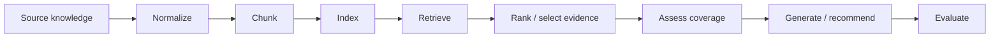
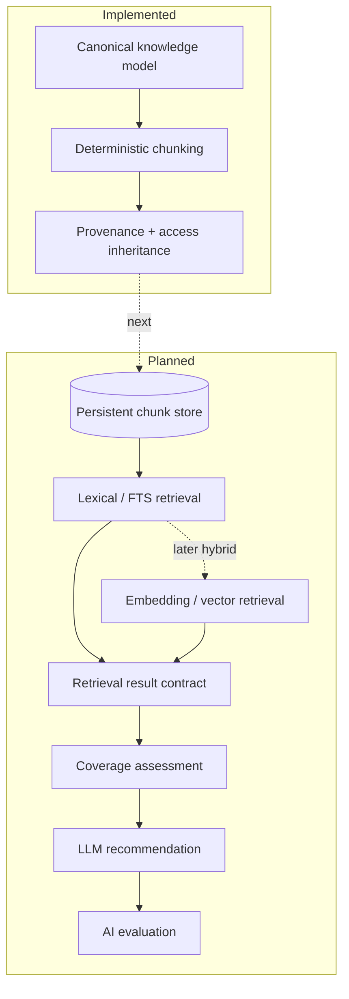
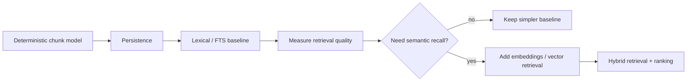

# RAG Architecture

## Purpose

Tropos will use retrieval-augmented reasoning to decide whether existing knowledge should be reused, improved, created, or left unchanged. This document separates what exists today from the target RAG architecture so planned components are not mistaken for implemented ones.

## Theory foundation

A RAG system is not one model call. It is a pipeline whose quality depends on distinct stages: source preparation, chunking, indexing, retrieval, ranking, coverage assessment, generation, and evaluation.



## Current versus target state



## Why retrieval is decomposed

| Stage | Primary question | Typical quality concern |
| --- | --- | --- |
| Chunking | What is the unit of evidence? | semantic coherence vs fragmentation |
| Indexing | How is evidence made searchable? | completeness and reproducibility |
| Retrieval | Did we fetch potentially useful evidence? | recall |
| Ranking | Are the best candidates near the top? | precision / ranking quality |
| Coverage assessment | Is retrieved evidence sufficient? | answerability / abstention |
| Generation | Is the recommendation supported by evidence? | groundedness / faithfulness |
| Evaluation | Did behavior improve or regress? | release quality |

## Planned retrieval strategy

Tropos should evolve incrementally:



The principle is **baseline before sophistication**: introduce embeddings only after lexical retrieval is measurable and its failure modes are visible.

## Core contracts

The eventual RAG path should preserve explicit contracts between stages rather than pass unstructured dictionaries through the system.

```mermaid
flowchart LR
    Q[Case / query representation] --> RP[Retriever port]
    RP --> RS[RetrievalResult[]]
    RS --> CP[Coverage assessor port]
    CP --> CS[CoverageAssessment]
    CS --> GP[Recommendation / generation port]
    GP --> KR[KnowledgeRecommendation]
```

Each downstream stage should receive evidence identifiers and provenance, not detached text only.

## RAG best practices applied to Tropos

- keep source evidence and retrieval representations separate;
- version chunking and later embedding/index strategies;
- evaluate retrieval independently from generation;
- preserve citations through orchestration;
- support abstention / insufficient-evidence outcomes;
- protect retrieval with access policy before evidence reaches a model;
- compare new retrieval strategies against a fixed evaluation dataset before release;
- prefer a measurable simple baseline over an opaque complex pipeline.

## Failure modes to watch

- high answer fluency hiding poor retrieval;
- retrieving inaccessible knowledge;
- using only top-k similarity without measuring recall;
- adding reranking before having a baseline dataset;
- allowing generation to invent evidence not present in retrieval results;
- treating vector-store metadata as the canonical source of truth;
- changing chunking and embeddings together, making regression causes impossible to isolate.

## Release implication

A retrieval change is a product-behavior change. It must therefore pass both deterministic software checks and the relevant retrieval/evaluation regression suite before promotion.
