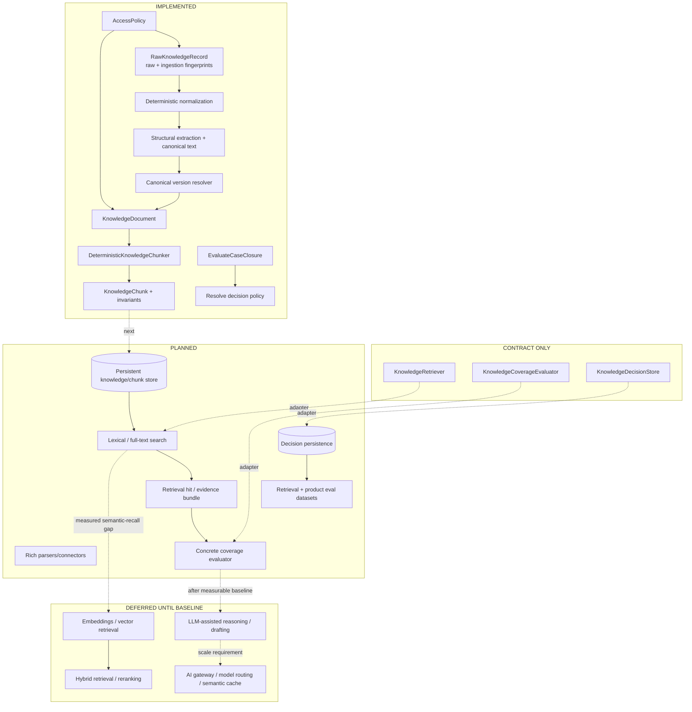
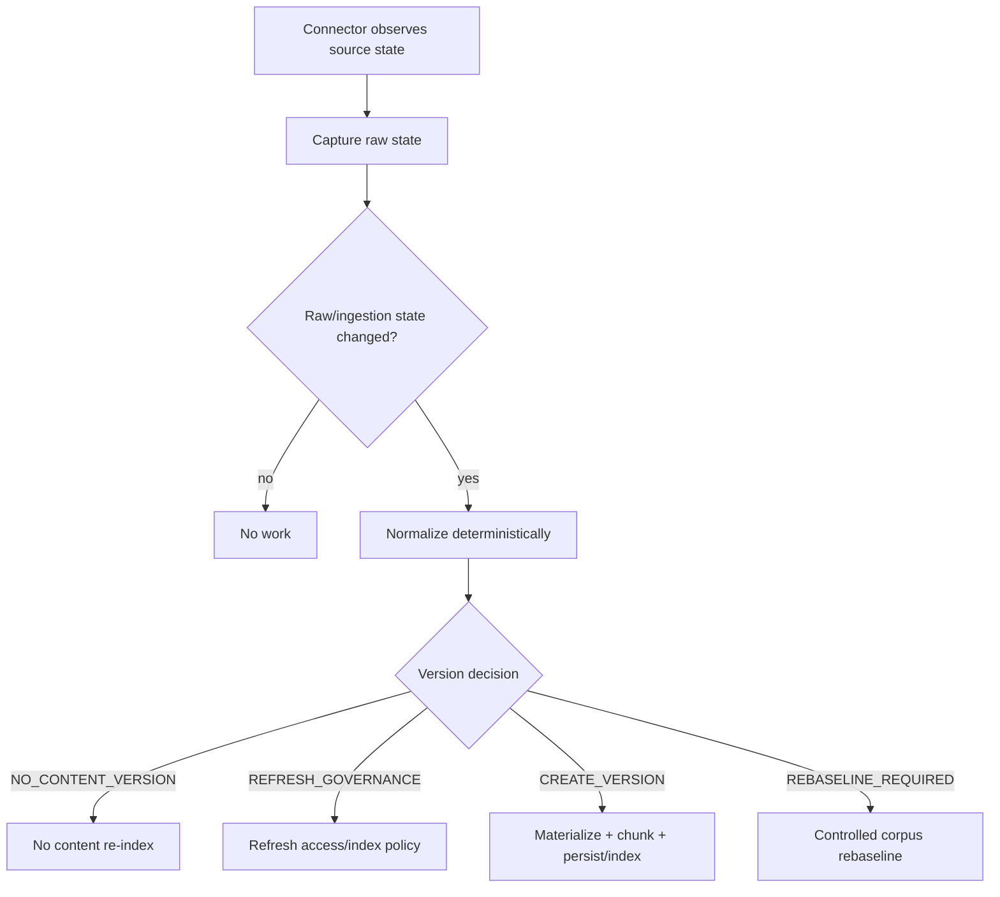
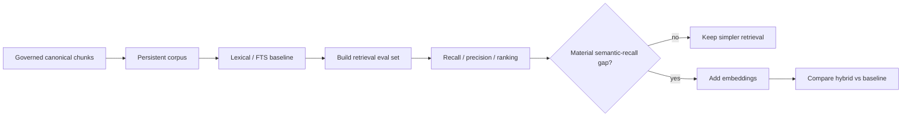
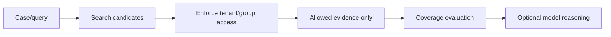
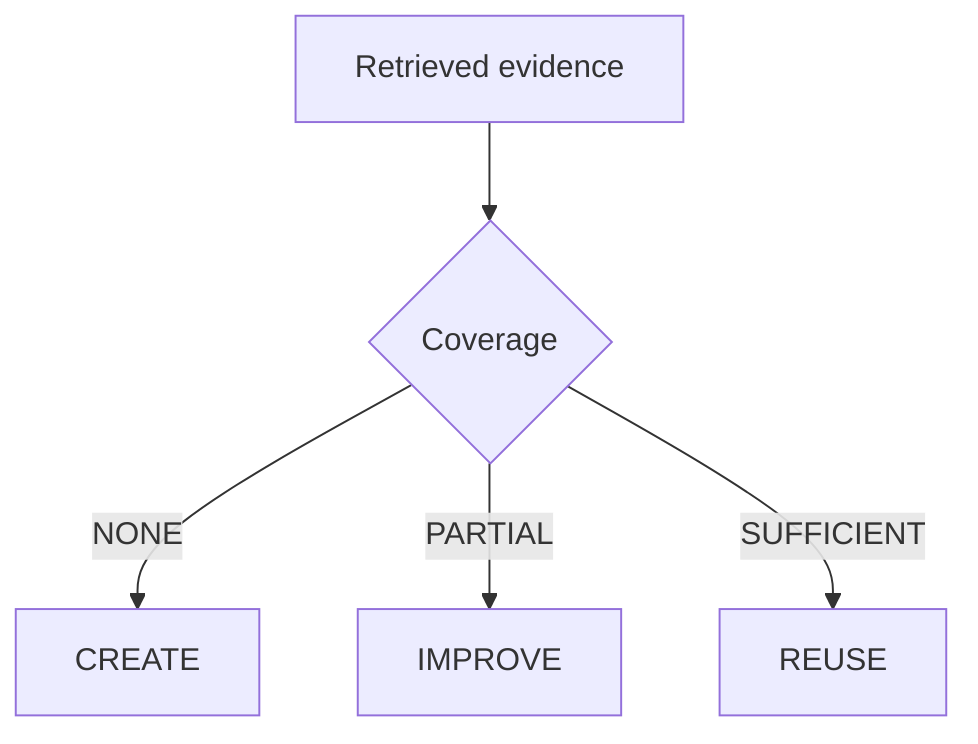
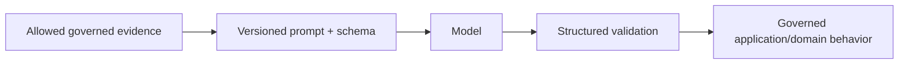
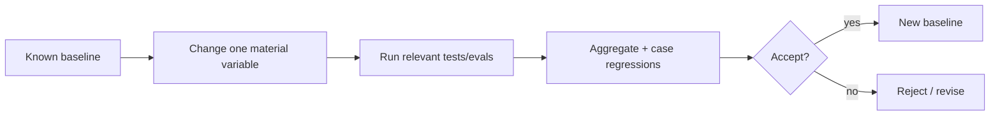

# RAG Architecture

Tropos is being designed toward retrieval-augmented decision support, but the repository is **not yet a full production RAG platform**. The implemented foundation now includes governed raw capture, deterministic normalization/version resolution and deterministic canonical chunking. Persistence, retrieval, coverage and model reasoning remain staged deliberately.

## Target pipeline

```mermaid
flowchart LR
    S[Source knowledge]
    --> CAP[Capture raw state]
    --> EX[Extract source text/structure]
    --> N[Normalize + canonicalize]
    --> V[Resolve canonical version]
    --> C[Chunk]
    --> P[Persist]
    --> I[Index]
    --> R[Retrieve]
    --> K[Rank / select]
    --> A[Assess coverage]
    --> D[Decide knowledge action]
    --> G[Optional grounded AI assistance]
    --> E[Evaluate]
```



## What exists today



## Normalization is a RAG quality stage

A production RAG diagram often compresses parsing, normalization, deduplication and versioning into one ingestion box. Tropos keeps them conceptually separate because they fail differently.

| Stage | Question | Typical failure |
| --- | --- | --- |
| Raw capture | Did we preserve exact source state and access? | cannot audit/replay the input |
| Extraction | Did we correctly obtain text/meaning-bearing structure? | lost table/list/heading content |
| Normalization | Did incidental presentation disappear without rewriting meaning? | duplicate logical content or corrupted evidence |
| Version resolution | Is this actually new knowledge? | re-index churn or stale content |
| Chunking | Is the evidence unit faithful/reproducible? | fragmentation/citation drift |
| Persistence | Can canonical evidence be retrieved by stable identity? | stale/duplicate states |
| Retrieval | Did we fetch relevant candidates? | low recall |
| Ranking | Are useful candidates near the top? | noisy top-k |
| Coverage | Is existing knowledge enough? | wrong `CREATE/IMPROVE/REUSE` input |
| Decision policy | Given validated facts, is action deterministic? | hidden policy drift |
| Generation | Is optional output grounded in allowed evidence? | hallucination/data leakage |
| Evaluation | Did the change improve behavior without regressions? | aggregate score hides failures |

The important correction is that **source freshness is not equivalent to canonical-content freshness**. A source may update while canonical knowledge is unchanged; ACLs may update while text is unchanged; a normalizer may change while source content does not.

## Freshness lifecycle



This is the foundation for later freshness SLOs and incremental indexing.

## Retrieval baseline: lexical before vector

The planned strategy remains incremental:



This is experimental discipline, not an anti-vector position: establish what problem added complexity solves before adding it.

## Access filtering belongs before model reasoning



A model must never be the mechanism that decides whether unauthorized evidence was acceptable after retrieval.

## Coverage remains separate from retrieval

Retrieval asks *what might be relevant?* Coverage asks *is the retrieved evidence sufficient?*



A highly similar document may still be incomplete, while several moderately ranked chunks may collectively provide sufficient coverage.

## LLM role — downstream and bounded

**DEFERRED:** when introduced, an LLM should operate on already authorized, provenance-rich evidence and return typed/validated output.



Likely bounded uses include semantic coverage assistance, evidence-backed rationale, article-improvement suggestions and reviewer assistance. Stable identity/versioning, access control and core action vocabulary remain deterministic unless explicitly changed by a future ADR.

## Scale components are requirement-driven

AI gateway, model routing, semantic caching, reranking and distributed indexes are legitimate production patterns, but they are **DEFERRED** until requirements/evidence justify them. Tropos should not install production-scale boxes merely to resemble a reference diagram.

At scale, architecture decisions should map to explicit requirements:

```text
accuracy  -> retrieval/ranking/coverage evals
security  -> identity + ACL propagation/filtering
freshness -> incremental version resolver + index lifecycle
latency   -> index/rerank/model/cache choices measured at p95/p99
cost      -> avoid false reprocessing + model/embedding routing
```

## RAG change isolation

Avoid changing normalization, chunking, retrieval, embedding model, reranker and prompt in one experiment.



Once retrieval/model behavior becomes executable, software CI alone will be necessary but not sufficient; retrieval/AI eval gates must also pass.
