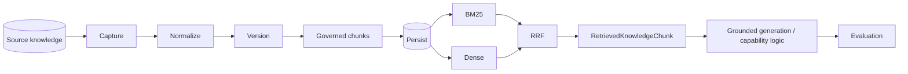
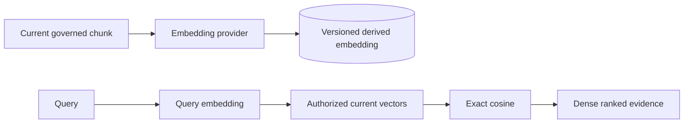
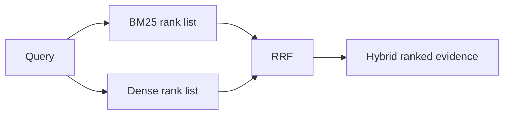
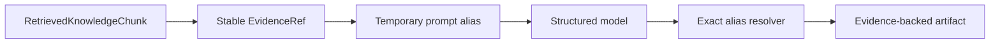

# RAG and retrieval architecture

Tropos retrieval has evolved from a lexical baseline into a governed multi-strategy retrieval layer supporting lexical, dense, and hybrid search. Retrieval remains separate from generation: its job is to return current, authorized, provenance-rich evidence through a stable contract.

## End-to-end position


```mermaid
flowchart LR
    Source[(Source knowledge)]
    --> Capture[Capture]
    --> Normalize[Normalize]
    --> Version[Version]
    --> Chunk[Governed chunks]
    --> Persist[(Persist)]
    --> Lex[BM25]
    Persist --> Dense[Dense]
    Lex --> Hybrid[RRF]
    Dense --> Hybrid
    Hybrid --> Evidence[RetrievedKnowledgeChunk]
    Evidence --> Generate[Grounded generation / capability logic]
    Generate --> Evaluate[Evaluation]
```

## Current capability status

| Stage | Status | Notes |
| --- | --- | --- |
| Source capture / access policy | Implemented | Source identity and source-state capture |
| Deterministic normalization | Implemented | Canonical representation before version comparison |
| Canonical version resolution | Implemented | Content/access/strategy changes separated |
| Deterministic chunking | Implemented | Governed lossless evidence units |
| SQLite persistence | Implemented baseline | Canonical state, chunks and derived embeddings |
| Lexical retrieval | Implemented | SQLite FTS5/BM25 |
| Dense retrieval | Implemented V1 | Versioned embeddings + exact cosine search |
| Hybrid retrieval | Implemented V1 | RRF over lexical and dense ranks |
| Retrieval evaluation | Implemented | Golden data, ranking metrics, saved runs/reports |
| Stable evidence reference | Implemented | `EvidenceRef` outside prompt-local aliases |
| Grounded structured generation | Implemented baseline | Training + Resolve Knowledge Articles |
| ANN/HNSW | Deferred | Scale/latency trigger not yet demonstrated |
| Cross-encoder reranking | Deferred | Quality/latency evidence not yet demonstrated |
| Hosted retrieval service | Planned | No production API/runtime yet |

## Shared retrieval contract

The core retrieval boundary accepts a `KnowledgeSearchRequest` containing:

- query;
- tenant/group access context;
- result limit.

Concrete retrievers implement `KnowledgeChunkRetriever` and return `RetrievedKnowledgeChunk` objects with governed chunk identity, rank, strategy-native score, and retrieval strategy version.

The contract deliberately does not normalize all scores to one generic relevance number. BM25 scores, cosine similarity, fusion positions and future reranker scores have different meanings.

## Authorization and freshness

Authorization is part of retrieval itself. Unauthorized evidence must not cross the governed retrieval boundary and then be filtered at presentation time.

```text
query
→ current canonical state
→ tenant eligibility
→ restricted-group eligibility
→ ranking
→ returned governed evidence
```

Historical versions may remain persisted for audit/history without remaining retrievable as current evidence.

## Lexical baseline

`sqlite-fts5-bm25-v1` remains the exact-term baseline.

Strengths:

- identifiers, codes and exact product/policy language;
- low operational complexity;
- transparent ranking behavior;
- no embedding provider dependency.

Weakness:

- paraphrases and semantically related wording can be missed.

The labeled V1 retrieval set made that semantic gap measurable.

## Dense Retrieval V1

Dense retrieval was added as an independent strategy rather than replacing BM25.


```mermaid
flowchart LR
    Chunk[Current governed chunk]
    --> Embed[Embedding provider]
    --> Vector[(Versioned derived embedding)]

    Query[Query]
    --> QEmbed[Query embedding]
    --> Candidate[Authorized current vectors]
    --> Cosine[Exact cosine]
    --> Ranked[Dense ranked evidence]
```

### Derived-state rule

Embeddings are not canonical knowledge. Their identity includes the stable chunk and embedding strategy version. Changing an embedding model/configuration is a processing migration, not a content version.

### Exact search before ANN

Dense V1 uses exact cosine similarity.

**Why:** representation quality and approximate-index quality are separate experiments. If the vector retriever misses relevant evidence, exact search makes it easier to attribute that miss to embeddings/chunking/query semantics rather than HNSW/IVF approximation.

**Cost:** O(N) scanning does not scale indefinitely.

**Revisit trigger:** corpus size and p95 latency show exact search is materially constraining service objectives.

See [ADR-015](../decisions/ADR-015-evidence-led-dense-and-hybrid-retrieval.md) and [Dense Retrieval V1](../learning/DENSE_RETRIEVAL_V1.md).

## Hybrid Retrieval V1

After lexical and dense strategies demonstrated complementary strengths, Tropos added Reciprocal Rank Fusion (RRF).


```mermaid
flowchart LR
    Query[Query]
    --> BM25[BM25 rank list]
    Query --> Dense[Dense rank list]
    BM25 --> RRF[RRF]
    Dense --> RRF
    RRF --> Hybrid[Hybrid ranked evidence]
```

RRF combines rank positions rather than blending raw scores.

**Why not weighted raw-score blending?** BM25 and cosine scores are not calibrated to a common scale. A fixed weighted sum would create a tuning parameter whose meaning depends on retriever-specific score distributions.

**Cost:** hybrid runs both retrieval paths and introduces candidate-depth/fusion parameters.

**What it does not solve:** no-answer/abstention, semantic entailment, or reranking quality.

See [Hybrid Retrieval V1](../learning/HYBRID_RETRIEVAL_V1.md).

## No-answer behavior

Dense retrieval always has a nearest neighbor. A generic hard-coded cosine threshold was deliberately not introduced in V1.

Current principle:

> abstention thresholds must be calibrated from labeled evidence, not chosen as a magic constant.

No-answer cases remain part of retrieval evaluation. Future options include:

- calibrated strategy-specific thresholds;
- hybrid/reranker confidence;
- explicit abstention classifier;
- workflow-level insufficient-evidence decision.

## Retrieval evaluation

Tropos keeps retrieval evaluation independent of generation evaluation.

Current retrieval evidence includes:

- versioned golden definitions;
- development/synthetic cases;
- Recall@1/3/5;
- Precision@5;
- Mean Reciprocal Rank (MRR);
- no-answer checks;
- access/current-version/integrity assertions;
- persisted execution/run evidence;
- comparative BM25/dense/hybrid work.

The synthetic datasets are regression/development evidence, not enterprise production accuracy claims.

See [Evaluation strategy](../quality/EVAL_STRATEGY.md) and [Evaluation runs](EVALUATION_RUNS.md).

## Generation boundary

Authorized retrieval evidence is projected into capability-specific generation contracts.


```mermaid
flowchart LR
    Retrieved[RetrievedKnowledgeChunk]
    --> Ref[Stable EvidenceRef]
    --> Alias[Temporary prompt alias]
    --> Model[Structured model]
    --> Resolve[Exact alias resolver]
    --> Artifact[Evidence-backed artifact]
```

The retrieval layer does not decide whether a generated claim is semantically supported. It establishes the controlled evidence set and lineage. Generation evaluation owns claim/artifact quality.

## Current trade-offs

| Decision | Selected approach | Cost | Revisit trigger |
| --- | --- | --- | --- |
| Lexical vs vector | Keep both strategies | multiple retrieval paths | one strategy becomes clearly redundant on production evidence |
| Dense index | Exact cosine | O(N) query cost | p95 latency/corpus scale |
| Fusion | RRF | candidate/fusion tuning | production-like eval favors reranking/another fusion policy |
| Score threshold | no generic threshold | weak raw dense abstention | labeled score distributions |
| Authorization | pre-filter/governed boundary | constrains index choices | invariant remains; implementation may evolve |
| Embedding state | derived/versioned | storage/model lifecycle | operational scale/migration needs |

## Deferred complexity

- HNSW/IVF/managed vector service;
- generic vector-score thresholds;
- cross-encoder reranking;
- Maximum Marginal Relevance unless diversity is a measured need;
- query rewriting/orchestration frameworks before evaluation proves value.

## Related documents

- [Architecture overview](ARCHITECTURE_OVERVIEW.md)
- [Knowledge model](KNOWLEDGE_MODEL.md)
- [Evaluation strategy](../quality/EVAL_STRATEGY.md)
- [Dense Retrieval V1](../learning/DENSE_RETRIEVAL_V1.md)
- [Hybrid Retrieval V1](../learning/HYBRID_RETRIEVAL_V1.md)
- [ADR-015](../decisions/ADR-015-evidence-led-dense-and-hybrid-retrieval.md)
