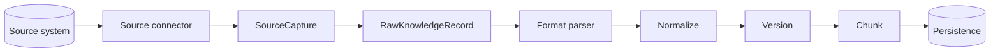

# Source integration

Tropos separates **where knowledge comes from** from **how its content format is parsed**. A source connector captures one source-native record and converts it into the stable Tropos ingestion boundary; format parsers then interpret the captured bytes.

## Boundary



A connector owns source-system concerns such as authentication, record lookup, source-native version metadata, content-type mapping, access-policy mapping, and source URI/update metadata. It must not own canonical normalization, content version decisions, chunking, or persistence.

A parser owns content-format interpretation such as HTML, DOCX, Markdown, or PDF. It must not know whether those bytes came from SharePoint, Gmail, Jira, a local directory, or another connector.

## Connector contract

`KnowledgeSourceConnector` exposes two things:

- `source_namespace`: a stable identifier for one configured source instance;
- `capture(source_record_id)`: returns a `SourceCapture`.

`SourceCapture` contains the immutable `RawKnowledgeRecord` plus optional `source_uri` and `source_updated_at` metadata used downstream for provenance.

`IngestFromSource` bridges any connector into the existing `IngestKnowledge` orchestrator. The core orchestrator therefore does not grow source-specific branches when new connectors are added.

## Source identity

`RawKnowledgeRecord.source_system` is used as a **source namespace**, not merely a generic product name. The namespace must distinguish configured source scopes whose native record identifiers may overlap.

Examples:

```text
local:demo-knowledge
sharepoint:contoso/hr-site
gmail:support-mailbox
jira:acme-cloud/support-project
```

Within that namespace, `source_record_id` is the stable source-native record identifier and `source_version` is the connector's stable upstream revision token.

This convention prevents two unrelated source instances from accidentally sharing the same source identity while avoiding vendor-specific fields in the core ingestion model.

## Implemented adapter

`LocalFileSourceConnector` is the first source adapter. It:

- restricts reads to one configured root directory;
- supports the file extensions already understood by parsing v1: TXT, Markdown, HTML/XHTML, and DOCX;
- maps the relative path to `source_record_id`;
- uses SHA-256 of exact file bytes as the local source revision token;
- carries a configured Tropos `AccessPolicy` because local files do not expose a native enterprise ACL model;
- emits file URI and modification time as provenance;
- rejects path traversal, missing files, empty files, and unsupported extensions.

External connectors such as SharePoint, Gmail, Jira, and Confluence are not implemented yet.

## Adding a source

A new connector should:

1. implement `KnowledgeSourceConnector`;
2. define a stable source namespace for the configured source instance;
3. translate source-native identity/version metadata into `RawKnowledgeRecord`;
4. resolve source-native authorization into a Tropos `AccessPolicy` or fail closed if it cannot be resolved safely;
5. return exact source bytes with an accurate MIME content type;
6. preserve source URI/update metadata when available;
7. pass the capture to `IngestFromSource` rather than calling parser, normalizer, versioning, chunking, or SQL directly.

Adding a connector should not require changes to `IngestKnowledge` or to existing format parsers unless the new source introduces a genuinely new content format.

## Pull versus push ingestion

The connector boundary covers **pull-style** ingestion where Tropos reads a source record. A future HTTP/API ingestion surface may also accept already-captured content directly and call `IngestKnowledge` without a connector. Both modes converge at `RawKnowledgeRecord`, so downstream identity, governance, versioning, and chunking rules remain the same.

## Current limits

Connector discovery/listing, incremental sync cursors, deletion/tombstone handling, bulk backfills, connector credentials, rate limiting, retries, and webhook/event ingestion are not implemented. Those capabilities should be added when a real external source requires them rather than embedded prematurely into the core orchestrator.
