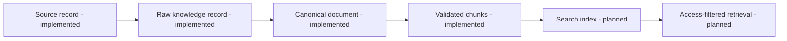
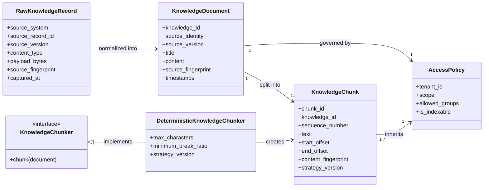

# Tropos knowledge-processing model

| Control | Value |
| --- | --- |
| Status | Living architecture and data-contract reference |
| Product capability | Governed knowledge ingestion and retrieval preparation |
| Owning team | Tropos knowledge platform |
| Baseline | `structural-character-v1` |
| Review trigger | Any change to document, chunk, access, provenance, parsing, indexing, or retrieval contracts |

## Product capability view

Implemented components establish controlled ingestion, canonical knowledge, access governance,
provenance, and deterministic chunking. Persistence, indexing, and retrieval remain planned.

## Logical model

## KnowledgeChunk data contract

| Category | Field | Standard meaning | Product purpose |
| --- | --- | --- | --- |
| Identity | `chunk_id` | Derived artifact identifier | Uniquely identifies this chunk occurrence |
| Identity | `knowledge_id` | Parent entity identifier | Links the chunk to canonical knowledge |
| Identity | `sequence_number` | Ordered child position | Reconstructs and validates chunk order |
| Source lineage | `source_system` | Originating system | Shows where the knowledge entered Tropos |
| Source lineage | `source_record_id` | Upstream record identifier | Supports source lookup and reconciliation |
| Source lineage | `source_version` | Upstream version | Separates historical and active source states |
| Source lineage | `source_fingerprint` | Source snapshot digest | Detects source or governed-metadata changes |
| Evidence | `document_title` | Human-readable parent context | Makes retrieval results understandable |
| Evidence | `text` | Exact source substring | Provides searchable and citable evidence |
| Evidence | `start_offset` | Inclusive source coordinate | Locates where evidence begins |
| Evidence | `end_offset` | Exclusive source coordinate | Locates where evidence ends |
| Evidence | `content_fingerprint` | Chunk-text digest | Detects text corruption or mutation |
| Governance | `access_policy` | Authorization metadata | Prevents retrieval outside allowed scope |
| Processing lineage | `strategy_version` | Transformation version | Makes reprocessing reproducible and comparable |

## Systems of record and derived data

| Asset | Classification | Authority and lifecycle |
| --- | --- | --- |
| Source-system record | External system of record | Authoritative upstream business content |
| `RawKnowledgeRecord` | Immutable ingestion snapshot | Reprocessing and audit input |
| `KnowledgeDocument` | Canonical Tropos representation | Internal content and governance authority |
| `KnowledgeChunk` | Derived, rebuildable data | Exact, governed retrieval unit |
| Search index | Derived projection | Rebuilt from active validated chunks |
| Embedding | Model-dependent derived projection | Added only when retrieval evaluation justifies it |

## Integrity and governance rules

1. Every chunk must reference one canonical document and one immutable source version.
2. Chunk text must equal the document substring identified by its offsets.
3. Ordered chunks must cover the complete document without gaps or overlaps.
4. Every chunk must inherit the document access policy and source provenance.
5. Changing source content, source governance, offsets, or strategy version must change chunk identity.
6. Derived chunks and indexes may be rebuilt; historical evidence links must remain resolvable.
7. Unresolved access policy prevents content from entering a searchable index.

## Capability status

| Capability | Status | Current decision |
| --- | --- | --- |
| Raw ingestion contract | Implemented | Preserve bytes, source identity, access, time, and fingerprint |
| Canonical document contract | Implemented | Preserve normalized content, provenance, and resolved access |
| Deterministic chunking | Implemented | Structural character strategy with exact coverage |
| Source parsing | Planned | Add content-type-specific parsers behind a common contract |
| Chunk persistence | Planned | Store canonical and historical derived chunks |
| Lexical indexing | Planned | SQLite FTS5/BM25 baseline |
| Vector retrieval | Deferred | Add only if labelled retrieval evaluation demonstrates value |
| Citation assembly | Planned | Return human-readable source locator and excerpt |
| Retrieval evaluation | Planned | Precision, recall, rank, access leakage, and citation integrity |

## Change-management policy

This document is part of the product definition, not a one-time diagram.

- A pull request changing a listed contract must update this model in the same change.
- A behavioral change to chunking requires a new `strategy_version`.
- A new data source should add a connector or parser without changing core knowledge rules.
- A new index should consume the same validated chunks rather than redefining their governance.
- Schema changes must state backward compatibility, migration, re-indexing, and rollback impact.
- Status moves from planned to implemented only after tests and release evidence exist.

## Evolution log

| Version | Change | Evidence |
| --- | --- | --- |
| 1.0 | Established governed `KnowledgeChunk` and deterministic chunking baseline | PR #1 and 54 passing tests |
