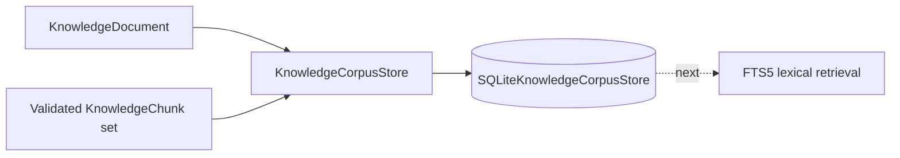

# ADR-004: SQLite current-corpus persistence behind an application port

Status: Accepted  
Date: 2026-09-20

## Context

Tropos already has governed `KnowledgeDocument` and `KnowledgeChunk` domain objects plus deterministic chunking, but those objects disappear when the process ends. Retrieval cannot become measurable until there is a stable corpus that can be reloaded with the same provenance and access semantics.

The persistence slice must solve the current need without allowing a database technology to leak into the domain or prematurely choosing production-scale infrastructure.

## Options considered

1. Keep persistence deferred and move directly to an in-memory retriever.
2. Add SQLite persistence directly inside domain/application objects.
3. Define an inward `KnowledgeCorpusStore` port and implement a SQLite adapter using Python's standard-library `sqlite3` module.
4. Introduce an ORM and production database platform immediately.

## Decision

Choose option 3.

Tropos defines `KnowledgeCorpusStore` as an application-owned contract and implements `SQLiteKnowledgeCorpusStore` as the first concrete adapter.

The store persists the **current canonical retrieval snapshot** for each `knowledge_id`:

Saving a newer canonical snapshot validates the complete chunk set and replaces the document + prior chunks inside one SQLite transaction.

## Rationale

SQLite provides a real durable corpus with very low operational overhead and no additional runtime dependency. It is sufficient for the current single-process development stage and is the natural foundation for the planned FTS5/BM25 lexical baseline.

The application port prevents SQLite-specific concerns from becoming domain assumptions. A later PostgreSQL/ORM-backed adapter can implement the same boundary if deployment, concurrency or scale require it.

The current store is deliberately not a historical archive. The source system remains the authoritative upstream record; Tropos persists the current retrieval-ready canonical snapshot while retaining source/version/fingerprint lineage on every object.

## Consequences

### Positive

- deterministic chunks survive process restarts;
- source/access/provenance metadata can be reconstructed exactly into domain objects;
- document and chunk replacement is atomic;
- stale chunks from the prior canonical snapshot are removed when a new version is stored;
- no new runtime dependency is required;
- SQLite FTS5 can be added as the next bounded retrieval slice;
- domain and application policy remain independent of the database implementation.

### Negative / trade-offs

- SQLite is not yet a production-scale database decision;
- explicit schema migrations are not implemented in this slice;
- the corpus stores only the current canonical snapshot rather than every historical source version;
- concurrent writers, hosted operations, backup/restore and production durability are not solved here;
- moving to another database later requires a new adapter and migration path.

## Evidence

Implementation:

- `apps/api/src/tropos/application/ports/persistence.py`
- `apps/api/src/tropos/adapters/persistence/sqlite.py`

Tests:

- `apps/api/tests/unit/adapters/persistence/test_sqlite.py`

The tests cover exact round-trip reconstruction, access/provenance preservation, current-snapshot replacement, isolation between knowledge items, missing-record behavior, and validation before persistence.

## Revisit when

Reconsider or supersede this decision when one or more of the following becomes true:

- Tropos needs multiple concurrent application instances;
- production deployment requires managed database durability/backup controls;
- corpus size or write patterns materially exceed SQLite's practical operating envelope;
- schema evolution requires a formal migration framework;
- historical canonical-version retention becomes a product requirement;
- the FTS baseline needs a search architecture that cannot be supported cleanly by the current persistence boundary.
