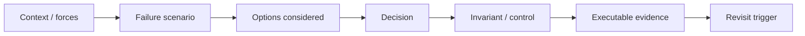

# Architecture Decision Records

ADRs capture **why** Tropos is built a certain way. Living architecture docs explain the current system; ADRs preserve the durable choices and trade-offs that shaped it.

## Decision map



## Current ADR index

| ADR | Status | Decision |
| --- | --- | --- |
| [`ADR-001-modular-monolith-ports-and-adapters.md`](ADR-001-modular-monolith-ports-and-adapters.md) | Accepted | Start as a modular monolith with inward domain/application boundaries and replaceable adapters |
| [`ADR-002-governed-evidence-and-deterministic-chunking.md`](ADR-002-governed-evidence-and-deterministic-chunking.md) | Accepted | Treat `KnowledgeChunk` as governed evidence and establish deterministic lossless chunking before semantic retrieval |
| [`ADR-003-protected-main-and-required-ci.md`](ADR-003-protected-main-and-required-ci.md) | Accepted | Require PR-based integration into protected `main` with `api-quality` as a mandatory status check |
| [`ADR-004-deterministic-normalization-and-content-versioning.md`](ADR-004-deterministic-normalization-and-content-versioning.md) | Accepted | Separate raw/source identity from deterministic canonical content identity, access refresh and normalizer rebaselining |
| [`ADR-005-independent-governance-refresh-signal.md`](ADR-005-independent-governance-refresh-signal.md) | Accepted | Keep access/governance refresh independently observable when content or normalization changes at the same time |

## Decisions intentionally not yet recorded as accepted ADRs

Some directions are **PLANNED** but have not earned an accepted architecture decision because implementation/evaluation evidence does not exist yet:

- persistence technology;
- lexical/FTS engine choice;
- vector database or embedding model;
- concrete coverage-evaluation method;
- LLM/model/provider selection;
- API framework and deployment platform;
- observability stack;
- rich parser choices for PDF/DOCX/HTML.

A roadmap idea should not become an architecture decision simply because it appeared in a diagram.

## When to add an ADR

Create or update an ADR when a change materially affects:

- module or service boundaries;
- dependency direction;
- canonical data/evidence identity;
- normalization/version semantics;
- access/security semantics;
- persistence or retrieval strategy;
- external provider/model strategy;
- evaluation/release gates;
- deployment topology or environment promotion.

Do **not** create an ADR for routine refactoring, variable naming, ordinary tests, or an implementation detail that does not constrain future architecture.

## Architecture-review questions before accepting a durable decision

1. What happens when the source changes but the business meaning does not?
2. What counts as the same logical knowledge and what counts as a new version?
3. What must be deterministic or replayable?
4. Which provenance must survive every transformation?
5. Can access/security change independently from content?
6. Can multiple change dimensions happen at the same time, and can one safely mask another?
7. What happens when the algorithm itself changes?
8. Which invariant will detect an incorrect implementation?
9. Which regression test proves that invariant?
10. What future evidence should make us revisit the choice?

These questions are intentionally failure-oriented. Architecture quality comes from making important failure behavior explicit, not from maximizing the number of components in a diagram.

## ADR template

```markdown
# ADR-NNN: Decision title

Status: Proposed | Accepted | Superseded
Date: YYYY-MM-DD

## Context
What problem, constraint or force requires a durable decision?
What concrete failure would occur if the choice remained implicit?

## Options considered
1. Option A
2. Option B
3. Option C

## Decision
What was chosen?

## Rationale
Why is this the right trade-off for Tropos now?

## Consequences
### Positive
- ...

### Negative / trade-offs
- ...

## Evidence
Which code/tests/operational controls demonstrate the decision?

## Revisit when
What new evidence or system condition should cause reconsideration?
```

## ADR discipline

An ADR is not a claim that a choice is permanent. It is a record of the best decision under the constraints that existed at the time. When constraints change, supersede the ADR rather than silently rewriting architectural history.
