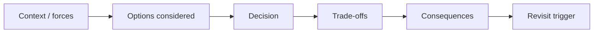

# Architecture Decision Records

ADRs capture **why** Tropos is built a certain way. Living architecture docs explain the current system; ADRs preserve the durable choices and trade-offs that shaped it.

## Decision map



## Current ADR index

| ADR | Status | Decision |
| --- | --- | --- |
| [`ADR-001-modular-monolith-ports-and-adapters.md`](ADR-001-modular-monolith-ports-and-adapters.md) | Accepted | Start as a modular monolith with inward domain/application boundaries and replaceable adapters |
| [`ADR-002-governed-evidence-and-deterministic-chunking.md`](ADR-002-governed-evidence-and-deterministic-chunking.md) | Accepted | Treat `KnowledgeChunk` as governed evidence and establish deterministic lossless chunking before semantic retrieval |
| [`ADR-003-protected-main-and-required-ci.md`](ADR-003-protected-main-and-required-ci.md) | Accepted | Require PR-based integration into protected `main` with `api-quality` as a mandatory status check |
| [`ADR-004-sqlite-current-corpus-persistence.md`](ADR-004-sqlite-current-corpus-persistence.md) | Accepted | Persist the current canonical document/chunk snapshot behind an application port using SQLite as the first executable baseline |

## Decisions intentionally not yet recorded as accepted ADRs

Some directions are documented as **PLANNED** but have not earned an accepted architecture decision because implementation evidence does not exist yet:

- lexical/FTS retrieval details beyond the current SQLite direction;
- vector database or embedding model;
- concrete coverage-evaluation method;
- LLM/model/provider selection;
- API framework and deployment platform;
- observability stack;
- production database / migration platform.

This distinction is important. A roadmap idea should not become an “architecture decision” simply because it appeared in a diagram.

## When to add an ADR

Create or update an ADR when a change materially affects:

- module or service boundaries;
- dependency direction;
- canonical data/evidence identity;
- access/security semantics;
- persistence or retrieval strategy;
- external provider/model strategy;
- evaluation/release gates;
- deployment topology or environment promotion.

Do **not** create an ADR for routine refactoring, variable naming, test additions, or an implementation detail that does not constrain future architecture.

## ADR template

```markdown
# ADR-NNN: Decision title

Status: Proposed | Accepted | Superseded
Date: YYYY-MM-DD

## Context
What problem, constraint or force requires a durable decision?

## Options considered
1. Option A
2. Option B
3. Option C

## Decision
What was chosen?

## Rationale
Why is this the right trade-off for Tropos now?

## Consequences
### Positive
- ...

### Negative / trade-offs
- ...

## Evidence
Which code/tests/operational controls demonstrate the decision?

## Revisit when
What new evidence or system condition should cause reconsideration?
```

## ADR discipline

An ADR is not a claim that a choice is permanent. It is a record of the best decision under the constraints that existed at the time. When the constraints change, supersede the ADR rather than silently rewriting history.
