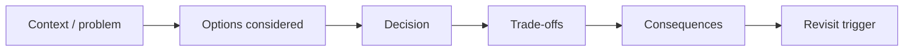

# Architecture Decision Records

Architecture Decision Records preserve **why** Tropos is designed a certain way.

## Decision flow



Use an ADR when a change materially affects architecture boundaries, dependency direction, persistence, retrieval, model/provider strategy, security/governance, or release topology.

Do not create an ADR for routine implementation detail.

## Template

```markdown
# ADR-NNN: Decision title

Status: Proposed | Accepted | Superseded
Date: YYYY-MM-DD

## Context
What forces or problem require a decision?

## Options considered
1. Option A
2. Option B
3. Option C

## Decision
What was chosen?

## Rationale
Why does this option fit Tropos now?

## Consequences
### Positive
- ...

### Negative / trade-offs
- ...

## Revisit when
What evidence or system change should cause this decision to be reconsidered?
```

## Initial decision set to capture as implementation matures

- modular monolith with ports-and-adapters boundaries;
- governed `KnowledgeChunk` as the canonical retrieval evidence unit;
- deterministic chunking before semantic retrieval;
- lexical/FTS baseline before vector retrieval;
- environment promotion model;
- prompt/version/evaluation strategy when LLM reasoning is introduced.
