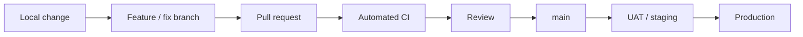
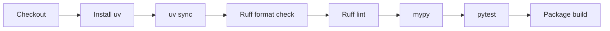

# CI/CD Model

## Purpose

Tropos uses GitHub as the engineering control plane for proposed changes. Local validation remains useful, but GitHub CI is the shared, repeatable quality gate.

## Theory foundation

This follows **Continuous Integration**, **shift-left quality**, and **progressive delivery**:



## Current CI scope

For the Python API, every pull request and push to `main` should prove:



These are deterministic engineering gates. RAG/AI evaluation gates will be added when retrieval and model reasoning become executable product capabilities.

## Local-to-GitHub contract

The same logical checks should be runnable locally and in CI:

```bash
cd apps/api
uv sync --dev
uv run ruff format --check .
uv run ruff check .
uv run mypy src tests
uv run pytest
uv build
```

## Why this matters

| Risk | Control |
| --- | --- |
| AI or developer forgets a validation step | CI repeats the agreed checks |
| Change works only on one machine | Clean GitHub runner rebuilds environment |
| Type drift enters main | strict mypy gate |
| Style/import defects accumulate | Ruff format + lint |
| Regression enters main | pytest |
| Project stops packaging correctly | build gate |

## Future gates

Add only when the corresponding capability exists:

- integration tests for persistence and retrieval;
- contract/schema checks for external adapters;
- prompt-template validation;
- retrieval eval suite;
- groundedness / recommendation eval suite;
- regression comparison against an approved baseline;
- preview deployment smoke tests;
- production deployment approval and rollback checks.

## Pull-request principle

A PR is the unit of review and integration. It should explain the problem, architecture impact, scope, expected behavior, validation, evidence, and follow-ups. Small, bounded PRs are preferred because failures are easier to attribute and reverse.

## Release principle

`main` means integrated and releasable; it does not mean every commit must be immediately promoted to production. Environment promotion is a separate controlled decision described in `ENVIRONMENT_STRATEGY.md`.
