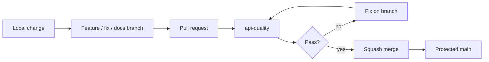
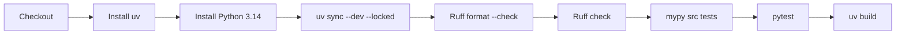
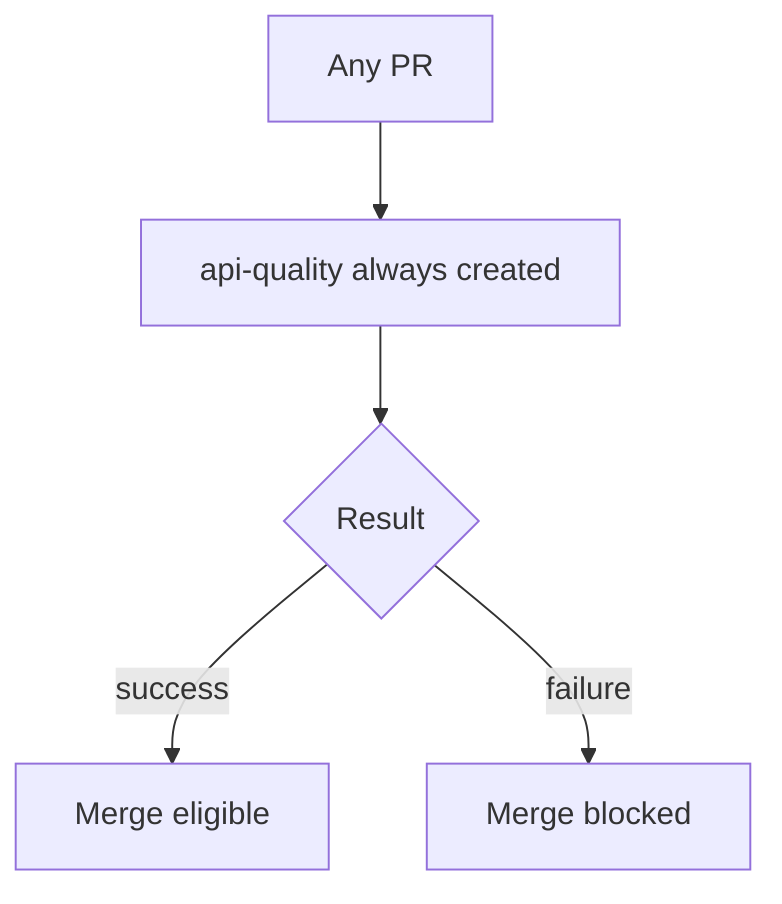
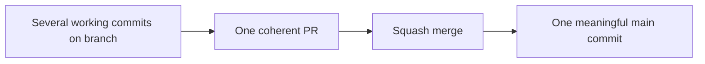
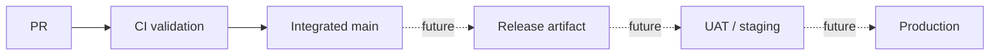
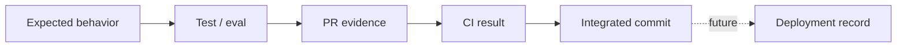

# CI/CD and Change-Control Model

Tropos uses GitHub as the engineering control plane. The current delivery system is intentionally stronger than the runtime system: code changes already have an enforced integration workflow even though the product is not yet deployed.

## Current enforced path to `main`



`main` is protected. The `api-quality` status check is required and protection applies to everyone, including the repository owner/admin under the configured rule.

## What CI runs today

The GitHub workflow runs on **every pull request** and every push to `main`.



This is the current deterministic release gate for integrated code.

## Local-to-CI parity

Run the same logical checks before opening or updating a PR:

```bash
cd apps/api
uv sync --dev --locked
uv run ruff format --check .
uv run ruff check .
uv run mypy src tests
uv run pytest
uv build
```

Local validation is fast feedback; GitHub CI is the shared source of integration evidence.

## Why every PR runs the API quality job

Earlier, CI used path filters and could skip documentation-only PRs. That becomes dangerous once a status check is required by branch protection, because a skipped workflow can leave the expected check absent.

Tropos now runs the workflow for every PR so the required check is predictable.



The job may later be split into faster path-aware jobs, but there should remain an always-present required gate if branch protection depends on it.

## Pull request as the unit of integration

The PR template requires the author to make the reasoning visible:

- problem;
- architecture impact;
- decision;
- scope / out of scope;
- expected behavior;
- validation;
- evidence;
- risks / follow-ups;
- documentation / ADR impact.

This matters especially for AI-assisted development: generated code is not accepted because it looks plausible; the PR must expose the intended behavior and the evidence that validates it.

## Merge convention

For bounded feature, fix and documentation work, prefer **Squash and merge**.



The feature branch is disposable after merge. The product history should optimize for understandable integrated changes, not preserve every local correction.

## Current branch-protection intent

The configured policy is designed to enforce:

- changes reach `main` through pull requests;
- `api-quality` must pass;
- unresolved review conversations block merge;
- owner/admin bypass is disabled;
- force push is not allowed;
- branch deletion is not allowed.

Approving reviewers are not currently required because Tropos is a solo repository; self-review ceremony would add little control. That policy can change when another maintainer joins.

## CI is not deployment



Today, there is no Tropos production deployment pipeline. `main` means **integrated and releasable by current standards**, not “automatically running in production.”

## Future CI/CD gates — only when the capability exists

| Future capability | Gate to add |
| --- | --- |
| Persistent store | migration + persistence integration tests |
| Retrieval | retrieval integration tests + eval suite |
| External adapters | schema/contract tests |
| LLM prompts/models | prompt/schema validation + applicable AI evals |
| API | request/response + smoke tests |
| Preview environment | deployment health + smoke checks |
| UAT/staging | release-candidate validation |
| Production | approval, traceability, observability and rollback checks |

## Public-repository hygiene

This repository is public. CI and review therefore also protect the repository boundary:

- use synthetic fixtures/examples;
- never commit secrets or `.env` files;
- never commit real customer/support records or employer/client confidential material;
- keep production configuration outside source control;
- re-run secret scanning before major public-boundary changes or when sensitive integration work begins.

## Evidence chain



The long-term goal is traceability from product decision to deployed behavior without turning the repository into paperwork.
