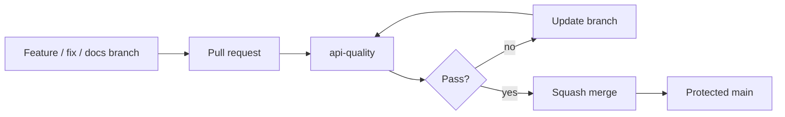
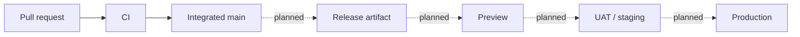

# CI/CD and change control

Tropos uses pull requests and GitHub Actions as the current integration control. No production deployment pipeline exists yet.

## Integration path



`main` is protected and requires the `api-quality` status check. Conversation resolution is required; force pushes and branch deletion are disabled by the branch policy. Mandatory approving reviewers are not configured while the repository has one maintainer.

## CI job

The workflow runs on every pull request and every push to `main`.

```text
checkout
→ install uv
→ install Python 3.14
→ uv sync --dev --locked
→ ruff format --check
→ ruff check
→ mypy src tests
→ pytest
→ uv build
```

The workflow definition is `.github/workflows/ci.yml`.

## Local validation

Run the same checks from `apps/api`:

```bash
uv sync --dev --locked
uv run ruff format --check .
uv run ruff check .
uv run mypy src tests
uv run pytest
uv build
```

Local checks provide fast feedback; GitHub Actions is the shared integration record.

## Merge convention

Bounded feature, fix, and documentation changes use **Squash and merge**. The feature branch can be deleted after merge.

This keeps `main` focused on integrated changes rather than intermediate working commits.

## Deployment boundary

CI validates repository state; it does not deploy Tropos.



Deployment controls will be added with the first hosted runtime rather than inferred from branch names.

## Future gates

| Capability | Additional gate |
| --- | --- |
| Persistence | Migration and persistence integration tests |
| Retrieval | Retrieval integration tests and evaluation suite |
| External adapters | Contract/schema tests |
| LLM prompts/models | Schema validation and applicable AI evaluations |
| API | Request/response and smoke tests |
| Hosted environment | Deployment health, traceability, rollback checks |

## Repository hygiene

The repository uses synthetic fixtures and examples. Secrets, real support/customer records, confidential employer/client material, and production configuration must remain outside source control.

See [Environment strategy](ENVIRONMENT_STRATEGY.md) for the planned runtime promotion model.
