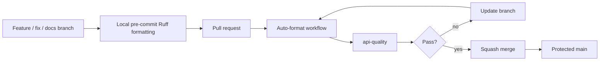
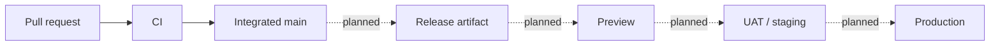

# CI/CD and change control

Tropos uses pull requests and GitHub Actions as the current integration control. No production deployment pipeline exists yet.

## Integration path


```mermaid
flowchart LR
    Branch[Feature / fix / docs branch]
    --> Local[Local pre-commit Ruff formatting]
    --> PR[Pull request]
    --> Auto[Auto-format workflow]
    Auto --> CI[api-quality]
    --> Gate{Pass?}
    Gate -- no --> Fix[Update branch]
    Fix --> Auto
    Gate -- yes --> Merge[Squash merge]
    --> Main[Protected main]
```

`main` is protected and requires the `api-quality` status check. Conversation resolution is required; force pushes and branch deletion are disabled by the branch policy. Mandatory approving reviewers are not configured while the repository has one maintainer.

## Formatting before CI

Tropos formats Python before the main quality gate in two places.

### Local Git hook

Run once after cloning:

```bash
python scripts/setup_git_hooks.py
```

This configures `core.hooksPath=.githooks`. The pre-commit hook runs Ruff auto-fix and formatting only on staged Python files under `apps/api`, then re-stages those same files.

The hook uses the repository's locked API environment:

```text
staged Python
→ ruff check --fix
→ ruff format
→ re-stage
→ commit continues
```

### Pull-request auto-format

`.github/workflows/autoformat.yml` runs on same-repository pull requests. It:

1. checks out the PR branch;
2. installs the locked API dependencies;
3. runs `python scripts/format_api.py`;
4. commits `style: auto-format Python` only when Ruff changed files;
5. pushes the formatting commit back to the PR branch.

The bot-generated synchronization event does not run the formatter again, preventing an automation loop. Fork pull requests are not auto-written; they remain check-only for security.

The shared command is:

```bash
python scripts/format_api.py          # auto-fix + format
python scripts/format_api.py --check  # check only
```

The main CI still performs format/lint checks. Auto-formatting removes mechanical failures; CI remains the independent integration gate.

## CI job

The workflow runs on every pull request and every push to `main`.

```text
checkout
→ install uv
→ install Python 3.14
→ uv sync --dev --locked
→ ruff format --check
→ ruff check
→ mypy src tests
→ pytest
→ uv build
```

The workflow definition is `.github/workflows/ci.yml`.

## Local validation

From the repository root:

```bash
python scripts/format_api.py
```

Then run the same non-mutating gates from `apps/api`:

```bash
uv sync --dev --locked
uv run ruff format --check .
uv run ruff check .
uv run mypy src tests
uv run pytest
uv build
```

Local formatting provides immediate feedback; GitHub Actions remains the shared integration record.

## Merge convention

Bounded feature, fix, and documentation changes use **Squash and merge**. The feature branch can be deleted after merge.

This keeps `main` focused on integrated changes rather than intermediate working commits.

## Deployment boundary

CI validates repository state; it does not deploy Tropos.


```mermaid
flowchart LR
    PR[Pull request]
    --> CI[CI]
    --> Main[Integrated main]
    -. planned .-> Artifact[Release artifact]
    -. planned .-> Preview[Preview]
    -. planned .-> UAT[UAT / staging]
    -. planned .-> Prod[Production]
```

Deployment controls will be added with the first hosted runtime rather than inferred from branch names.

## Future gates

| Capability | Additional gate |
| --- | --- |
| Persistence | Migration and persistence integration tests |
| Retrieval | Retrieval integration tests and evaluation suite |
| External adapters | Contract/schema tests |
| LLM prompts/models | Schema validation and applicable AI evaluations |
| API | Request/response and smoke tests |
| Hosted environment | Deployment health, traceability, rollback checks |

## Repository hygiene

The repository uses synthetic fixtures and examples. Secrets, real support/customer records, confidential employer/client material, and production configuration must remain outside source control.

See [Environment strategy](ENVIRONMENT_STRATEGY.md) for the planned runtime promotion model.
