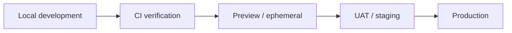
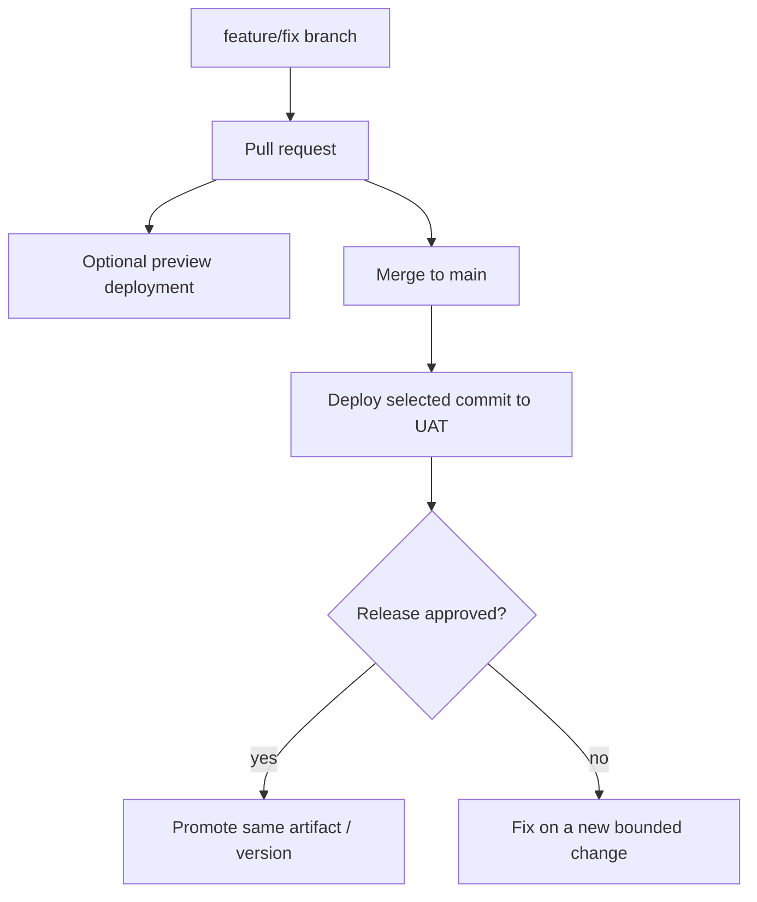
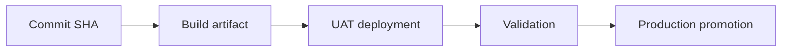

# Environment Strategy

## Purpose

Tropos separates **code versioning** from **runtime environments**. Git branches describe proposed/integrated code. Environments describe where a selected version is running with environment-specific configuration and data.

## Theory foundation

This follows standard SDLC environment separation and progressive delivery.

## Branches are not environments

Tropos should not create permanent `dev`, `uat`, and `prod` branches merely to represent environments unless a concrete deployment constraint requires that model.

## Environment responsibilities

| Environment | Purpose | Data/config expectation |
| --- | --- | --- |
| Local | Fast development and deterministic tests | Local/dev-only values |
| CI | Reproducible validation from a clean runner | Ephemeral test configuration |
| Preview | Validate a PR as a running system | Isolated / non-production resources |
| UAT / staging | Release candidate validation | Production-like configuration, controlled test data |
| Production | Real governed workload | Production secrets, policies, monitoring, rollback readiness |

## Promotion principle

Prefer promoting the **same built version** through environments instead of rebuilding materially different artifacts at every stage.

## Configuration principle

Configuration and secrets vary by environment; source code should not contain production secrets or environment-specific hard-coding.

## Future release controls

When Tropos is deployable, add:

- explicit environment variables/secrets per environment;
- deployment traceability back to commit SHA;
- smoke tests after deployment;
- migration checks for persistent stores;
- UAT approval before production;
- observability and rollback runbooks;
- production change evidence.

## Failure modes to avoid

- testing for the first time in production;
- treating `main` as an environment rather than a code line;
- manually changing production code outside version control;
- rebuilding different dependencies between UAT and production;
- allowing production configuration to leak into local development;
- deploying without knowing which commit is running.
