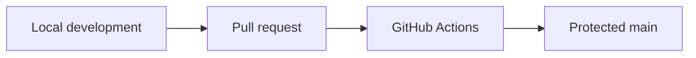
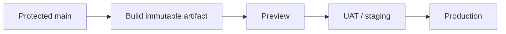
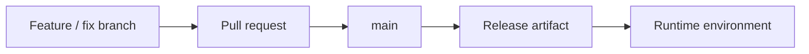
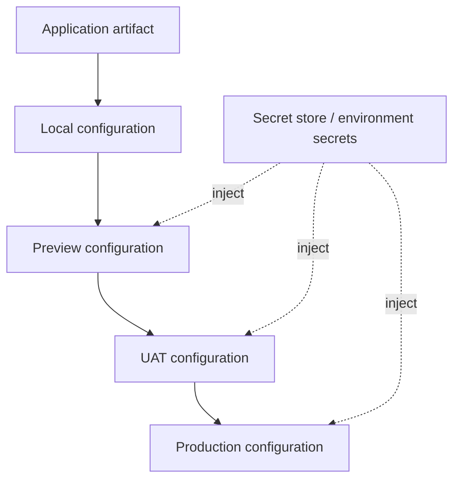

# Environment strategy

Tropos separates source-control branches from runtime environments. A branch identifies code being integrated; an environment identifies an approved artifact running with a specific configuration and data boundary.

## Current state

Only local development and GitHub Actions CI exist today.



Preview, UAT/staging, and Production are planned runtime environments, not current capabilities.

## Target promotion path



The same artifact should be promoted between environments instead of being materially rebuilt for each stage.

## Branches are not environments

Tropos does not use permanent `dev`, `uat`, or `prod` branches to model runtime state. Source control tracks code history; deployment systems track which artifact is running where.



## Environment responsibilities

| Environment | Purpose | Data/configuration | Status |
| --- | --- | --- | --- |
| Local | Fast engineering feedback | Local values and synthetic data | In use |
| CI | Clean reproducible validation | Ephemeral test context | In use |
| Preview | Validate a pull request as a running system | Isolated non-production resources | Planned |
| UAT / staging | Validate a release candidate | Production-like configuration with controlled test data | Planned |
| Production | Serve governed workloads | Production secrets, monitoring, rollback | Deferred until hosted workload exists |

## Configuration

Application code should remain environment-agnostic. Runtime-specific configuration and secrets are injected outside committed source.



## Data boundaries

| Environment | Preferred data |
| --- | --- |
| Local | Synthetic fixtures |
| CI | Synthetic and ephemeral test data |
| Preview | Isolated synthetic scenarios |
| UAT / staging | Controlled representative test data |
| Production | Real governed workload |

Production-derived data outside Production requires an explicit privacy and security design.

## Deployment traceability

A future deployment record should identify at least:

```text
DeploymentRecord
├── environment
├── commit SHA
├── artifact version / digest
├── deployment timestamp
├── configuration version or reference
├── migration version
├── smoke-test result
└── rollback target
```

No `DeploymentRecord` model exists in the codebase today.

See [CI/CD](CI_CD.md) for the current integration path.
