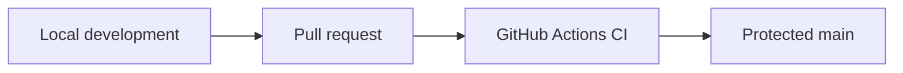
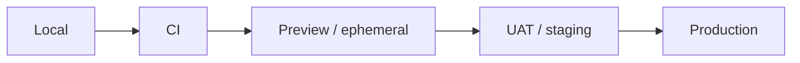
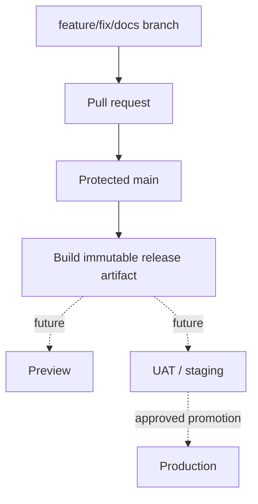
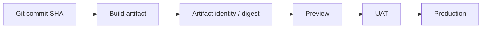
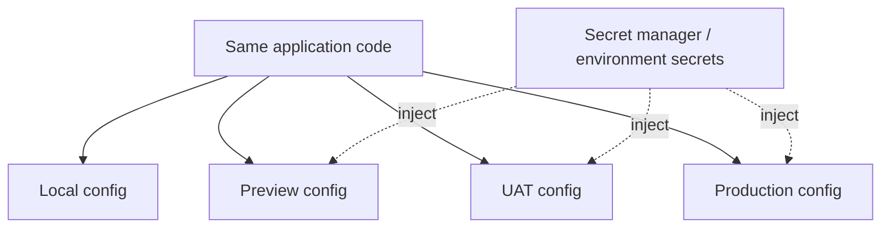
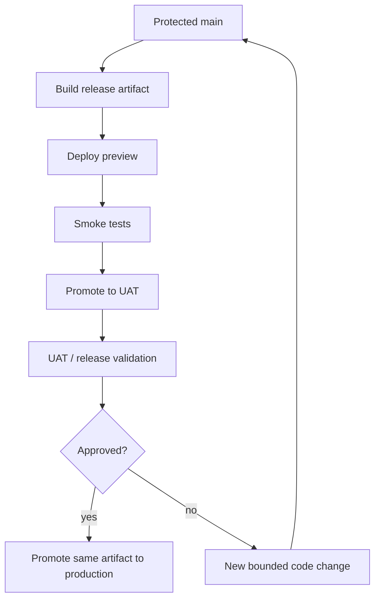

# Environment Strategy

Tropos separates **code versioning** from **runtime environments**. A Git branch answers “which code changes are being integrated?” An environment answers “which approved version is running with which configuration and data?”

## Current reality

Tropos does **not** yet have hosted Preview, UAT/staging, or Production environments.

What exists today:



Everything after `main` in the diagrams below is target release architecture, not current runtime capability.

## Target environment flow



## Branches are not environments



Tropos should not create permanent `dev`, `uat`, and `prod` branches merely to represent runtime environments. Environment state belongs in deployment/configuration systems, while source control tracks code history.

## Environment responsibilities

| Environment | Primary purpose | Data/config expectation | Current status |
| --- | --- | --- | --- |
| Local | Fast engineering feedback | local/dev-only values and synthetic data | IMPLEMENTED workflow |
| CI | Reproducible clean validation | ephemeral test context | IMPLEMENTED |
| Preview | Validate one PR as a running system | isolated non-production resources | PLANNED |
| UAT / staging | Validate a release candidate | production-like config + controlled test data | PLANNED |
| Production | Governed real workload | production secrets, policy, monitoring, rollback | DEFERRED |

## Promote the same version

A release candidate should be built once and promoted, rather than being materially rebuilt for each environment.



This reduces “works in UAT, different bits in production” risk.

## Configuration model

Source code should be environment-agnostic. Runtime-specific values belong outside committed code.



The public repository must never become a storage location for production secrets or real customer data.

## Future deployment contract

Every deployed version should eventually answer:

```text
DeploymentRecord
├── environment
├── commit SHA
├── artifact version / digest
├── deployment timestamp
├── configuration version/reference
├── migration version
├── smoke-test result
└── rollback target
```

This structure is conceptual for now; no `DeploymentRecord` model is implemented.

## Release progression



## Data separation principle

Environment promotion should not imply copying uncontrolled production data downward.

| Environment | Preferred data |
| --- | --- |
| Local | synthetic fixtures |
| CI | synthetic/ephemeral test data |
| Preview | isolated synthetic scenarios |
| UAT | controlled representative test data |
| Production | real governed workload |

If production-derived data is ever used outside production, it requires an explicit privacy/security design rather than being treated as a normal development convenience.

## Failure modes to avoid

- creating `dev`, `uat`, `prod` branches and confusing code lines with deployments;
- manually modifying production code outside Git;
- rebuilding different dependency sets between UAT and production;
- deploying without knowing the exact commit/artifact;
- storing environment secrets in source control;
- using real customer data in public test fixtures;
- testing deployment behavior for the first time in production;
- lacking a known rollback target.

## When deployment work starts

The first deployment slice should add only the controls needed for the first runnable environment:

1. immutable build artifact;
2. environment-specific configuration/secrets;
3. deployment traceability to commit SHA;
4. post-deploy smoke check;
5. rollback procedure;
6. basic observability.

Add UAT/production ceremony only when Tropos has a real hosted workload to promote.
