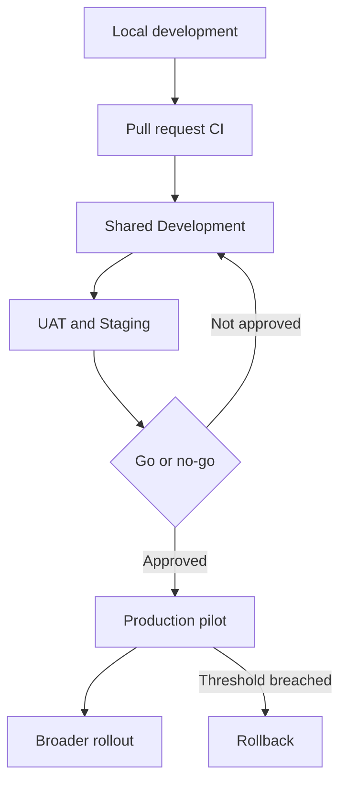
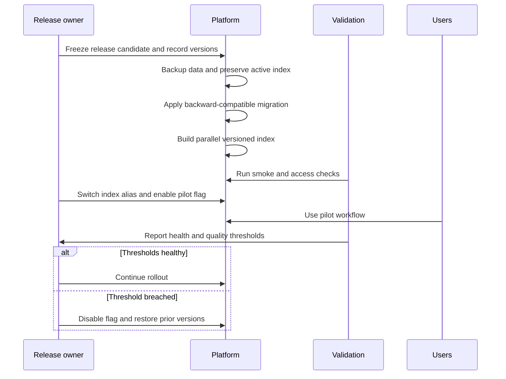

# Tropos environment and release strategy

| Control | Value |
| --- | --- |
| Status | Target operating model; implementation tracked below |
| Scope | Build, validation, UAT, production cutover, rollback, and hypercare |
| Release approach | Trunk-based development with short-lived feature branches |
| Promotion unit | One immutable, versioned artifact plus declared configuration |
| Production approach | Human-approved, pilot-first rollout |
| Review trigger | Changes to runtime, persistence, schema, prompts, models, indexing, access, or deployment |

## Why this exists

An environment is not merely a server. It is a controlled execution context with its own data,
configuration, secrets, access, deployment rules, and evidence. The purpose of the environment
strategy is to reduce the chance that a change which worked on a developer machine fails, leaks
data, or cannot be reversed in production.

Tropos uses only the environments justified by its current maturity. Shared deployed environments
are created when an API, persistence layer, and runnable artifact exist; they are not simulated in
documentation before then.

## Current state versus target state

| Capability | Current state | Target state |
| --- | --- | --- |
| Local development | Implemented: Python, `uv`, isolated `.venv`, locked dependencies | Retain as the fast developer feedback loop |
| Automated build validation | Manual commands are established | GitHub Actions runs the same gates on every pull request |
| Shared Development | Not created; no deployable service yet | Automatic deployment from `main` for integration testing |
| UAT/Staging | Not created | Production-like release-candidate validation |
| Production | Not created | Controlled pilot with monitoring and rollback |
| Persistent data and indexes | Not implemented | Separate stores and index generations per environment |

This table prevents a common programme error: describing a target-state operating model as if it
already exists.

## Environment topology

| Environment | Primary purpose | Deployment trigger | Data policy | Exit evidence |
| --- | --- | --- | --- | --- |
| Local | Develop and debug quickly | Developer action | Synthetic fixtures only | Focused tests pass |
| Pull request CI | Reproducible build and automated verification | Pull request update | Test fixtures; no secrets or production data | Required checks pass |
| Development | Integrate code, migrations, connectors, and indexes | Merge to `main` | Synthetic or approved masked data | Integration, smoke, and migration tests pass |
| UAT/Staging | Business acceptance and production-readiness rehearsal | Versioned release candidate | Representative sanitized dataset | UAT acceptance and go-live gates pass |
| Production | Deliver customer value safely | Approved release tag or promotion | Governed production data | Pilot metrics stable; release accepted |

An optional customer sandbox is added only when customers need safe hands-on evaluation. It is
not a substitute for UAT.

## Configuration and isolation rules

1. Build once and promote the same immutable artifact; never rebuild separately for each environment.
2. Keep code identical across environments and externalize configuration.
3. Store secrets in an environment-specific secret manager; never commit `.env` files.
4. Use separate databases, object stores, indexes, credentials, and service identities per environment.
5. Do not copy production content into lower environments unless it is explicitly approved and masked.
6. Apply least privilege and keep production write access narrower than non-production access.
7. Version schema migrations, prompts, evaluation datasets, models, chunking strategies, and index configurations.
8. Record the exact versions that formed each release.

## Branching and artifact strategy

- Engineers use short-lived feature branches and pull requests.
- Pull-request checks must pass before merge.
- `main` remains releasable and is the source of Development deployments.
- A release candidate identifies one commit and one immutable artifact digest.
- UAT and Production receive that same artifact; only approved external configuration differs.
- A production release is tagged and linked to its test, evaluation, approval, and rollback evidence.

For the current repository-only stage, the Git commit SHA is the release identity. Container or
package digests become the deployment identity when the API is packaged.

## Quality gates

| Gate | Required evidence | Blocks |
| --- | --- | --- |
| Commit | Formatting, lint, type checks, focused tests, full regression, clean diff | Invalid code entering review |
| Pull request | CI checks, review, contract/docs impact, dependency review | Merge to `main` |
| Development | Deploy smoke test, integration tests, migration forward/backward check | UAT promotion |
| UAT | Agreed business scenarios, access tests, audit evidence, defect disposition | Production approval |
| Production readiness | Backup/restore evidence, rollback rehearsal, monitoring, runbook, owners | Go-live |
| Pilot exit | Error, latency, access, retrieval-quality, and business thresholds stable | Broad rollout |

AI-assisted behavior adds evaluation gates; it does not replace deterministic software gates.
The first retrieval release must measure relevance, access leakage, and citation integrity before
production promotion.

## UAT strategy

UAT validates business fitness, not code style. Product owns scenario acceptance; engineering owns
technical correction; the release owner maintains evidence and decisions.

Minimum Tropos UAT scenarios:

1. A resolved case produces the expected `REUSE`, `IMPROVE`, `CREATE`, or `NO_ACTION` recommendation.
2. Retrieved evidence is relevant, readable, and traceable to the exact source version and location.
3. Tenant and restricted-group access prevent unauthorized retrieval.
4. Updating a source makes the approved version authoritative and preserves historical auditability.
5. Repeated ingestion is idempotent and failed processing can be retried safely.
6. Missing or unresolved access metadata prevents indexing.
7. A human can approve, edit, or reject a recommendation and the decision is auditable.
8. Performance is acceptable for the pilot workload.
9. A release and index rollback can be completed using the runbook.

Every scenario has an owner, test data, expected result, actual result, evidence link, and final
disposition. Open defects are either fixed or explicitly accepted by an accountable owner.

## Cutover strategy

Cutover steps:

1. Confirm scope, approved commit, artifact digest, configuration, migration, prompt/model, and index strategy.
2. Confirm owners, support coverage, communication channel, decision time, and rollback authority.
3. Pause or checkpoint ingestion if consistency requires it; retain the connector cursor.
4. Back up mutable data and verify restore instructions.
5. Apply backward-compatible schema changes.
6. Build new chunks and indexes as a parallel generation rather than overwriting the active generation.
7. Run deployment, health, access-control, retrieval, and citation smoke tests.
8. Switch the active index alias and enable the capability for a limited pilot cohort.
9. Observe agreed technical and product thresholds through the hypercare window.
10. Continue rollout or invoke the relevant rollback path.

## Rollback strategy

Rollback is component-specific because code, data, prompts, and indexes fail differently.

| Change type | Preferred rollback | Design requirement |
| --- | --- | --- |
| Application code | Redeploy the last known-good artifact | Previous artifact remains available |
| Feature behavior | Disable a feature flag | New path is isolated behind a flag |
| Runtime configuration | Restore the prior versioned configuration | Configuration changes are audited |
| Prompt or model | Reactivate prior prompt/model combination | Versions and evaluation results are recorded |
| Retrieval configuration | Restore prior ranking parameters | Settings are externalized and versioned |
| Chunking/index generation | Switch alias to previous complete generation | New generation is built in parallel |
| Connector | Disable connector and resume from saved cursor later | Ingestion is idempotent and cursor is durable |
| Source content | Mark current version inactive and reactivate approved version | History is preserved; derived data is rebuildable |
| Database schema | Roll code back while compatible schema remains | Use expand-and-contract migrations |

Destructive database contraction occurs in a later release, after the old code path can no longer
be needed. A database rollback that risks losing accepted production data requires an explicit
recovery decision, not an automatic script.

## Release record

Each promoted release must make these values traceable:

- release ID, commit SHA, and artifact digest;
- dependency lockfile and runtime version;
- schema migration version;
- configuration and feature-flag version;
- prompt, model, chunking, retrieval, and index versions where applicable;
- evaluation-dataset version and results;
- automated test and security-check results;
- UAT scenarios, defects, and acceptance;
- approvers, deployment timestamps, and rollback target;
- post-release monitoring outcome and incident links.

This is the delivery equivalent of provenance: it proves exactly what was released, why it was
approved, and how it can be reproduced or reversed.

## Decision rights

| Responsibility | Accountable role |
| --- | --- |
| Product outcome and UAT acceptance | Product owner |
| Release plan, dependencies, evidence, and go/no-go facilitation | Technical programme or release owner |
| Technical readiness and rollback feasibility | Engineering lead |
| Automated tests and AI-quality evaluation | Engineering and evaluation owner |
| Access, data handling, and security acceptance | Security or data owner |
| Monitoring, incident response, and recovery | Operations/on-call owner |

During solo development one person may hold several roles, but the responsibilities remain
separate. This makes missing evidence visible and prepares the project for a larger team.

## Implementation sequence

| Order | Capability | Status |
| --- | --- | --- |
| 1 | Local reproducible environment and locked dependencies | Implemented |
| 2 | Repeatable formatting, lint, type, and test gates | Implemented manually |
| 3 | Pull-request CI with required checks | Next |
| 4 | Deployable API artifact and health endpoint | Planned |
| 5 | Separate Development data store and automated deployment | Planned |
| 6 | UAT/Staging environment and release evidence | Planned |
| 7 | Production pilot, observability, and tested rollback | Planned |

The next environment increment is therefore CI, not prematurely provisioning Development, UAT,
and Production infrastructure before there is a service to deploy.
